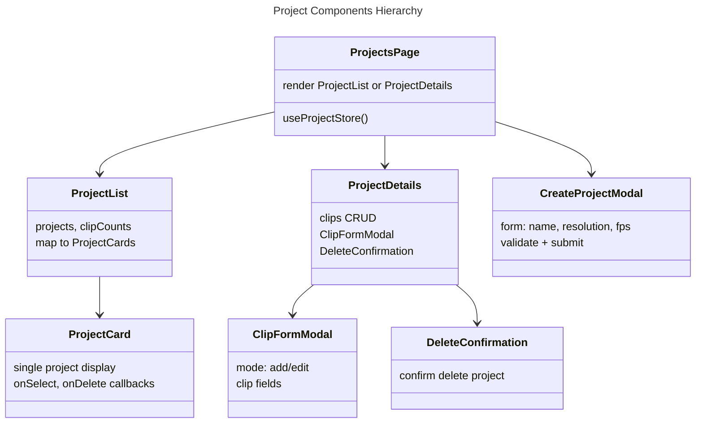

# C4 Code Level: Project Components

**Source:** `gui/src/components/Project*.tsx`

**Component:** Web GUI

## Purpose

Manage project lifecycle (create, list, display, delete) with clip management sub-views. Components for CRUD operations at the project level.

## Code Elements

### ProjectCard

**Location:** `gui/src/components/ProjectCard.tsx` (line 19)

**Props:**
```typescript
interface ProjectCardProps {
  project: Project
  clipCount: number
  onSelect: (id: string) => void
  onDelete: (id: string) => void
}
```

- **Renders:** Card with project name, creation date, clip count, resolution/fps
- **Actions:** Click name → onSelect, Click delete button → onDelete
- **Styling:** Hover border change, grid-responsive
- **Helper:** `formatDate(iso)` → "2025 Mar 13"

### ProjectList

**Location:** `gui/src/components/ProjectList.tsx` (line 13)

**Props:**
```typescript
interface ProjectListProps {
  projects: Project[]
  clipCounts: Record<string, number>
  loading: boolean
  error: string | null
  onSelect: (id: string) => void
  onDelete: (id: string) => void
}
```

- **Renders:** Grid of ProjectCards, or loading/error/empty states
- **Grid layout:** 1 col (mobile) → 2 (tablet) → 3 (desktop)
- **States:**
  - Loading: "Loading projects..."
  - Error: Error message text
  - Empty: "No projects yet. Create one to get started."
- **Delegation:** ProjectCard for individual project rendering

### ProjectDetails

**Location:** `gui/src/components/ProjectDetails.tsx` (line 19)

**Props:**
```typescript
interface ProjectDetailsProps {
  project: Project
  onBack: () => void
  onDelete: (id: string) => void
}
```

- **Renders:** Project info + clips table with CRUD actions
- **Sections:**
  1. Header: Back button, project name, delete project button
  2. Metadata: Resolution, FPS, creation date
  3. Clips table with columns: #, timeline position, in/out points, duration, actions
- **Clip actions:** Edit, Delete
- **Modals:** ClipFormModal (add/edit), inline delete confirmation

**State:**
- `clips` - Fetched clips list
- `showClipForm, editingClip` - Add/edit modal state
- `showDeleteConfirm, deletingClip` - Delete confirmation state

**Features:**
- Loads clips on mount via `fetchClips()`
- Edit/Add ClipFormModal with pre-fill
- Inline delete confirmation with Confirm/Cancel buttons
- Timecode formatting: `formatTimecode(frames, fps)` → "0:00.00" format

### CreateProjectModal

**Location:** `gui/src/components/CreateProjectModal.tsx` (line 40)

**Props:**
```typescript
interface CreateProjectModalProps {
  open: boolean
  onClose: () => void
  onCreated: () => void
}
```

- **Form fields:**
  - Project Name (required, string)
  - Resolution (required, "1920x1080" format, regex-parsed)
  - Frame Rate/FPS (required, 1-120, number)
- **Validation:**
  - `parseResolution()` - Regex matches `\d+[xX×]\d+`
  - FPS bounds: `1 <= fps <= 120`
  - Errors display per-field
- **Submit:** POST to `createProject()`, closes modal on success
- **Reset:** Clears form on close or successful submit

**Helpers:**
- `parseResolution(value)` → `{ width, height }` or null
- `validateForm(name, resolution, fps)` → FormErrors object

## Dependencies

### Internal Dependencies

- **Type imports:** Project, Clip (from useProjects)
- **Hooks:** useClipStore, useProjectStore (via parent pages)
- **Components:** ClipFormModal, DeleteConfirmation (ProjectDetails)
- **API functions:** createProject, deleteProject, fetchClips (useProjects)

### External Dependencies

- React hooks: `useState`, `useEffect`, `useCallback`
- Tailwind CSS for styling
- No external UI libraries

## Key Implementation Details

### Timecode Formatting (ProjectDetails)

```typescript
function formatTimecode(frames: number, fps: number): string {
  const totalSeconds = frames / fps
  const minutes = Math.floor(totalSeconds / 60)
  const seconds = totalSeconds % 60
  return `${minutes}:${seconds.toFixed(2).padStart(5, '0')}`
}
```

Converts frame counts to MM:SS.SS for readability.

### Clip List Rendering

ProjectDetails renders table of clips with:
- Index (1-based)
- Timeline position (timecode)
- In/out points (timecodes)
- Duration = out - in (timecode)
- Edit button → pre-fill ClipFormModal
- Delete button → inline confirmation with Confirm/Cancel

### Parallel Clip Count Loading

ProjectsPage loads clip counts via:
```typescript
await Promise.all(projects.map(p => fetchClips(p.id)))
```

Each project fetched independently; results stored in `clipCounts` state.

### Resolution Parser

Regex pattern: `^(\d+)\s*[xX×]\s*(\d+)$`
- Accepts: "1920x1080", "1920 x 1080", "1920X1080", "1920 × 1080"
- Returns: { width, height } or null

### Form Validation Pattern

Validation errors cleared on field change if input becomes valid:
```typescript
const handleNameChange = (value: string) => {
  setName(value)
  if (errors.name && value.trim()) {
    delete updated.name
    setErrors(updated)
  }
}
```

Live validation feedback as user types.

## Relationships



## Code Locations

- **ProjectCard.tsx**: Individual project card display
- **ProjectList.tsx**: Grid of ProjectCards with state display
- **ProjectDetails.tsx**: Full project view with clip table and CRUD
- **CreateProjectModal.tsx**: Form modal for project creation

