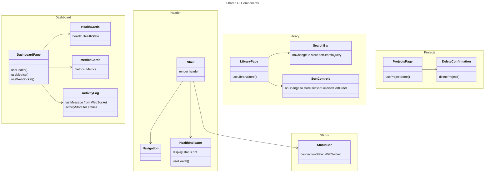

# C4 Code Level: Shared & UI Components

**Source:** `gui/src/components/Status*.tsx`, `gui/src/components/Search*.tsx`, `gui/src/components/Sort*.tsx`, `gui/src/components/Health*.tsx`, `gui/src/components/Metrics*.tsx`, `gui/src/components/Activity*.tsx`, `gui/src/components/DeleteConfirmation.tsx`

**Component:** Web GUI

## Purpose

Reusable UI components for common patterns: status displays, search/filter controls, health monitoring, activity logging, and confirmation dialogs.

## Code Elements

### StatusBar

**Location:** `gui/src/components/StatusBar.tsx` (line 19)

**Props:**
```typescript
interface StatusBarProps {
  connectionState: ConnectionState
}
```

- **Purpose:** Display WebSocket connection status at bottom of page
- **Renders:** Single line with state-dependent color and label
- **States:**
  - `connected` → green-400 "Connected"
  - `disconnected` → red-400 "Disconnected"
  - `reconnecting` → yellow-400 "Reconnecting..."
- **Styling:** Footer bar with border-top

### SearchBar

**Location:** `gui/src/components/SearchBar.tsx` (line 6)

**Props:**
```typescript
interface SearchBarProps {
  value: string
  onChange: (value: string) => void
}
```

- **Renders:** Text input for searching videos
- **Placeholder:** "Search videos..."
- **Focus state:** blue-500 border on focus
- **Usage:** LibraryPage passes to useLibraryStore.setSearchQuery

### SortControls

**Location:** `gui/src/components/SortControls.tsx` (line 16)

**Props:**
```typescript
interface SortControlsProps {
  sortField: SortField       // 'date' | 'name' | 'duration'
  sortOrder: SortOrder       // 'asc' | 'desc'
  onSortFieldChange: (field: SortField) => void
  onSortOrderChange: (order: SortOrder) => void
}
```

- **Renders:** Dropdown for sort field + button for sort order direction
- **Sort options:** Date, Name, Duration
- **Order toggle:** Arrow up (asc) / down (desc), title shows full name
- **Usage:** LibraryPage for video list sorting

### HealthIndicator

**Location:** `gui/src/components/HealthIndicator.tsx` (line 15)

**Props:** None (reads from hook)

- **Purpose:** Display system health status in header
- **Renders:** Colored dot + label
- **Colors:**
  - `healthy` → green-500
  - `degraded` → yellow-500
  - `unhealthy` → red-500
- **Uses:** `useHealth()` hook (30s polling)
- **Used by:** Shell header

### HealthCards

**Location:** `gui/src/components/HealthCards.tsx` (line 56)

**Props:**
```typescript
interface HealthCardsProps {
  health: HealthState
}
```

- **Renders:** Grid of health component cards (Database, FFmpeg, Rust Core)
- **Cards:** Show component name + status dot + label
- **Status mapping:**
  - `ok` → green-900/50, green dot, "Operational"
  - `error` → red-900/50, red dot, "Error"
  - `unknown` → yellow-900/50, yellow dot, "Unknown"
- **Rust Core:** Derived from overall health status
- **Grid:** 1 col (mobile) → 3 (sm/larger)
- **Used by:** DashboardPage

### MetricsCards

**Location:** `gui/src/components/MetricsCards.tsx` (line 7)

**Props:**
```typescript
interface MetricsCardsProps {
  metrics: Metrics
}
```

- **Renders:** Two metric cards
  1. Total Requests: `metrics.requestCount`
  2. Avg Response Time: `metrics.avgDurationMs.toFixed(1) + " ms"` (or "--" if null)
- **Grid:** 1 col (mobile) → 2 (sm/larger)
- **Used by:** DashboardPage

### ActivityLog

**Location:** `gui/src/components/ActivityLog.tsx` (line 20)

**Props:**
```typescript
interface ActivityLogProps {
  lastMessage: MessageEvent | null
}
```

- **Purpose:** Display WebSocket activity feed
- **Features:**
  - Listens to lastMessage from WebSocket
  - Parses JSON: `{ type, payload, timestamp }`
  - Adds to `useActivityStore()` entries
  - Shows max 50 entries (LRU)
- **Display:**
  - Entry type (underscores replaced with spaces)
  - Timestamp (locale time format)
  - Payload details (JSON stringified)
- **Empty state:** "No recent activity"
- **Height:** max-h-80 with overflow-y-auto
- **Used by:** DashboardPage

**Helper:**
- `formatTimestamp(iso)` → "HH:MM:SS" locale format
- `formatType(type)` → Replace underscores with spaces

### DeleteConfirmation

**Location:** `gui/src/components/DeleteConfirmation.tsx` (line 12)

**Props:**
```typescript
interface DeleteConfirmationProps {
  open: boolean
  projectId: string
  projectName: string
  onClose: () => void
  onDeleted: () => void
}
```

- **Purpose:** Confirmation dialog for project deletion
- **Modal:** Centered overlay with dark bg
- **Renders:**
  - Title: "Delete Project"
  - Message: "Are you sure..." with project name highlighted
  - Error message (if deletion fails)
  - Cancel / Delete buttons
- **Delete button:** Shows "Deleting..." state while in flight
- **Flow:**
  1. User clicks delete on ProjectCard
  2. Modal opens with project name
  3. User confirms → calls `deleteProject()`
  4. On success: calls `onDeleted()` + closes
  5. On error: shows error message
- **Used by:** ProjectsPage

## Dependencies

### Internal Dependencies

- **Hooks:** useHealth, useWebSocket (Shell), useActivityStore (ActivityLog), useMetrics (DashboardPage)
- **Types:** ConnectionState (from useWebSocket), HealthState, Metrics, SortField/SortOrder (stores)
- **API functions:** deleteProject (DeleteConfirmation)

### External Dependencies

- React: `useState`, `useEffect`, `useMemo`
- Native Web APIs: JSON.parse, Date.toLocaleTimeString
- Tailwind CSS for styling

## Key Implementation Details

### Activity Log WebSocket Integration

ActivityLog listens to lastMessage and parses JSON:
```typescript
useEffect(() => {
  if (!lastMessage) return
  try {
    const event = JSON.parse(lastMessage.data) as {
      type: string
      payload: Record<string, unknown>
      timestamp: string
    }
    addEntry({
      type: event.type,
      timestamp: event.timestamp,
      details: event.payload,
    })
  } catch {
    // Ignore non-JSON messages
  }
}, [lastMessage, addEntry])
```

Silent failure on non-JSON; only logs parseable events.

### Health Card Rendering

Each component gets status from health.checks:
```typescript
const check = health.checks[key]
const status = check?.status ?? 'unknown'
```

Safe fallback to 'unknown' if component check missing.

### Metrics Display

Average response time conditionally rendered:
```typescript
{metrics.avgDurationMs !== null
  ? `${metrics.avgDurationMs.toFixed(1)} ms`
  : '--'}
```

Prevents division-by-zero display ("NaN ms").

### SortControls Order Toggle

Toggle state updates store, which resets pagination:
```typescript
onSortOrderChange(sortOrder === 'asc' ? 'desc' : 'asc')
```

Parent (LibraryPage) passes store setter; sort change → page = 0.

### DeleteConfirmation States

Three phases:
1. Closed: `open === false` → null (no render)
2. Open (ready): Show form, buttons enabled
3. Deleting: Delete button disabled, shows "Deleting..."

Error state persists until modal closes.

### Timestamp Formatting

ActivityLog formats ISO string using locale settings:
```typescript
function formatTimestamp(iso: string): string {
  try {
    return new Date(iso).toLocaleTimeString()
  } catch {
    return iso  // Fallback to raw string if parse fails
  }
}
```

Safe fallback for malformed ISO strings.

## Relationships



## Code Locations

- **StatusBar.tsx**: WebSocket connection status
- **SearchBar.tsx**: Video search input
- **SortControls.tsx**: Sort field and order controls
- **HealthIndicator.tsx**: Header health dot
- **HealthCards.tsx**: Dashboard health cards
- **MetricsCards.tsx**: Dashboard metrics display
- **ActivityLog.tsx**: WebSocket activity feed
- **DeleteConfirmation.tsx**: Project deletion confirmation

