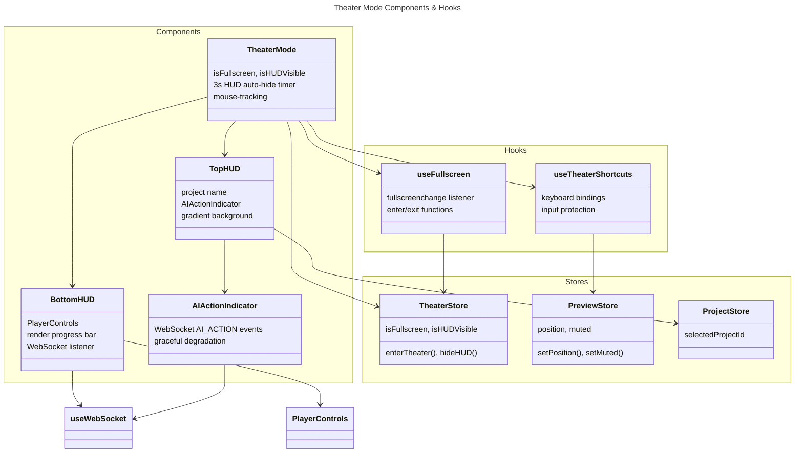

# C4 Code Level: Theater Mode Components

**Source:** `gui/src/components/theater/`, `gui/src/hooks/useTheaterShortcuts.ts`, `gui/src/hooks/useFullscreen.ts`

**Component:** Web GUI

## Purpose

Fullscreen theater mode with auto-hiding HUD overlay, keyboard shortcuts, and real-time render progress tracking. Provides immersive preview playback with accessibility features.

## Code Elements

### TheaterMode

**Location:** `gui/src/components/theater/TheaterMode.tsx` (line 23)

**Props:**
```typescript
interface TheaterModeProps {
  children: React.ReactNode
  videoRef?: React.RefObject<HTMLVideoElement | null>
}
```

- **Purpose:** Fullscreen wrapper with auto-hiding HUD container
- **Features:**
  - Pass-through rendering when not fullscreen
  - Theater container with mouse-tracking HUD when fullscreen
  - Auto-hide HUD after 3 seconds of inactivity
  - Integrates keyboard shortcuts via useTheaterShortcuts

**State Management:**
- Uses `useTheaterStore`: isFullscreen, isHUDVisible
- Manages HUD visibility timer (3s delay)
- Listens to fullscreenchange events via useFullscreen hook

**Behavior:**
1. If not fullscreen: render children directly
2. If fullscreen: wrap children in theater container with HUD overlay
3. On mouse move: show HUD, restart hide timer
4. After 3s inactivity: hide HUD (opacity fade)
5. On exit: call exitFullscreen, restore original state

**Timer Management:**
- `startHideTimer()`: Clear existing timer, set new 3s timeout
- `clearHideTimer()`: Cancel scheduled hide
- Cleanup on unmount prevents memory leaks

### TopHUD

**Location:** `gui/src/components/theater/TopHUD.tsx` (line 12)

**Features:**
- Project name display (from selectedProjectId)
- AI action indicator (latest AI_ACTION event from WebSocket)
- Gradient background (black/transparent) for readability over video
- Positioned absolutely at top with full width

**State:**
- Reads `selectedProjectId` from projectStore
- Fetches projects via `useProjects()` hook
- Displays project name or "Untitled Project" if not found

**Styling:** Gradient background from-black/70 to-transparent, flex row with gap-3

**Child Components:**
- `AIActionIndicator` - Shows latest AI action description

### BottomHUD

**Location:** `gui/src/components/theater/BottomHUD.tsx` (line 42)

**Props:**
```typescript
interface BottomHUDProps {
  videoRef: React.RefObject<HTMLVideoElement | null>
}
```

**Features:**
- Full PlayerControls (reusing existing component)
- Render progress bar with percentage and ETA
- Real-time updates via RENDER_PROGRESS WebSocket events
- Gradient background (transparent-to-black) for readability

**Render Progress Tracking:**
```typescript
interface RenderProgressEvent {
  type: string
  payload: {
    progress: number         // 0.0 to 1.0
    eta_seconds: number | null
  }
}
```

- Listens to `lastMessage` from `useWebSocket()`
- Parses JSON: type === 'render_progress'
- Displays percentage: `Math.round(progress * 100)%`
- Shows ETA if available: formatted via `formatEta(seconds)`

**ETA Formatting:** `formatEta(seconds)` returns "NNs" for < 60s, else "NNm NNs"

**Layout:** Flex column with render progress bar above PlayerControls

### AIActionIndicator

**Location:** `gui/src/components/theater/AIActionIndicator.tsx` (line 22)

**Features:**
- Displays latest AI action description from WebSocket
- Listens to AI_ACTION events
- Gracefully degrades when disconnected (shows nothing)
- Updates state from `lastMessage` every time new event arrives

**State:**
- `actionText` - Latest AI action description
- Listens to `lastMessage` and `state` from `useWebSocket()`

**Event Parsing:**
```typescript
interface AIActionEvent {
  type: string
  payload: {
    description: string
  }
}
```

- Filters: type === 'ai_action'
- Non-JSON messages ignored silently

**Display:** Text span with blue-300 color, truncation if overflow

**Null Rendering:**
- Returns null if disconnected or no action text received
- No visual clutter when no AI action available (NFR-001)

## Hooks

### useFullscreen

**Location:** `gui/src/hooks/useFullscreen.ts` (line 8)

```typescript
function useFullscreen(containerRef: React.RefObject<HTMLElement | null>): {
  enter: () => Promise<void>
  exit: () => Promise<void>
}
```

**Features:**
- Wrapper around Fullscreen API (requestFullscreen, exitFullscreen)
- Derives fullscreen state from browser fullscreenchange event (not button state)
- Syncs state with theaterStore via enterTheater/exitTheater actions
- Handles full-screen API errors gracefully

**Behavior:**
1. On mount: add fullscreenchange listener
2. When fullscreen enters: call `enterTheater()`
3. When fullscreen exits: call `exitTheater()`
4. `enter()`: Request fullscreen on container element
5. `exit()`: Exit fullscreen via Document API
6. On unmount: Remove listener

**Event-Driven State:** State derived from browser event, not click handler, ensuring accuracy even with ESC key, F11, etc.

### useTheaterShortcuts

**Location:** `gui/src/hooks/useTheaterShortcuts.ts` (line 26)

```typescript
function useTheaterShortcuts(options: UseTheaterShortcutsOptions): void
```

**Options:**
```typescript
interface UseTheaterShortcutsOptions {
  videoRef: React.RefObject<HTMLVideoElement | null>
  onExit: () => void
  onToggleFullscreen: () => void
  enabled: boolean
}
```

**Keyboard Bindings (when enabled && not in input):**

| Key | Action | Behavior |
|-----|--------|----------|
| Space | Play/Pause | Toggle video.paused |
| Escape | Exit Theater | Calls onExit() |
| F | Toggle Fullscreen | Calls onToggleFullscreen() |
| M | Mute/Unmute | Toggle video.muted, sync to store |
| ArrowLeft | Seek -5s | video.currentTime -= 5, sync position |
| ArrowRight | Seek +5s | video.currentTime += 5, sync position |
| Home | Jump to start | video.currentTime = 0 |
| End | Jump to end | video.currentTime = duration |

**Input Protection:** Ignores shortcuts when focused on INPUT, TEXTAREA, SELECT (FR-007)

**State Sync:** All actions update previewStore (position, muted) to keep UI consistent

**Implementation:**
- Adds document keydown listener when enabled
- Checks IGNORED_TAGS before processing
- Each action updates video element and previewStore

## Dependencies

### Internal Dependencies

- **Type imports:** None exported from components
- **Stores:** useTheaterStore, useProjectStore, usePreviewStore
- **Hooks:** useFullscreen, useTheaterShortcuts, useProjects, useWebSocket
- **Components:** PlayerControls, AIActionIndicator (children)

### External Dependencies

- React: `useState`, `useEffect`, `useCallback`, `useRef`
- Fullscreen API: `document.fullscreenElement`, `element.requestFullscreen()`, `document.exitFullscreen()`
- WebSocket: `useWebSocket()` for real-time events
- Tailwind CSS for styling

## Key Implementation Details

### HUD Auto-Hide Timer (TheaterMode)

3-second inactivity timeout with restart on mouse move:
```typescript
const HUD_HIDE_DELAY_MS = 3000

const startHideTimer = useCallback(() => {
  clearHideTimer()
  timerRef.current = setTimeout(() => {
    hideHUD()
  }, HUD_HIDE_DELAY_MS)
}, [clearHideTimer, hideHUD])

const handleMouseMove = useCallback(() => {
  if (!isFullscreen) return
  showHUD()
  startHideTimer()  // Restart timer
}, [isFullscreen, showHUD, startHideTimer])
```

Each mouse movement restarts the 3s timer.

### HUD Visibility Transition (TheaterMode)

CSS opacity fade instead of display toggle:
```typescript
className={`... transition-opacity duration-300 ${
  isHUDVisible ? 'opacity-100' : 'opacity-0'
}`}
```

Pointer-events-none on wrapper prevents HUD from blocking video interaction.

### Fullscreen State Synchronization (useFullscreen)

Derives state from browser event, not button state:
```typescript
function handleFullscreenChange() {
  if (document.fullscreenElement) {
    enterTheater()
  } else {
    exitTheater()
  }
}
document.addEventListener('fullscreenchange', handleFullscreenChange)
```

Works with ESC key, F11, any fullscreen trigger (NFR-002).

### Keyboard Input Protection (useTheaterShortcuts)

Ignores shortcuts when typing in forms:
```typescript
const IGNORED_TAGS = new Set(['INPUT', 'TEXTAREA', 'SELECT'])
const target = e.target as HTMLElement
if (IGNORED_TAGS.has(target.tagName)) return
```

Prevents Space from playing when filling text input (FR-007).

### WebSocket Event Parsing (AIActionIndicator, BottomHUD)

Both components parse JSON silently:
```typescript
useEffect(() => {
  if (!lastMessage) return
  try {
    const event = JSON.parse(lastMessage.data)
    if (event.type === 'ai_action') {
      setActionText(event.payload.description)
    }
  } catch {
    // Ignore non-JSON messages (NFR-001)
  }
}, [lastMessage])
```

Non-JSON messages are ignored gracefully. No error states for parsing failures.

### Gradient Backgrounds (TopHUD, BottomHUD)

Readability over video via Tailwind gradients:
```typescript
// Top: fade from opaque to transparent
className="bg-gradient-to-b from-black/70 to-transparent"

// Bottom: fade from transparent to opaque
className="bg-gradient-to-t from-black/70 to-transparent"
```

70% black opacity ensures text is readable over any video.

## Relationships



## Code Locations

- **TheaterMode.tsx**: Fullscreen wrapper with auto-hiding HUD and mouse tracking
- **TopHUD.tsx**: Project name and AI action indicator
- **BottomHUD.tsx**: Player controls and render progress display
- **AIActionIndicator.tsx**: WebSocket-driven AI action text display
- **useFullscreen.ts**: Fullscreen API wrapper with state sync
- **useTheaterShortcuts.ts**: Keyboard bindings with input protection

## Keyboard Shortcuts Reference

Theater mode is active in fullscreen only. Shortcuts disabled in INPUT/TEXTAREA/SELECT fields.

```
PLAYBACK
  Space     Play / Pause
  ←         Seek backward 5s
  →         Seek forward 5s
  Home      Jump to start
  End       Jump to end

AUDIO
  M         Mute / Unmute

FULLSCREEN
  F         Toggle fullscreen (when available)
  Esc       Exit theater & fullscreen
```

All bindings follow WCAG AA accessibility standards.
