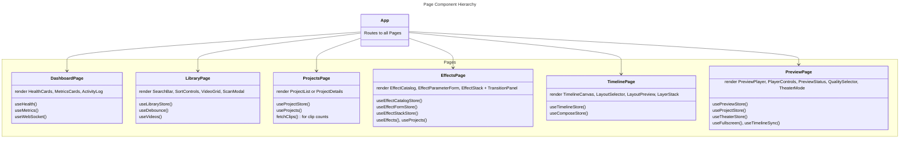

# C4 Code Level: Pages

**Source:** `gui/src/pages/`

**Component:** Web GUI

## Purpose

Five top-level page components serving as route destinations. Each page manages its own data fetching, state, and domain-specific UI composition.

## Code Elements

### DashboardPage

**Location:** `gui/src/pages/DashboardPage.tsx` (line 15)

- Displays system health, metrics, and activity log
- Uses hooks: `useHealth()` (30s poll), `useMetrics()` (30s poll), `useWebSocket()`
- Renders: HealthCards, MetricsCards, ActivityLog
- Passes `lastMessage` from WebSocket to ActivityLog for live updates

### LibraryPage

**Location:** `gui/src/pages/LibraryPage.tsx` (line 10)

- Video library with search, sort, pagination, and directory scan
- State: `useLibraryStore()` for search query, sort field/order, pagination
- Hooks: `useDebounce()` (300ms) on search, `useVideos()` for list
- Components: SearchBar, SortControls, VideoGrid, ScanModal
- Pagination: 20 items/page, with prev/next buttons
- Scan button opens `ScanModal` which refetches on complete

**Features:**
- Search triggers `useVideos` with debounced query
- Sort field changes reset page to 0
- Empty state when no videos found

### ProjectsPage

**Location:** `gui/src/pages/ProjectsPage.tsx` (line 9)

- Project CRUD with clip count display and details view
- State: `useProjectStore()` for selection, modal states, pagination
- Hooks: `useProjects()` for paginated list
- Components: ProjectCard, ProjectList, ProjectDetails, CreateProjectModal, DeleteConfirmation
- Detail view selected via `setSelectedProjectId`; shows ProjectDetails for editing clips

**Features:**
- Loads clip counts for all projects via parallel `fetchClips()` calls
- ProjectDetails sub-view for managing clips within a project
- Delete flow: opens DeleteConfirmation modal, calls `deleteProject()`, clears selection if needed

### EffectsPage

**Location:** `gui/src/pages/EffectsPage.tsx` (line 20)

- Effect application workshop with effects, transitions, and stacking
- State: Multiple stores:
  - `useEffectCatalogStore()`: search, category, selected effect, view mode
  - `useEffectFormStore()`: parameters, schema, validation errors
  - `useEffectStackStore()`: selected clip, applied effects
- Tab toggle: `activeTab` ('effects' | 'transitions')
- Hooks: `useEffects()`, `useProjects()`, `useEffectPreview()`
- Components: ClipSelector, EffectCatalog, EffectParameterForm, EffectStack, FilterPreview, TransitionPanel

**Effects Tab Flow:**
1. Project selector (auto-selects first if multiple)
2. Fetch clips for selected project
3. ClipSelector to pick effect target
4. EffectCatalog with search/filter
5. EffectParameterForm (schema-driven, appears when effect selected)
6. FilterPreview (live FFmpeg preview)
7. Apply/Update buttons (POST or PATCH to `/api/v1/projects/{id}/clips/{id}/effects`)
8. EffectStack showing applied effects with edit/remove actions

**Transitions Tab Flow:**
- Delegates to TransitionPanel (pair-mode clip selection + transition type catalog)

### TimelinePage

**Location:** `gui/src/pages/TimelinePage.tsx` (line 9)

- Timeline canvas with clips, tracks, and layout/compose tools
- State:
  - `useTimelineStore()`: tracks, duration, playhead position
  - `useComposeStore()`: layout presets, custom positions
- Hooks: Fetches presets on mount
- Components: TimelineCanvas, LayoutSelector, LayoutPreview, LayerStack

**Layout:**
- TimelineCanvas (full width top)
- Presets section below (3-column grid: LayoutSelector + LayoutPreview | LayerStack)

**Features:**
- Empty state if no tracks AND no presets
- Loading/error states for both timeline and presets independently
- Presets section only rendered if `presets.length > 0`

### PreviewPage

**Location:** `gui/src/pages/PreviewPage.tsx` (line 14)

- HLS video preview with quality selection, theater mode, and real-time sync
- State:
  - `usePreviewStore()`: sessionId, status, quality, position, duration, volume, muted, progress, error
  - `useProjectStore()`: selectedProjectId
  - `useTheaterStore()`: isFullscreen
- Hooks: `useFullscreen()`, `useTimelineSync()`, lazy-loaded `PreviewPlayer`
- Components: PreviewPlayer, PlayerControls, PreviewStatus, QualitySelector, TheaterMode

**Features:**
- Connect to preview session via `POST /api/v1/projects/{id}/preview/start`
- Quality selector (low/medium/high) with session restart
- Theater mode toggle (fullscreen with auto-hiding HUD)
- Real-time position/duration sync with timeline
- Progress bar during generation with percentage display
- Error handling with retry button
- Session expiration handling with restart option

**State Transitions:**
- "No project selected" → Select project
- "No session" → Click "Start Preview"
- "Initializing" → Waiting for session creation
- "Generating" → Progress bar with percentage
- "Ready" → Player visible, quality selector, theater button
- "Error" → Error message with retry
- "Expired" → Session expired message with restart

**Theater Mode:**
- Enters fullscreen on "Theater Mode" button click
- Quality selector visible in normal mode only
- Auto-hiding HUD in theater (player controls + project name + AI indicator)
- Exit theater with Esc key or fullscreen exit

**Timeline Sync:**
- `useTimelineSync()` syncs video playhead ↔ timeline playhead
- Debounced bidirectional sync (100ms debounce, 0.5s threshold)

## Dependencies

### Internal Dependencies

**Stores:**
- `useActivityStore`, `useLibraryStore`, `useProjectStore`, `useEffectCatalogStore`, `useEffectFormStore`, `useEffectStackStore`, `useTimelineStore`, `useComposeStore`, `useTransitionStore`

**Hooks:**
- `useDebounce`, `useHealth`, `useMetrics`, `useWebSocket`, `useVideos`, `useProjects`, `useEffects`, `useEffectPreview`

**Components:**
- HealthCards, MetricsCards, ActivityLog (Dashboard)
- SearchBar, SortControls, VideoGrid, ScanModal (Library)
- ProjectCard, ProjectList, ProjectDetails, CreateProjectModal, DeleteConfirmation (Projects)
- ClipSelector, EffectCatalog, EffectParameterForm, EffectStack, FilterPreview, TransitionPanel (Effects)
- TimelineCanvas, LayoutSelector, LayoutPreview, LayerStack (Timeline)

### External Dependencies

- React hooks: `useState`, `useEffect`, `useCallback`
- React Router: implicit via page-level export
- API endpoints:
  - `/health/ready`, `/metrics` (Dashboard)
  - `/api/v1/videos`, `/api/v1/videos/search`, `/api/v1/videos/{id}/thumbnail` (Library)
  - `/api/v1/projects`, `/api/v1/projects/{id}/clips` (Projects)
  - `/api/v1/effects`, `/api/v1/effects/preview`, `/api/v1/projects/{id}/clips/{id}/effects*` (Effects)
  - `/api/v1/projects/{id}/timeline`, `/api/v1/compose/presets` (Timeline)

## Key Implementation Details

### Auto-Select Pattern (Projects & Effects)

Both Pages auto-select first item when list loads:
- Projects: `if (projects.length > 0 && !selectedProjectId) setSelectedProjectId(projects[0].id)`
- Effects: `if (projects.length > 0 && !selectedProjectId) setSelectedProjectId(projects[0].id)`

### Debounced Search (Library)

SearchBar onChange → store.setSearchQuery → useDebounce(300ms) → useVideos refetch
Prevents excessive API calls during typing

### Modal State Management

- **EffectsPage**: Local state for `selectedProjectId`, `clips`, `applyStatus`, `editIndex`, `activeTab`
- **ProjectsPage**: Derived from `useProjectStore()` + local `clipCounts`, `deleteTargetId`
- Modals open/close via store setters or local state

### API Patterns

**Effect Apply/Update:**
- POST to create: `body: { effect_type, parameters }`
- PATCH to edit: `body: { parameters }`
- Both return 200 + full effect stack on success

**Effect Remove:**
- DELETE `/api/v1/projects/{id}/clips/{id}/effects/{index}`

**Transition Apply:**
- POST `/api/v1/projects/{id}/effects/transition`
- `body: { source_clip_id, target_clip_id, transition_type, parameters }`
- Validates clips are adjacent; returns 400 if not

## Relationships

