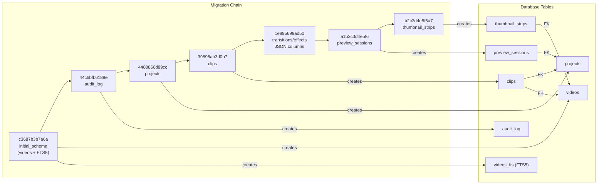

# C4 Code Level: Alembic Migration Versions

## Overview
- **Name**: Database Migration Scripts
- **Description**: Ordered Alembic migration scripts that define the SQLite schema evolution from initial creation through current state.
- **Location**: `alembic/versions/`
- **Language**: Python (Alembic migration scripts)
- **Purpose**: Provides reversible database schema migrations for the SQLite database, covering tables for videos, audit logs, projects, clips, transitions/effects, preview sessions, and thumbnail strips.
- **Parent Component**: [Data Access Layer](./c4-component-data-access.md)

## Code Elements

### Functions/Methods

Each migration file contains two standard functions:

#### `upgrade() -> None`
Applies the forward migration (creating tables, adding columns, creating indexes).

#### `downgrade() -> None`
Reverses the migration (dropping tables, recreating tables without added columns).

### Classes/Modules

#### Migration Chain (in order)

| # | Revision | File | Description |
|---|----------|------|-------------|
| 1 | `c3687b3b7a6a` | `c3687b3b7a6a_initial_schema.py` | Creates `videos` table, path index, FTS5 virtual table, and insert/delete/update triggers |
| 2 | `44c6bfb6188e` | `44c6bfb6188e_add_audit_log.py` | Creates `audit_log` table with entity index |
| 3 | `4488866d89cc` | `4488866d89cc_add_projects_table.py` | Creates `projects` table (name, output dimensions, fps) |
| 4 | `39896ab3d0b7` | `39896ab3d0b7_add_clips_table.py` | Creates `clips` table with FK to projects/videos, timeline indexes |
| 5 | `1e895699ad50` | `1e895699ad50_add_transitions_and_effects_json_columns.py` | Adds `transitions_json` column to projects, `effects_json` to clips |
| 6 | `a1b2c3d4e5f6` | `a1b2c3d4e5f6_add_preview_sessions.py` | Creates `preview_sessions` table for HLS session tracking |
| 7 | `b2c3d4e5f6a7` | `b2c3d4e5f6a7_add_thumbnail_strips.py` | Creates `thumbnail_strips` table for sprite sheet metadata |

#### Schema Details

**`videos` table:**
- `id TEXT PRIMARY KEY`, `path TEXT NOT NULL UNIQUE`, `filename TEXT`, `duration_frames INTEGER`, `frame_rate_numerator/denominator INTEGER`, `width/height INTEGER`, `video_codec TEXT`, `audio_codec TEXT`, `file_size INTEGER`, `thumbnail_path TEXT`, `created_at/updated_at TEXT`
- FTS5 virtual table `videos_fts` with triggers for insert/delete/update sync

**`audit_log` table:**
- `id TEXT PRIMARY KEY`, `timestamp TEXT`, `operation TEXT`, `entity_type TEXT`, `entity_id TEXT`, `changes_json TEXT`, `context TEXT`
- Index: `idx_audit_log_entity(entity_id, timestamp)`

**`projects` table:**
- `id TEXT PRIMARY KEY`, `name TEXT`, `output_width/height INTEGER` (default 1920x1080), `output_fps INTEGER` (default 30), `transitions_json TEXT`, `created_at/updated_at TEXT`

**`clips` table:**
- `id TEXT PRIMARY KEY`, `project_id TEXT` (FK -> projects), `source_video_id TEXT` (FK -> videos), `in_point/out_point/timeline_position INTEGER`, `effects_json TEXT`, `created_at/updated_at TEXT`
- Indexes: `idx_clips_project`, `idx_clips_timeline`

**`preview_sessions` table:**
- `id TEXT PRIMARY KEY`, `project_id TEXT` (FK -> projects), `status TEXT`, `manifest_path TEXT`, `segment_count INTEGER`, `quality_level TEXT`, `created_at/updated_at/expires_at TEXT`, `error_message TEXT`

**`thumbnail_strips` table:**
- `id TEXT PRIMARY KEY`, `video_id TEXT` (FK -> videos), `status TEXT`, `file_path TEXT`, `frame_count/frame_width/frame_height INTEGER`, `interval_seconds REAL`, `columns/rows INTEGER`, `created_at TEXT`

## Dependencies

### Internal Dependencies
None (migrations are standalone SQL operations).

### External Dependencies
| Package | Purpose |
|---------|---------|
| `alembic` | Migration framework (provides `op.execute()`) |
| `sqlalchemy` | Database engine (used by Alembic) |

## Relationships

