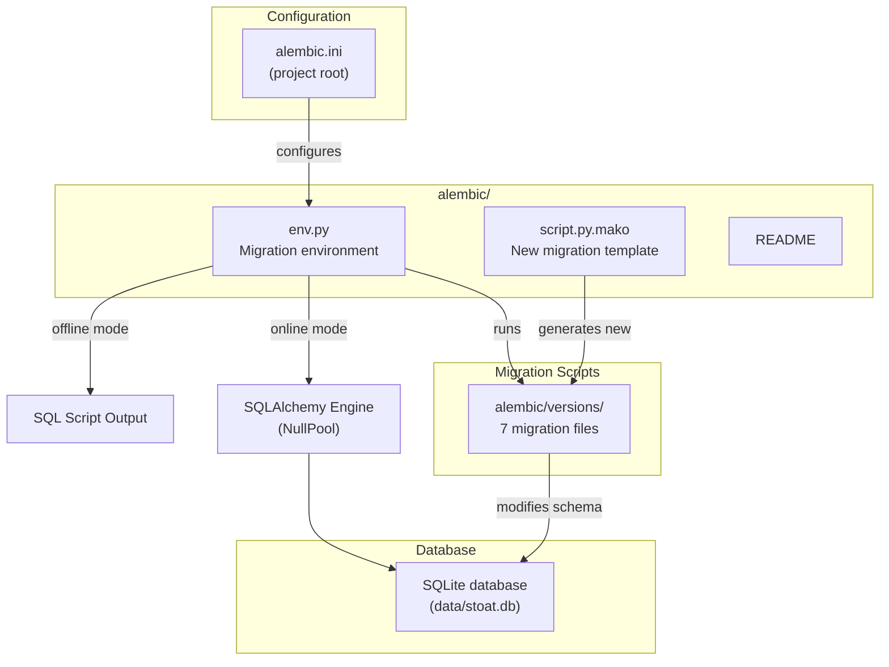

# C4 Code Level: Alembic Configuration

## Overview
- **Name**: Alembic Migration Configuration
- **Description**: Alembic environment configuration for running SQLite database migrations in online and offline modes.
- **Location**: `alembic/`
- **Language**: Python, Mako template
- **Purpose**: Configures the Alembic migration environment with SQLAlchemy engine setup, supports CLI URL overrides via `-x sqlalchemy.url=...`, and provides a Mako template for generating new migration scripts.
- **Parent Component**: [Data Access Layer](./c4-component-data-access.md)

## Code Elements

### Functions/Methods

#### `run_migrations_offline() -> None` (`env.py`)
```python
def run_migrations_offline() -> None
```
Runs migrations in offline mode using only a URL string. Configures the Alembic context with `literal_binds=True` for SQL script generation without requiring a live database connection.

#### `run_migrations_online() -> None` (`env.py`)
```python
def run_migrations_online() -> None
```
Runs migrations in online mode by creating a SQLAlchemy engine via `engine_from_config()` with `NullPool`. Establishes a connection and runs migrations within a transaction.

### Classes/Modules

#### `env.py`
Migration environment entry point. Key behaviors:
- Reads `alembic.ini` configuration via `context.config`
- Configures Python logging from the config file
- Supports `-x sqlalchemy.url=...` CLI override for dynamic database URLs
- Routes to `run_migrations_offline()` or `run_migrations_online()` based on `context.is_offline_mode()`
- Sets `target_metadata = None` (no autogenerate support)

#### `script.py.mako`
Mako template for new migration files. Generates:
- Module docstring with revision message, ID, and creation date
- Standard revision identifiers (`revision`, `down_revision`, `branch_labels`, `depends_on`)
- `upgrade()` and `downgrade()` function stubs

#### `README`
Single-line file: "Generic single-database configuration."

## Dependencies

### Internal Dependencies
| Module | Relationship |
|--------|-------------|
| `alembic/versions/` | Migration script directory managed by this configuration |

### External Dependencies
| Package | Purpose |
|---------|---------|
| `alembic` | Migration framework (`context`, `op`) |
| `sqlalchemy` | Database engine creation (`engine_from_config`, `pool.NullPool`) |
| `logging.config.fileConfig` | Logging setup from alembic.ini |

## Relationships



> **Fixture Origin:** The baseline SQLite schema is stored as an immutable fixture at `tests/fixtures/stoat.seed.db` and tracked in git. On application startup, if the runtime database is absent, the fixture is copied to `data/stoat.db` and Alembic migrations are applied to reach the current schema head.
