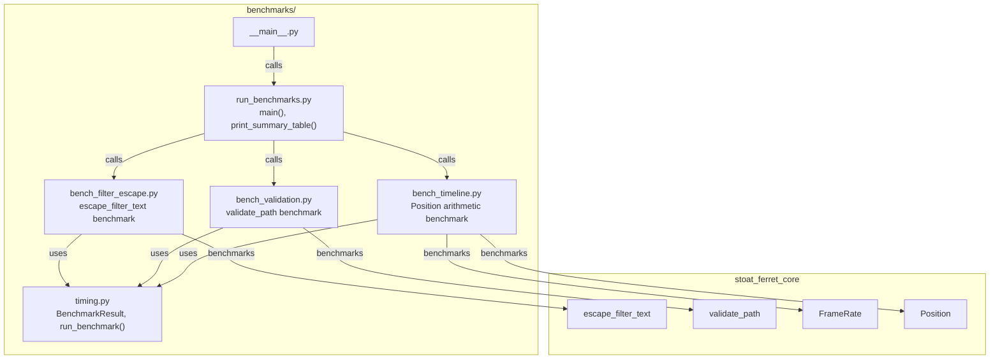

# C4 Code Level: Performance Benchmarks

## Overview
- **Name**: Rust vs Python Benchmarks
- **Description**: Performance benchmark suite comparing Rust (PyO3) implementations against pure Python equivalents.
- **Location**: `benchmarks/`
- **Language**: Python
- **Purpose**: Measures and reports speedup ratios of the Rust-backed functions (timeline arithmetic, filter text escaping, path validation) against functionally equivalent pure Python implementations, providing evidence for the hybrid Rust/Python architecture decision.
- **Parent Component**: [Application Services](./c4-component-application-services.md)

## Code Elements

### Functions/Methods

#### `run_benchmarks.py`

```python
def main() -> None
```
Entry point that runs all benchmark suites (timeline, filter escape, validation), prints individual results, and outputs a summary table.

```python
def print_summary_table(results: list[BenchmarkResult]) -> None
```
Prints a formatted summary table with benchmark name, speedup ratio, and winner (Rust/Python).

```python
def print_environment() -> None
```
Prints system environment info (Python version, platform, CPU, Rust health check) for reproducibility.

#### `timing.py`

```python
def time_function(func: object, iterations: int) -> list[float]
```
Times a function over 10 runs of `iterations` each, returning per-run elapsed times.

```python
def run_benchmark(
    name: str,
    rust_func: object,
    python_func: object,
    iterations: int = 1000,
    warmup: int = 100,
) -> BenchmarkResult
```
Runs a head-to-head benchmark with warmup phase, returning a `BenchmarkResult`.

```python
def format_time(seconds: float) -> str
```
Formats time with appropriate units (s, ms, us, ns).

```python
def print_result(result: BenchmarkResult) -> None
```
Prints formatted single benchmark result with mean, median, stdev, and speedup.

#### `bench_filter_escape.py`

```python
def py_escape_filter_text(text: str) -> str
```
Pure Python reference implementation of FFmpeg filter character escaping.

```python
def run_escape_benchmark() -> BenchmarkResult
```
Benchmarks `escape_filter_text` across 6 test strings with varying special character densities (0% to 50%).

```python
def run_all() -> list[BenchmarkResult]
```
Returns list of all filter escape benchmark results.

#### `bench_validation.py`

```python
def py_validate_path(path: str) -> None
```
Pure Python reference implementation of path validation (empty check, null byte check).

```python
def run_validate_path_benchmark() -> BenchmarkResult
```
Benchmarks `validate_path` across 8 valid paths of varying complexity.

```python
def run_all() -> list[BenchmarkResult]
```
Returns list of all validation benchmark results.

#### `bench_timeline.py`

```python
def py_from_seconds(seconds: float, numerator: int, denominator: int) -> int
```
Pure Python reference: `round(seconds * numerator / denominator)`.

```python
def py_to_seconds(frames: int, numerator: int, denominator: int) -> float
```
Pure Python reference: `frames * denominator / numerator`.

```python
def run_from_seconds_benchmark() -> BenchmarkResult
```
Benchmarks `Position.from_secs` across 7 time values and 3 frame rates (24, 29.97, 60 fps).

```python
def run_to_seconds_benchmark() -> BenchmarkResult
```
Benchmarks `Position.as_secs` across 6 frame counts and 2 frame rates.

```python
def run_all() -> list[BenchmarkResult]
```
Returns list of all timeline benchmark results.

### Classes/Modules

#### `BenchmarkResult` (`timing.py`)
```python
@dataclass
class BenchmarkResult:
    name: str
    rust_times: list[float]
    python_times: list[float]
    iterations: int
```
**Properties:** `rust_mean`, `python_mean`, `rust_median`, `python_median`, `rust_stdev`, `python_stdev`, `speedup_mean`, `speedup_median`

#### `__main__.py`
Entry point for `uv run python -m benchmarks`. Delegates to `run_benchmarks.main()`.

#### `__init__.py`
Package docstring: "Performance benchmarks comparing Rust (PyO3) vs pure Python implementations."

## Dependencies

### Internal Dependencies
| Module | Relationship |
|--------|-------------|
| `stoat_ferret_core.escape_filter_text` | Rust filter escaping function |
| `stoat_ferret_core.validate_path` | Rust path validation function |
| `stoat_ferret_core.FrameRate` | Rust frame rate type |
| `stoat_ferret_core.Position` | Rust timeline position type |
| `stoat_ferret_core.health_check` | Rust health check for environment info |

### External Dependencies
| Package | Purpose |
|---------|---------|
| `statistics` (stdlib) | Mean, median, stdev calculations |
| `time` (stdlib) | `perf_counter` for high-resolution timing |
| `platform` (stdlib) | System environment information |

## Relationships


