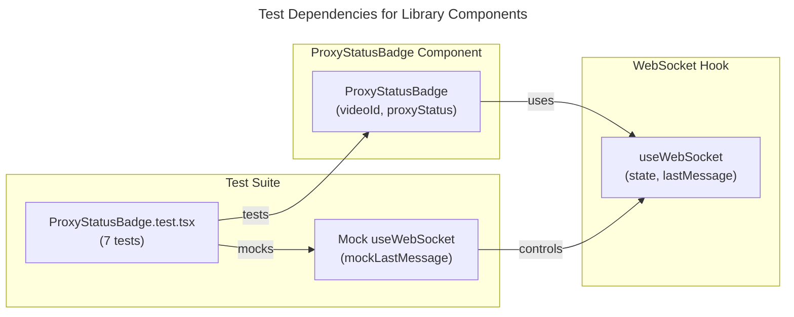

# C4 Code Level: GUI Library Components Tests

## Overview

- **Name**: ProxyStatusBadge Test Suite
- **Description**: Unit tests for the ProxyStatusBadge component that displays video proxy generation status with WebSocket event handling.
- **Location**: `gui/src/components/library/__tests__`
- **Language**: TypeScript/React (Vitest)
- **Purpose**: Verify ProxyStatusBadge renders correct status indicators and updates state via WebSocket events
- **Parent Component**: [Web GUI](./c4-component-web-gui.md)

## Code Elements

### Test Files

#### ProxyStatusBadge.test.tsx
- **Location**: `gui/src/components/library/__tests__/ProxyStatusBadge.test.tsx`
- **Total Tests**: 7

**Test Cases**:
1. `renders green badge for ready status` - Verifies green (bg-green-500) indicator for 'ready' status
2. `renders yellow badge for generating status` - Verifies yellow (bg-yellow-500) indicator for 'generating' status
3. `renders gray badge for none status` - Verifies gray (bg-gray-500) indicator for 'none' status
4. `defaults to none when no proxyStatus provided` - Confirms default 'none' status when prop omitted
5. `updates to ready on PROXY_READY WebSocket event` - Validates state update from WebSocket message type 'proxy.ready'
6. `ignores PROXY_READY events for other videos` - Ensures filtering by video_id in WebSocket payload
7. `is visible on the page` - Confirms element presence and testid='proxy-status-badge'

**Key Assertions**:
- DOM testid: `proxy-status-badge`
- Dataset attribute: `data-status` (tracks current status state)
- CSS class checks for Tailwind color classes (bg-green-500, bg-yellow-500, bg-gray-500)
- WebSocket event parsing and filtering by video_id

**Component Under Test**: `ProxyStatusBadge`
- Props: `videoId: string`, `proxyStatus?: 'ready' | 'generating' | 'none'`
- Listens to WebSocket messages of type 'proxy.ready'

## Dependencies

### Internal Dependencies
- `../ProxyStatusBadge` - Component being tested
- `../../../hooks/useWebSocket` - Mocked hook providing WebSocket connection state and message events
- `@testing-library/react` - Testing utilities (render, screen, waitFor)
- `vitest` - Test runner and assertions

### External Dependencies
- `@testing-library/react` - React component testing library
- `vitest` - Vitest test framework and mocking utilities
- React DOM rendering

## Test Summary

- **Total Test Count**: 7 tests in 1 file
- **Test File Inventory**:
  - `ProxyStatusBadge.test.tsx` (1 describe block, 7 it blocks)
- **Coverage Focus**:
  - Status rendering (3 status types + default)
  - WebSocket event handling and filtering
  - Component visibility and testid consistency

## Relationships

## Notes

- Test uses beforeEach to reset mockLastMessage state between tests
- WebSocket mock returns static state: 'connected'
- MessageEvent JSON payloads match backend schema: `{ type: 'proxy.ready', payload: { video_id, quality } }`
- Component filters WebSocket events by comparing video_id from payload against passed props
