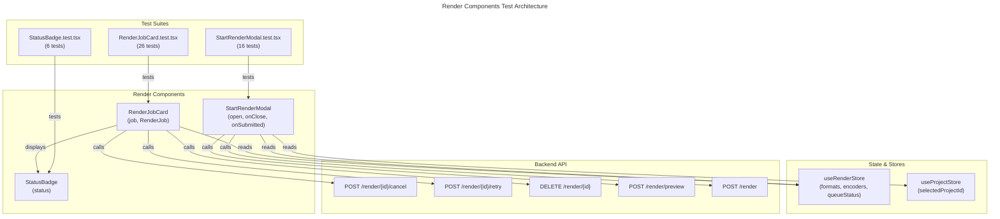

# C4 Code Level: GUI Render Components Tests

## Overview

- **Name**: Render System Test Suite
- **Description**: Comprehensive unit tests for render job management components (job card, status badge, start modal) handling job lifecycle, UI state, and API interactions.
- **Location**: `gui/src/components/render/__tests__`
- **Language**: TypeScript/React (Vitest)
- **Purpose**: Verify render job card displays progress/ETA/speed, status badge shows job states, and modal handles form submission with validation
- **Parent Component**: [Web GUI](./c4-component-web-gui.md)

## Code Elements

### Test Files

#### StatusBadge.test.tsx
- **Location**: `gui/src/components/render/__tests__/StatusBadge.test.tsx`
- **Total Tests**: 6

**Test Cases**:
1. `renders blue dot for "queued"` - Status 'queued' shows blue (bg-blue-500) with label 'Queued'
2. `renders yellow dot for "running"` with label 'Rendering' - Status 'running' shows yellow (bg-yellow-500)
3. `renders green dot for "completed"` - Status 'completed' shows green (bg-green-500)
4. `renders red dot for "failed"` - Status 'failed' shows red (bg-red-500)
5. `renders gray dot for "cancelled"` - Status 'cancelled' shows gray (bg-gray-500)
6. `renders gray fallback for unknown status` - Unknown status defaults to gray with status text as label

**Key Assertions**:
- DOM testids: `status-badge-dot`, `status-badge-label`
- Tailwind color classes mapped to status values
- Label text (e.g., 'Queued', 'Rendering', 'Completed', 'Failed', 'Cancelled')

**Component Under Test**: `StatusBadge`
- Props: `status: 'queued' | 'running' | 'completed' | 'failed' | 'cancelled' | string`

#### RenderJobCard.test.tsx
- **Location**: `gui/src/components/render/__tests__/RenderJobCard.test.tsx`
- **Total Tests**: 26

**Test Cases**:
1. `renders progress bar width matching job.progress * 100%` - Progress bar width = progress * 100
2. `clamps progress bar at 100%` - Progress capped at 100% even if input > 1.0
3. `shows formatted ETA when eta_seconds is present` - ETA "2m 5s" format for 125 seconds
4. `shows ETA in seconds when under 60` - ETA "45s" format for < 60 seconds
5. `hides ETA when eta_seconds is null` - No ETA text when eta_seconds null
6. `shows speed ratio as "N.Nx real-time"` - Speed "2.3x real-time" format
7. `hides speed ratio when speed_ratio is null` - No speed text when speed_ratio null
8. `shows StatusBadge with correct status` - StatusBadge receives and displays job status
9. `enables cancel button for queued status` - Cancel enabled for 'queued'
10. `enables cancel button for running status` - Cancel enabled for 'running'
11. `disables cancel button for completed status` - Cancel disabled for 'completed'
12. `disables cancel button for failed status` - Cancel disabled for 'failed'
13. `disables cancel button for cancelled status` - Cancel disabled for 'cancelled'
14. `enables retry button for failed status` - Retry enabled for 'failed'
15. `disables retry button for running status` - Retry disabled for 'running'
16. `disables retry button for completed status` - Retry disabled for 'completed'
17. `shows error and disables retry on 409 response` - 409 shows error detail, disables retry
18. `delete button is always enabled` - Delete always clickable
19. `cancel button calls POST /render/{id}/cancel` - Fetch POST to /api/v1/render/{id}/cancel
20. `retry button calls POST /render/{id}/retry` - Fetch POST to /api/v1/render/{id}/retry
21. `delete button calls DELETE /render/{id} after confirmation` - Fetch DELETE with window.confirm
22. `delete button does not call API when confirmation denied` - No API call if confirm() returns false
23. `renders with correct data-testid` - Element with testid='render-job-card-{id}'
24. Progress bar tests (sub-suite)
25. ETA display tests (sub-suite)
26. Speed ratio tests (sub-suite)

**Key Assertions**:
- DOM testids: `progress-bar-fill`, `eta-text`, `speed-text`, `status-badge-label`, `cancel-btn`, `retry-btn`, `delete-btn`, `retry-error`, `render-job-card-{id}`
- Fetch API call verification with mock spy
- Button disabled state checks
- Window.confirm integration for delete confirmation

**Component Under Test**: `RenderJobCard`
- Props: `job: RenderJob` (id, status, progress, eta_seconds, speed_ratio, error_message, etc.)
- API Endpoints: POST /render/{id}/cancel, POST /render/{id}/retry, DELETE /render/{id}
- Store Dependency: `useRenderStore` (state reset in beforeEach)

#### StartRenderModal.test.tsx
- **Location**: `gui/src/components/render/__tests__/StartRenderModal.test.tsx`
- **Total Tests**: 16

**Test Cases**:
1. `populates format selector with all formats` - Select populated with OutputFormat options
2. `selecting format updates quality preset options` - Format change cascades to quality presets
3. `auto-selects best available encoder (hardware preferred)` - Hardware encoders preferred (h264_nvenc)
4. `renders disk space bar from queueStatus` - Disk usage bar from queue_status data
5. `shows disk space warning when usage >= 90%` - Warning when 90% disk used
6. `calls POST /render/preview for command preview` - Preview endpoint with debounce (300ms)
7. `shows inline validation error for missing required fields` - Error message for required fields
8. `clears validation errors on field change` - Errors cleared when user modifies field
9. `submit calls POST /render with correct payload` - Submit with project_id, output_format, quality_preset
10. `closes modal on successful submission` - onClose and onSubmitted callbacks invoked
11. `shows server error on 422/500 response` - Server error detail displayed
12. `returns null when open is false` - Modal hidden when open=false prop
13. Format selector cascade test (sub-suite)
14. Encoder selection test (sub-suite)
15. Disk space bar test (sub-suite)
16. Validation and submission test (sub-suite)

**Key Assertions**:
- DOM testids: `select-format`, `select-quality`, `select-encoder`, `disk-space-bar`, `disk-space-fill`, `disk-space-text`, `disk-space-warning`, `btn-start-render`, `error-{fieldName}`, `submit-error`
- Fetch API calls to /api/v1/render/preview and /api/v1/render
- Form field validation and error clearing
- Store state mutations (useRenderStore, useProjectStore)

**Component Under Test**: `StartRenderModal`
- Props: `open: boolean`, `onClose: () => void`, `onSubmitted: () => void`
- API Endpoints: POST /render/preview, POST /render
- Store Dependencies: `useRenderStore` (formats, encoders, queueStatus), `useProjectStore` (selectedProjectId)

## Dependencies

### Internal Dependencies
- `../StatusBadge` - Component for status display
- `../RenderJobCard` - Component for job display
- `../StartRenderModal` - Modal component for render submission
- `../../../stores/renderStore` - State management (RenderJob, OutputFormat, Encoder, QueueStatus types)
- `../../../stores/projectStore` - Project selection state
- `@testing-library/react` - Testing utilities (render, screen, fireEvent, waitFor)
- `vitest` - Test runner, mocking, and assertions

### External Dependencies
- `@testing-library/react` - React component testing library
- `vitest` - Vitest test framework
- React DOM rendering
- Fetch API (mocked in tests)
- Window.confirm (mocked in tests)

## Test Summary

- **Total Test Count**: 48 tests across 3 files
- **Test File Inventory**:
  - `StatusBadge.test.tsx` (1 describe, 6 it blocks)
  - `RenderJobCard.test.tsx` (1 describe, 26 it blocks)
  - `StartRenderModal.test.tsx` (1 describe, 16 it blocks)
- **Coverage Focus**:
  - Status visualization across all states
  - Progress bar rendering and clamping
  - ETA and speed display formatting
  - Button enable/disable logic based on job status
  - API endpoint integration (cancel, retry, delete, preview, submit)
  - Form field validation and cascading selectors
  - Disk space warning threshold (90%)
  - WebSocket-less state management for job operations

## Relationships

## Notes

- RenderJobCard uses helper function `makeJob()` to create test fixtures with sensible defaults
- StartRenderModal tests establish initial state via `setupStore()` helper function
- Fetch responses mocked globally in beforeEach with default 200 status
- Component error handling tested for 409 (retry limit), 422/500 (validation/server errors)
- Modal returns null (empty container) when open=false, avoiding DOM pollution
