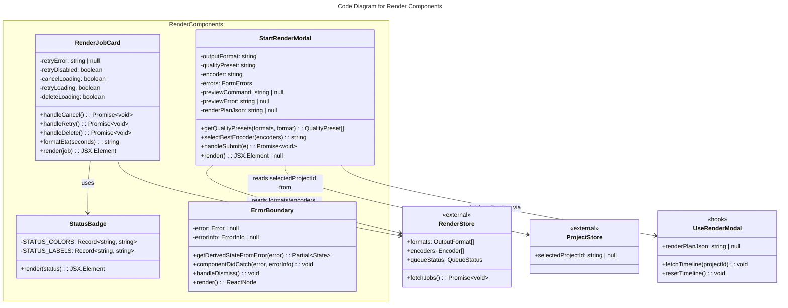

# C4 Code Level: GUI Render Components

## Overview

- **Name**: Render Components
- **Description**: UI components for managing render jobs and initiating video renders with format/quality/encoder selection
- **Location**: `gui/src/components/render`
- **Language**: TypeScript/React
- **Purpose**: Provides render queue management (status badges, progress tracking, job actions) and modal form for submitting new render jobs
- **Parent Component**: [Web GUI](./c4-component-web-gui.md)

## Code Elements

### Components

#### StatusBadge
- **Description**: Displays a color-coded dot and label indicating render job status. Maps job states (queued, running, completed, failed, cancelled) to visual indicators and text labels.
- **Location**: `gui/src/components/render/StatusBadge.tsx:30-43`
- **Props Interface**:
  ```typescript
  interface StatusBadgeProps {
    status: string  // Job status string (queued, running, completed, failed, cancelled)
  }
  ```
- **Key Behaviors**:
  - Looks up color and label from constants; falls back to gray dot and status string if unmapped
  - Renders inline flex container with colored dot (2.5x2.5 units) and text label
  - No state management; purely presentational
- **Dependencies**: None (no hooks)

#### RenderJobCard
- **Description**: Displays a single render job with progress bar, ETA, speed ratio, status badge, and action buttons (cancel, retry, delete). Manages local retry error state and API interactions.
- **Location**: `gui/src/components/render/RenderJobCard.tsx:21-120`
- **Props Interface**:
  ```typescript
  interface RenderJobCardProps {
    job: RenderJob  // Render job object from renderStore
  }
  ```
- **State Management**:
  - `retryError: string | null` — Error message from failed retry attempt
  - `retryDisabled: boolean` — Tracks if retry was permanently disabled (e.g., retry limit reached)
  - `cancelLoading: boolean` — True while cancel API request is in-flight; disables cancel button
  - `retryLoading: boolean` — True while retry API request is in-flight; disables retry button
  - `deleteLoading: boolean` — True while delete API request is in-flight; disables delete button
- **Key Behaviors**:
  - Renders progress bar with percentage (clamped 0-100%)
  - Shows ETA and speed ratio if available (eta_seconds, speed_ratio not null)
  - Button availability: Cancel (queued/running), Retry (failed + not disabled), Delete (always)
  - On cancel/retry/delete, calls API endpoints and refetches jobs via renderStore
  - Displays retry error message if 409 Conflict (retry limit reached)
- **API Interactions**:
  - POST `/api/v1/render/{job.id}/cancel` — Cancel running/queued job
  - POST `/api/v1/render/{job.id}/retry` — Retry failed job
  - DELETE `/api/v1/render/{job.id}` — Delete job
- **Dependencies**: `StatusBadge` component, `useRenderStore` hook, `useState`

#### StartRenderModal
- **Description**: Modal form for creating a new render job. Provides dropdowns for output format, quality preset, and encoder selection with live FFmpeg command preview. Validates form, handles submission, and shows disk space warnings.
- **Location**: `gui/src/components/render/StartRenderModal.tsx:35-345`
- **Props Interface**:
  ```typescript
  interface StartRenderModalProps {
    open: boolean        // Controls modal visibility
    onClose: () => void  // Callback when user closes modal
    onSubmitted: () => void  // Callback when render job submitted successfully
  }
  ```
- **State Management**:
  - `outputFormat: string` — Selected output format (e.g., 'mp4')
  - `qualityPreset: string` — Selected quality preset (e.g., 'high')
  - `encoder: string` — Selected encoder name
  - `errors: FormErrors` — Validation errors for format and quality fields
  - `submitting: boolean` — Loading state during form submission
  - `submitError: string | null` — Error message from failed submission (always a string, never an object)
  - `previewCommand: string | null` — FFmpeg command preview
  - `previewError: string | null` — Error message from 422 preview response (e.g., incompatible format-encoder)
  - `debouncedFormat, debouncedQuality, debouncedEncoder` — Debounced values for preview
  - `renderPlanJson: string | null` — JSON string `{"total_duration": <duration>}` from `useRenderModal`; null if timeline not loaded or empty
- **Key Behaviors**:
  - Auto-selects first format on mount if formats available
  - Resets quality preset when format changes
  - Auto-selects best encoder (hardware preferred, then alphabetical)
  - Debounces preview request (300ms) to avoid excessive API calls
  - Validates that format and quality are selected before submission
  - Calculates disk usage percentage and shows red warning if >= 90%
  - On project change, calls `fetchTimeline(selectedProjectId)` to populate `renderPlanJson`
  - Form submission POST to `/api/v1/render` with `project_id`, `output_format`, `quality_preset`, `render_plan: renderPlanJson ?? '{}'`
  - Error extraction: if `body.detail` is a string, uses it directly; if it is an object, extracts `detail.message` (type-safe optional chaining at lines 272–278); falls back to `String(rawDetail)`. Result is always a string stored in `submitError`.
- **Form Fields**:
  - Output Format dropdown (populated from renderStore.formats)
  - Quality Preset dropdown (filtered by selected format)
  - Encoder dropdown (populated from renderStore.encoders)
  - Disk Space progress bar (shows usage percentage)
  - FFmpeg Command Preview (read-only code block, only shown if preview available)
- **API Interactions**:
  - GET `/api/v1/projects/{projectId}/timeline` — via `useRenderModal.fetchTimeline()` on project change
  - POST `/api/v1/render/preview` — Get FFmpeg command for given settings
  - POST `/api/v1/render` — Submit new render job with `render_plan` JSON string
- **Dependencies**: `useRenderStore`, `useProjectStore`, `useRenderModal` hook, `useDebounce` hook, `useState`, `useEffect`, `useCallback`

#### ErrorBoundary
- **Description**: React class component that catches unhandled errors thrown in its subtree and renders a visible fallback instead of a blank white screen. Wraps `RenderPage` content to isolate render-workflow errors from the rest of the application. Provides a "Go Back" dismiss button that resets boundary state and re-renders children.
- **Location**: `gui/src/components/ErrorBoundary.tsx:13`
- **Props Interface**:
  ```typescript
  interface Props {
    children: ReactNode
  }
  ```
- **State**:
  - `error: Error | null` — caught error; non-null triggers fallback UI
  - `errorInfo: ErrorInfo | null` — React component stack trace
- **Key Behaviors**:
  - `getDerivedStateFromError(error)` — sets `error` state to trigger fallback render
  - `componentDidCatch(error, errorInfo)` — sets both `error` and `errorInfo` state
  - `handleDismiss` — resets state to `{error: null, errorInfo: null}`, causing children to re-render; if child still throws, boundary catches again immediately
  - Fallback UI: `role="alert"` div with `data-testid="error-boundary-fallback"`, truncated error message (200 chars max) at `data-testid="error-boundary-message"`, and dismiss button at `data-testid="error-boundary-dismiss"` labeled "Go Back"
- **Usage**: Wraps the `RenderPage` main content (`<ErrorBoundary>` at line 161 of RenderPage.tsx). See `c4-code-gui-pages.md` RenderPage entry.
- **Dependencies**: `react.Component`, `react.ErrorInfo`, `react.ReactNode`
- **Tests**: 6 tests in `gui/src/components/__tests__/ErrorBoundary.test.tsx` (catch + fallback render, truncation, dismiss, recovery, "Go Back" button label)

### Utility Functions

#### formatEta (RenderJobCard)
- **Signature**: `formatEta(seconds: number): string`
- **Location**: `gui/src/components/render/RenderJobCard.tsx:10-15`
- **Description**: Converts ETA seconds to human-readable format (e.g., 150 → "2m 30s")
- **Returns**: Formatted string with minutes and seconds

#### getQualityPresets
- **Signature**: `getQualityPresets(formats: OutputFormat[], selectedFormat: string): { preset: string; video_bitrate_kbps: number }[]`
- **Location**: `gui/src/components/render/StartRenderModal.tsx:18-25`
- **Description**: Extracts quality presets for selected format by finding first matching codec
- **Returns**: Array of quality preset objects with preset name and bitrate

#### selectBestEncoder
- **Signature**: `selectBestEncoder(encoders: Encoder[]): string`
- **Location**: `gui/src/components/render/StartRenderModal.tsx:28-33`
- **Description**: Picks best encoder: hardware encoders preferred over software, alphabetically sorted
- **Returns**: Encoder name string; empty string if no encoders available

### Types/Interfaces

#### RenderJob
- **Source**: `gui/src/stores/renderStore`
- **Used in**: RenderJobCard props
- **Fields**: `id`, `status`, `progress` (0-1), `eta_seconds`, `speed_ratio`

#### OutputFormat
- **Source**: `gui/src/stores/renderStore`
- **Fields**: `format`, `extension`, `codecs[]`

#### Encoder
- **Source**: `gui/src/stores/renderStore`
- **Fields**: `name`, `is_hardware` (boolean)

#### FormErrors
- **Location**: `gui/src/components/render/StartRenderModal.tsx:12-15`
- **Fields**: `output_format?: string`, `quality_preset?: string`

## Dependencies

### Internal Dependencies
- `StatusBadge` component — Used by RenderJobCard for status display
- `useRenderStore` hook — Provides formats, encoders, queueStatus, fetchJobs
- `useProjectStore` hook — Provides selectedProjectId
- `useDebounce` hook — Debounces format/quality/encoder for preview
- `useRenderModal` hook — Fetches timeline and derives renderPlanJson for POST body (v068 Feature 003)

### External Dependencies
- React 18+ (`useState`, `useEffect`, `useCallback`)
- Tailwind CSS (for styling)
- Fetch API (for HTTP requests)

## Relationships



## Notes

- StatusBadge is a simple presentational component with no logic
- RenderJobCard uses local state for retry error but delegates job state to renderStore
- StartRenderModal is a complex form with multiple interdependent fields and debounced API calls
- Form validation is client-side only; server validates project_id, format, preset, encoder availability
- Disk space warning (>= 90% used) is calculated from queueStatus.disk_total_bytes and disk_available_bytes
- Preview command is optional; some format/encoder/quality combinations may not generate one
- `previewError` replaces `previewCommand` in the preview area when the backend returns 422 (e.g., `INCOMPATIBLE_FORMAT_ENCODER`); cleared on successful preview response
- `render.py` `_FORMAT_DATA` now includes `av1` codec in `mkv` (added v035); `libaom-av1 + mkv` is a valid combination and returns 200 from `render_preview`
- **v067 (BL-371)**: StartRenderModal now uses `useRenderModal` hook to fetch project timeline and construct `render_plan: {"total_duration": <duration>}`. Without a valid render_plan, noop-mode renders return 422 PREFLIGHT_FAILED.
- **v067/v068 (BL-372)**: `submitError` is always stored as `string | null`. Structured `detail` objects from 4xx responses are converted: `detail.message` is extracted (type-safe at lines 272–278 of StartRenderModal.tsx). This prevents the React "Objects are not valid as a React child" invariant violation.
- **v068 (BL-372)**: `ErrorBoundary` wraps `RenderPage` content to prevent white-screen unmounts on unexpected thrown errors. Located at `gui/src/components/ErrorBoundary.tsx` (not under `render/`). See `c4-code-gui-pages.md` for wrapping context.
