# C4 Code Level: GUI Component Tests

## Overview
- **Name**: GUI Component Tests
- **Description**: Vitest test suites validating all React UI components in the stoat-and-ferret GUI
- **Location**: `gui/src/components/__tests__/`
- **Language**: TypeScript (TSX)
- **Purpose**: Unit tests for 24 React components covering rendering, user interactions, API calls, state management, and accessibility
- **Parent Component**: [Web GUI](./c4-component-web-gui.md)

## Code Elements

### Test Suites

#### `Shell.test.tsx` (2 tests)
- "renders header, main, and footer sections" -- verifies navigation, health-indicator, status-bar test IDs
- "displays WebSocket status in status bar" -- verifies status-bar presence
- **Setup**: MockWebSocket class stub, mocked fetch returning health OK
- **Dependencies**: `Shell`, `MemoryRouter`

#### `Navigation.test.tsx` (4 tests)
- "renders tabs when backend endpoints are available" -- mocked fetch 200, checks nav-tab-* presence
- "hides tabs when backend endpoints are unavailable" -- mocked fetch rejects, checks tabs absent
- "shows only available tabs when some endpoints fail" -- partial availability mock
- "shows tabs when endpoint returns 405" -- treats Method Not Allowed as available
- **Setup**: `MemoryRouter` wrapper, mocked fetch
- **Dependencies**: `Navigation`, `MemoryRouter`

#### `StatusBar.test.tsx` (3 tests)
- Tests for connected, disconnected, and reconnecting states
- Pure rendering tests (no mocks needed)
- **Dependencies**: `StatusBar`

#### `HealthIndicator.test.tsx` (3 tests)
- "shows green when all checks pass" -- mocked health OK response, checks data-status="healthy"
- "shows yellow when status is degraded" -- mocked 503 degraded, checks data-status="degraded"
- "shows red when fetch fails" -- mocked network error, checks data-status="unhealthy"
- **Dependencies**: `HealthIndicator`

#### `HealthCards.test.tsx` (4 tests)
- "renders green cards when all checks pass" -- Python API, FFmpeg, Rust Core all ok
- "renders red card for failed component" -- ffmpeg error state
- "renders red Rust Core card when overall status is unhealthy"
- "renders unknown status when check is missing"
- **Dependencies**: `HealthCards`, `HealthState` type

#### `MetricsCards.test.tsx` (3 tests)
- "displays request count" -- verifies count rendering
- "displays average response time" -- verifies millisecond formatting (12.6 ms)
- "shows placeholder when no duration data" -- displays "--"
- **Dependencies**: `MetricsCards`, `Metrics` type

#### `ActivityLog.test.tsx` (5 tests)
- "shows empty state when no events"
- "appends WebSocket events as entries" -- verifies parsed type display
- "shows event details when payload is non-empty"
- "enforces 50 entry limit with FIFO eviction" -- pre-populates store with 50 entries
- "ignores non-JSON messages"
- **Setup**: Resets `useActivityStore` state, `makeMessage()` helper
- **Dependencies**: `ActivityLog`, `useActivityStore`

#### `ScanModal.test.tsx` (11 tests)
- "does not render when closed"
- "renders when open with directory input and submit button"
- "submit button is disabled when directory is empty"
- "triggers scan API call on submit" -- verifies POST /videos/scan and job polling
- "shows abort button during active scan" -- verifies scan-abort test ID
- "abort button calls cancel endpoint" -- verifies POST /api/v1/jobs/{id}/cancel
- "shows cancelled state when scan is cancelled" -- verifies scan-cancelled message
- "renders browse button when open" -- verifies scan-browse-button
- "opens DirectoryBrowser when browse button clicked" -- verifies directory-browser-overlay
- "populates path input when directory is selected from browser" -- integration with DirectoryBrowser
- "shows error when scan request fails"
- **Setup**: Mocked fetch with URL-based routing for scan/job/filesystem endpoints
- **Dependencies**: `ScanModal`, `DirectoryBrowser`

#### `DirectoryBrowser.test.tsx` (7 tests)
- "renders loading state initially"
- "renders directory list after loading" -- verifies directory-browser-entry count and names
- "renders empty state when directory has no subdirectories" -- "No subdirectories" message
- "calls onSelect with current path when Select button clicked"
- "navigates into subdirectory on click, triggering new fetch" -- verifies path update and re-fetch
- "calls onCancel when Cancel button clicked"
- "shows error state on fetch failure" -- 403 with structured error message
- **Setup**: Mocked fetch for `/api/v1/filesystem/directories`
- **Dependencies**: `DirectoryBrowser`

#### `SearchBar.test.tsx` (3 tests)
- "renders with placeholder text"
- "displays the current value"
- "calls onChange when typing"
- **Dependencies**: `SearchBar`

#### `SortControls.test.tsx` (4 tests)
- "renders sort field dropdown with options" -- 3 options (date/name/duration)
- "calls onSortFieldChange when selecting a field"
- "toggles sort order when clicking order button" -- desc to asc
- "toggles from asc to desc"
- **Dependencies**: `SortControls`

#### `VideoGrid.test.tsx` (4 tests)
- "renders video cards with thumbnails, filenames, and durations" -- verifies M:SS formatting
- "shows loading state"
- "shows error state"
- "shows empty state when no videos"
- **Setup**: `makeVideo()` factory helper creating Video objects
- **Dependencies**: `VideoGrid`, `Video` type

#### `CreateProjectModal.test.tsx` (6 tests)
- "does not render when closed"
- "renders form fields when open" -- name, resolution, fps, create/cancel buttons
- "shows error when name is empty" -- validation
- "shows error for invalid resolution" -- format validation
- "shows error for invalid fps" -- range validation (1-120)
- "submits valid form and calls API" -- verifies POST /api/v1/projects
- "clears errors when valid input is entered"
- **Dependencies**: `CreateProjectModal`

#### `DeleteConfirmation.test.tsx` (5 tests)
- "does not render when closed"
- "shows project name in confirmation dialog"
- "calls onClose when cancel is clicked"
- "calls delete API and onDeleted when confirmed" -- verifies DELETE /api/v1/projects/{id}
- "shows error when delete fails"
- **Dependencies**: `DeleteConfirmation`

#### `ProjectDetails.test.tsx` (8 tests)
- "displays project name and metadata" -- resolution + fps
- "displays clip list with timeline positions" -- timecode formatting at 30fps
- "shows empty state when no clips"
- "shows error when clip fetch fails"
- "renders Add Clip button"
- "renders Edit and Delete buttons per clip row" -- btn-edit-clip-{id}, btn-delete-clip-{id}
- "delete button triggers confirmation dialog" -- delete-clip-confirmation
- "Add Clip button opens clip form modal" -- opens ClipFormModal
- **Setup**: mockProject + mockClips fixtures, resets `useClipStore`
- **Dependencies**: `ProjectDetails`, `Project` type, `useClipStore`

#### `ProjectList.test.tsx` (4 tests)
- "shows loading state"
- "shows error state"
- "shows empty state"
- "renders project cards with name, date, and clip count"
- **Setup**: mockProjects + clipCounts fixtures
- **Dependencies**: `ProjectList`, `Project` type

#### `ClipFormModal.test.tsx` (5 tests)
- "renders empty form for Add mode" -- source video select, in/out/timeline inputs
- "renders pre-populated form for Edit mode" -- no source video select, values pre-filled
- "validates required fields before submission" -- clip-form-error
- "displays backend validation errors" -- 422 response error display
- "disables submit button during submission" -- "Saving..." text, disabled state
- **Setup**: mockVideos + mockClip fixtures, mocked fetch, resets `useClipStore`
- **Dependencies**: `ClipFormModal`, `useClipStore`, `Clip` type

#### `EffectCatalog.test.tsx` (10 tests)
- "shows loading state"
- "shows error state with retry button" -- verifies refetch callback
- "renders effect cards with name, description, and category" -- category badges
- "toggles between grid and list view"
- "filters effects by search query" -- volume search hides others
- "filters effects by category" -- audio category
- "shows empty message when no effects match"
- "shows AI hint tooltip via title attribute"
- "selects an effect on click" -- verifies store update
- "combines search and category filter"
- **Setup**: Mocked `useEffects` hook, reset `useEffectCatalogStore`
- **Dependencies**: `EffectCatalog`, `useEffects`, `useEffectCatalogStore`, `Effect` type

#### `EffectParameterForm.test.tsx` (14 tests in 2 describe blocks)
- **EffectParameterForm** (12 tests):
  - "renders nothing when no schema is set"
  - "renders a text input for string type"
  - "renders a number input for number type"
  - "renders range slider when number has min/max"
  - "renders a dropdown for string with enum" -- "Select..." placeholder + options
  - "renders a checkbox for boolean type"
  - "renders a color picker for format: 'color'"
  - "pre-populates default values from schema"
  - "displays validation errors inline"
  - "clears validation errors when schema is reset"
  - "onChange updates store parameter value" -- verifies isDirty
  - "number onChange updates store with numeric value"
  - "boolean onChange updates store"
  - "renders fields in schema property order"
- **effectFormStore** (3 tests):
  - "initializes parameters from schema defaults"
  - "stores and retrieves validation errors"
  - "resetForm clears all state"
- **Setup**: `renderWithSchema()` helper, reset `useEffectFormStore`
- **Dependencies**: `EffectParameterForm`, `useEffectFormStore`, `ParameterSchema`

#### `FilterPreview.test.tsx` (5 + 4 tests in 2 describe blocks)
- **FilterPreview** (5 tests):
  - "renders nothing when no filter string, not loading, and no error"
  - "renders filter string in monospace pre element"
  - "shows loading indicator when isLoading is true"
  - "shows error state when error is set"
  - "copies filter string to clipboard on button click"
  - "shows 'Copied!' feedback after copy" -- fake timers
- **highlightFilter** (4 tests):
  - "highlights filter names in the string"
  - "highlights pad labels in the string" -- `[0:v]`, `[out]`
  - "handles string with both filter names and pad labels"
  - "returns plain text when no patterns match"
- **Setup**: Reset `useEffectPreviewStore`, mock clipboard API
- **Dependencies**: `FilterPreview`, `highlightFilter`, `useEffectPreviewStore`

#### `ClipSelector.test.tsx` (4 tests)
- "renders clips with name and timeline position" -- verifies source_video_id display
- "calls onSelect when a clip is clicked"
- "highlights selected clip" -- checks border-blue-500 class
- "shows empty message when no clips"
- **Setup**: mockClips fixture
- **Dependencies**: `ClipSelector`, `Clip` type

#### `EffectStack.test.tsx` (7 tests)
- "renders ordered list of effects" -- effect types and filter strings
- "shows empty message when no effects"
- "shows loading state"
- "edit button calls onEdit with index and effect"
- "remove button shows confirmation dialog" -- two-step deletion
- "cancel on confirmation dialog hides it"
- "displays key parameters in summary" -- up to 3 params
- **Setup**: mockEffects fixture
- **Dependencies**: `EffectStack`, `AppliedEffect` type

## Dependencies

### Internal Dependencies
- All 24 components from `gui/src/components/`
- Zustand stores: `activityStore`, `effectCatalogStore`, `effectFormStore`, `effectPreviewStore`, `effectStackStore`, `clipStore`
- Hooks: `useEffects` (mocked in EffectCatalog tests)
- Types: `HealthState`, `Metrics`, `Video`, `Project`, `Clip`, `Effect`, `AppliedEffect`, `ParameterSchema`

### External Dependencies
- `vitest` (describe, it, expect, vi, beforeEach, afterEach)
- `@testing-library/react` (render, screen, fireEvent, waitFor)
- `react-router-dom` (MemoryRouter for routing tests)

## Test Coverage Summary

| Test File | Tests | Component(s) Tested |
|-----------|-------|---------------------|
| Shell.test.tsx | 2 | Shell |
| Navigation.test.tsx | 4 | Navigation |
| StatusBar.test.tsx | 3 | StatusBar |
| HealthIndicator.test.tsx | 3 | HealthIndicator |
| HealthCards.test.tsx | 4 | HealthCards |
| MetricsCards.test.tsx | 3 | MetricsCards |
| ActivityLog.test.tsx | 5 | ActivityLog |
| ScanModal.test.tsx | 11 | ScanModal + DirectoryBrowser integration |
| DirectoryBrowser.test.tsx | 7 | DirectoryBrowser |
| SearchBar.test.tsx | 3 | SearchBar |
| SortControls.test.tsx | 4 | SortControls |
| VideoGrid.test.tsx | 4 | VideoGrid |
| CreateProjectModal.test.tsx | 6 | CreateProjectModal |
| DeleteConfirmation.test.tsx | 5 | DeleteConfirmation |
| ProjectDetails.test.tsx | 8 | ProjectDetails + ClipFormModal integration |
| ProjectList.test.tsx | 4 | ProjectList |
| ClipFormModal.test.tsx | 5 | ClipFormModal + clipStore |
| EffectCatalog.test.tsx | 10 | EffectCatalog |
| EffectParameterForm.test.tsx | 14 | EffectParameterForm + effectFormStore |
| FilterPreview.test.tsx | 9 | FilterPreview + highlightFilter |
| ClipSelector.test.tsx | 4 | ClipSelector |
| EffectStack.test.tsx | 7 | EffectStack |
| **Total** | **129** | **24 components + 3 stores/functions** |

## Relationships

```mermaid
flowchart TD
    subgraph Layout["Layout Tests"]
        ST["Shell.test.tsx (2)"]
        NT["Navigation.test.tsx (4)"]
        SBT["StatusBar.test.tsx (3)"]
    end

    subgraph Dashboard["Dashboard Tests"]
        HIT["HealthIndicator.test.tsx (3)"]
        HCT["HealthCards.test.tsx (4)"]
        MCT["MetricsCards.test.tsx (3)"]
        ALT["ActivityLog.test.tsx (5)"]
    end

    subgraph Library["Library Tests"]
        SCNT["ScanModal.test.tsx (11)"]
        DBT["DirectoryBrowser.test.tsx (7)"]
        SRCH["SearchBar.test.tsx (3)"]
        SORT["SortControls.test.tsx (4)"]
        VGT["VideoGrid.test.tsx (4)"]
    end

    subgraph Projects["Project Tests"]
        CPT["CreateProjectModal.test.tsx (6)"]
        DCT["DeleteConfirmation.test.tsx (5)"]
        PDT["ProjectDetails.test.tsx (8)"]
        PLT["ProjectList.test.tsx (4)"]
        CFT["ClipFormModal.test.tsx (5)"]
    end

    subgraph Effects["Effect Workshop Tests"]
        ECT["EffectCatalog.test.tsx (10)"]
        EPT["EffectParameterForm.test.tsx (14)"]
        FPT["FilterPreview.test.tsx (9)"]
        CST["ClipSelector.test.tsx (4)"]
        EST["EffectStack.test.tsx (7)"]
    end

    subgraph Stores["Zustand Stores"]
        AS["activityStore"]
        ECS["effectCatalogStore"]
        EFS["effectFormStore"]
        EPS["effectPreviewStore"]
        CS["clipStore"]
    end

    ALT --> AS
    ECT --> ECS
    EPT --> EFS
    FPT --> EPS
    PDT --> CS
    CFT --> CS

    SCNT --> DBT

    subgraph TestUtils["Test Utilities"]
        RTL["@testing-library/react"]
        VI["vitest"]
        MR["MemoryRouter"]
    end

    ST --> MR
    NT --> MR
```

