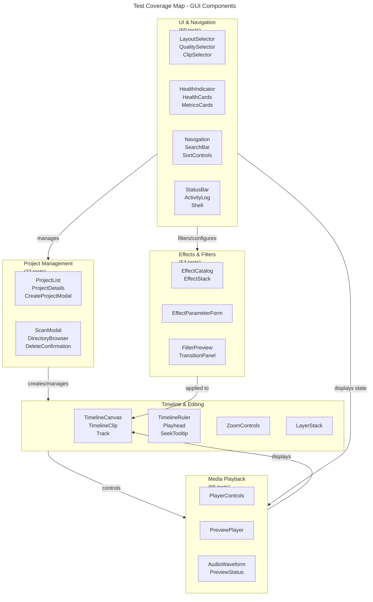

# C4 Code Level: GUI Components Test Suite

## Overview

- **Name**: GUI Components Test Suite
- **Description**: Comprehensive unit and integration tests for React/TypeScript components in the video editor UI
- **Location**: gui/src/components/__tests__
- **Language**: TypeScript/React (Vitest + React Testing Library)
- **Purpose**: Validates behavior of timeline editing, media playback, effects, project management, and utility components
- **Parent Component**: [Web GUI](./c4-component-web-gui.md)

## Code Elements

### Test Files by Functional Area

#### Timeline & Editing (10 files, 64 tests)
- **TimelineCanvas.test.tsx** (10 tests): Rendering, panning, scrolling, and event handling
- **TimelineClip.test.tsx** (10 tests): Clip positioning, zoom, selection, and in/out point editing
- **TimelinePage.test.tsx** (13 tests): Page layout, store integration, keyboard navigation, Start Render button, modal open/close
- **Track.test.tsx** (6 tests): Track rendering, clip management, drop zones
- **TimeRuler.test.tsx** (6 tests): Time tick rendering, zoom scaling, position indicators
- **Playhead.test.tsx** (6 tests): Playhead positioning, scrubbing, tooltip rendering
- **LayerStack.test.tsx** (9 tests): Layer list rendering, reordering, visibility toggles
- **SeekTooltip.test.tsx** (18 tests): Tooltip positioning, time display, keyboard events
- **ZoomControls.test.tsx** (7 tests): Zoom buttons, level display, store interaction

#### Media Playback (4 files, 65 tests)
- **PlayerControls.test.tsx** (38 tests): Play/pause, seeking, volume, playback rate, loop modes
- **PreviewPlayer.test.tsx** (17 tests): Video element lifecycle, HTML5 controls, frame rendering
- **AudioWaveform.test.tsx** (7 tests): Waveform canvas rendering, zoom scaling
- **PreviewStatus.test.tsx** (5 tests): Loading/playing/error status display

#### Effects & Filters (5 files, 54 tests)
- **EffectParameterForm.test.tsx** (17 tests): Dynamic form rendering for text, number, enum, boolean fields
- **EffectCatalog.test.tsx** (10 tests): Catalog loading, filter categories, effect selection
- **EffectStack.test.tsx** (7 tests): Effect chain rendering, reordering, removal
- **FilterPreview.test.tsx** (10 tests): Preview rendering, parameter changes
- **TransitionPanel.test.tsx** (10 tests): Transition selection, parameter editing

#### Project Management (6 files, 27 tests)
- **ProjectList.test.tsx** (4 tests): List rendering, loading states, selection
- **ProjectDetails.test.tsx** (8 tests): Project info display, metadata editing
- **CreateProjectModal.test.tsx** (7 tests): Form validation, project creation
- **ScanModal.test.tsx** (16 tests): Directory scanning, file selection, validation
- **DirectoryBrowser.test.tsx** (8 tests): Tree navigation, file filtering
- **DeleteConfirmation.test.tsx** (5 tests): Confirmation dialog rendering and callbacks

#### UI Components (8 files, 39 tests)
- **ClipFormModal.test.tsx** (5 tests): Form validation, field updates
- **ClipSelector.test.tsx** (10 tests): Dropdown rendering, search filtering, selection
- **LayoutSelector.test.tsx** (6 tests): Layout options, preview, selection
- **LayoutPreview.test.tsx** (7 tests): Layout preview rendering
- **QualitySelector.test.tsx** (7 tests): Quality options, default value
- **HealthIndicator.test.tsx** (3 tests): Health status icon and color
- **HealthCards.test.tsx** (4 tests): Health metrics cards
- **MetricsCards.test.tsx** (3 tests): Render/encode metrics display

#### Navigation & Search (3 files, 11 tests)
- **Navigation.test.tsx** (4 tests): Nav links, active states
- **SearchBar.test.tsx** (3 tests): Input handling, submission
- **SortControls.test.tsx** (4 tests): Sort button states, column sorting
- **StatusBar.test.tsx** (3 tests): Status message display
- **ActivityLog.test.tsx** (5 tests): Event logging, WebSocket integration
- **Shell.test.tsx** (2 tests): Layout structure

## Dependencies

### Internal Dependencies
- **Stores**: `usePreviewStore`, `useActivityStore`, `useTimelineStore`, `useEffectFormStore`, `useLayoutStore`, `useRenderStore`
- **Types**: Generated types from `src/generated/types.ts` (clips, tracks, effects, projects)
- **Mock utilities**: `makeMessage()` from shared mocks, custom fixture builders (makeClip, makeTrack, etc.)
- **Helper functions**: `formatTime()`, `timeToPixel()` calculations

### External Dependencies
- **React Testing Library** (@testing-library/react): `render`, `screen`, `fireEvent`
- **Vitest**: `describe`, `it`, `expect`, `beforeEach`, `vi` (mocking)
- **jsdom**: Virtual DOM environment
- **React**: Component rendering (v19)
- **React Router**: Navigation components
- **Zustand**: State management stores

## Test Summary

| Metric | Count |
|--------|-------|
| Total test files | 38 |
| Total test cases | 324 |
| Avg tests per file | 8.5 |

### Testing Patterns Used
- **Component rendering**: `render()` with props and state
- **User interactions**: `fireEvent` for clicks, keyboard, drag events
- **Store mocking**: Direct store state setup via `getState()`
- **Assertions**: RTL queries (`getByTestId`, `getByText`), DOM property checks
- **Fixtures**: Factory functions for consistent test data (clips, effects, projects)
- **Mock video elements**: Custom `createMockVideo()` with controllable properties

## Relationships

```mermaid
---
title: Test Coverage Map - GUI Components
---
graph TB
    subgraph ProjectMgmt["Project Management<br/>(27 tests)"]
        PR["ProjectList<br/>ProjectDetails<br/>CreateProjectModal"]
        SC["ScanModal<br/>DirectoryBrowser<br/>DeleteConfirmation"]
    end

    subgraph Timeline["Timeline & Editing<br/>(58 tests)"]
        TC["TimelineCanvas<br/>TimelineClip<br/>Track"]
        TL["TimelineRuler<br/>Playhead<br/>SeekTooltip"]
        ZC["ZoomControls"]
        LS["LayerStack"]
    end

    subgraph Playback["Media Playback<br/>(65 tests)"]
        PC["PlayerControls"]
        PP["PreviewPlayer"]
        AW["AudioWaveform<br/>PreviewStatus"]
    end

    subgraph Effects["Effects & Filters<br/>(54 tests)"]
        EC["EffectCatalog<br/>EffectStack"]
        EPF["EffectParameterForm"]
        FP["FilterPreview<br/>TransitionPanel"]
    end

    subgraph UI["UI & Navigation<br/>(50 tests)"]
        LS2["LayoutSelector<br/>QualitySelector<br/>ClipSelector"]
        HI["HealthIndicator<br/>HealthCards<br/>MetricsCards"]
        NAV["Navigation<br/>SearchBar<br/>SortControls"]
        OTH["StatusBar<br/>ActivityLog<br/>Shell"]
    end

    ProjectMgmt -->|creates/manages| Timeline
    Playback -->|displays| TC
    Effects -->|applied to| TC
    Timeline -->|controls| Playback
    UI -->|filters/configures| Effects
    UI -->|displays state| Playback
    UI -->|manages| ProjectMgmt
```

## Notes

- **BL-247 resolved**: Three pre-existing `TimelinePage.test.tsx` failures (introduced pre-v023, tracked as BL-247) were resolved by commit `cbe2fa5` (April 2026). That commit added a defensive guard against undefined `projects` in `TimelinePage.tsx` and fixed test mocks to use per-endpoint mock responses with fresh `Response` objects per call. As of v035 verification, all 13 `TimelinePage.test.tsx` tests pass with 0 failures.
- **Test coverage focus**: Highest coverage on interactive components (PlayerControls: 38, EffectParameterForm: 17, SeekTooltip: 18, PreviewPlayer: 17)
- **Mocking strategy**: Zustand stores reset in `beforeEach`, DOM mocks for video/canvas elements
- **Common patterns**: Builder functions for test fixtures, isolated store state per test
- **Vitest features used**: `vi.fn()` for callbacks, `fireEvent` for simulation, snapshot testing rare
- **React 19 support**: Tests validate hooks, functional components, strict mode
