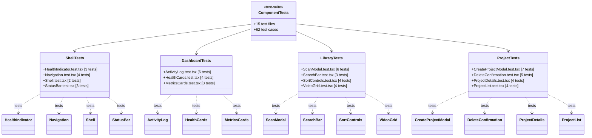

# C4 Code Level: GUI Component Tests

## Overview
- **Name**: GUI Component Tests
- **Description**: Vitest test suites validating all React UI components in the stoat-and-ferret GUI
- **Location**: `gui/src/components/__tests__/`
- **Language**: TypeScript (TSX)
- **Purpose**: Ensures correctness of UI rendering, user interactions, API integration, and state management across all GUI components

## Test Inventory

| Test File | Test Count | Component Under Test |
|-----------|-----------|---------------------|
| HealthIndicator.test.tsx | 3 | HealthIndicator |
| Navigation.test.tsx | 4 | Navigation |
| Shell.test.tsx | 2 | Shell |
| StatusBar.test.tsx | 3 | StatusBar |
| ActivityLog.test.tsx | 6 | ActivityLog |
| HealthCards.test.tsx | 4 | HealthCards |
| MetricsCards.test.tsx | 3 | MetricsCards |
| ScanModal.test.tsx | 6 | ScanModal |
| SearchBar.test.tsx | 3 | SearchBar |
| SortControls.test.tsx | 4 | SortControls |
| VideoGrid.test.tsx | 4 | VideoGrid |
| CreateProjectModal.test.tsx | 7 | CreateProjectModal |
| DeleteConfirmation.test.tsx | 5 | DeleteConfirmation |
| ProjectDetails.test.tsx | 4 | ProjectDetails |
| ProjectList.test.tsx | 4 | ProjectList |
| **Total** | **62** | **15 components** |

## Coverage Summary

### Shell & Layout Components
- **HealthIndicator**: Status dot coloring (green/yellow/red) for healthy/degraded/unhealthy states
- **Navigation**: Dynamic tab rendering based on endpoint availability via HEAD requests; handles 405 responses
- **Shell**: Header/main/footer structure; WebSocket status propagation
- **StatusBar**: Connection state display (Connected/Disconnected/Reconnecting)

### Dashboard Components
- **ActivityLog**: WebSocket message parsing, 50-entry FIFO limit, empty state, non-JSON resilience
- **HealthCards**: Per-component status cards (database, ffmpeg, rust core); unknown status handling
- **MetricsCards**: Request count display, average response time formatting, null data placeholder

### Library Components
- **ScanModal**: Open/close behavior, directory input validation, scan API call (`POST /api/v1/videos/scan`), error display
- **SearchBar**: Placeholder rendering, controlled input, onChange callback
- **SortControls**: Sort field dropdown (date/name/duration), sort order toggle (asc/desc)
- **VideoGrid**: Video card rendering, loading/error/empty states

### Project Components
- **CreateProjectModal**: Form field rendering (name/resolution/fps), validation (empty name, invalid resolution format, fps range 1-120), API submission (`POST /api/v1/projects`), error clearing
- **DeleteConfirmation**: Confirmation dialog, cancel/confirm actions, DELETE API call, error display
- **ProjectDetails**: Project metadata display, clip list with timecode formatting, empty/error states
- **ProjectList**: Loading/error/empty states, project card grid rendering with clip counts

## Test Patterns

### Common Setup
- `beforeEach(() => vi.restoreAllMocks())` for test isolation
- `vi.spyOn(globalThis, 'fetch').mockResolvedValue(...)` for API mocking
- `MockWebSocket` class for WebSocket simulation
- `MemoryRouter` wrapper for components using React Router

### Assertion Strategies
- `data-testid` attributes for DOM element selection
- `waitFor()` for async state updates
- `fireEvent` for user interaction simulation
- Props-based testing for controlled components

## Dependencies

### External Dependencies
- `vitest` (describe, it, expect, vi, beforeEach)
- `@testing-library/react` (render, screen, fireEvent, waitFor)
- `react-router-dom` (MemoryRouter)

### Internal Dependencies
- All component source files in `gui/src/components/`
- Type imports: `HealthState`, `Metrics`, `Video`, `Project`
- Store imports: `useActivityStore`

## Relationships

