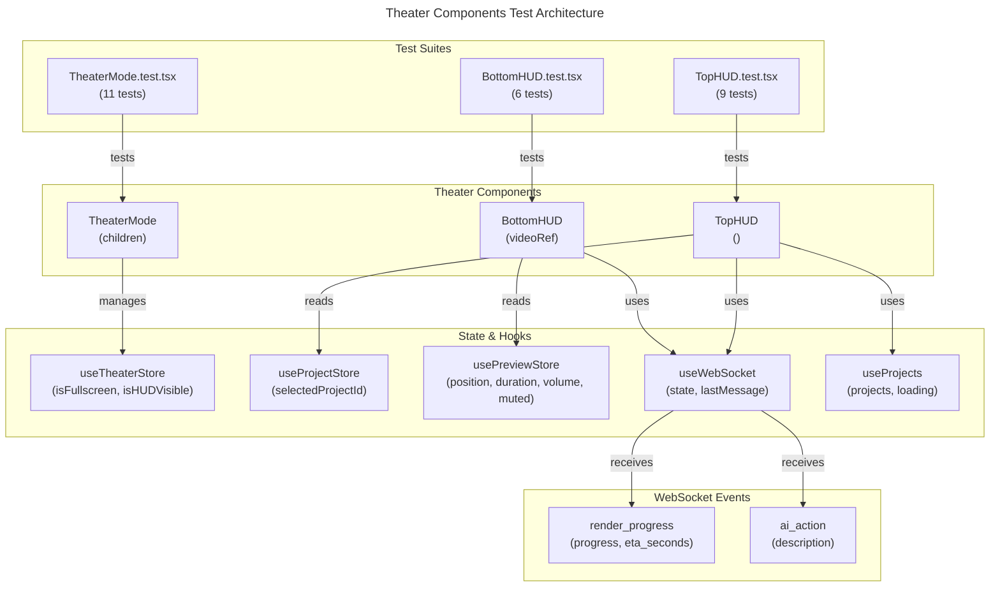

# C4 Code Level: GUI Theater Components Tests

## Overview

- **Name**: Theater Mode Test Suite
- **Description**: Unit tests for full-screen theater mode components (container, HUD visibility, top/bottom controls) with WebSocket event handling and auto-hide behavior.
- **Location**: `gui/src/components/theater/__tests__`
- **Language**: TypeScript/React (Vitest)
- **Purpose**: Verify theater mode fullscreen rendering, HUD auto-hide timer, and playback controls
- **Parent Component**: [Web GUI](./c4-component-web-gui.md)

## Code Elements

### Test Files

#### BottomHUD.test.tsx
- **Location**: `gui/src/components/theater/__tests__/BottomHUD.test.tsx`
- **Total Tests**: 6

**Test Cases**:
1. `renders playback controls` - Confirms presence of player-controls element
2. `does not show render progress when no events received` - No render-progress when no WebSocket events
3. `shows render progress when RENDER_PROGRESS event arrives` - Shows progress and ETA on 'render_progress' message
4. `shows render progress without ETA when eta_seconds is null` - Progress displayed with null ETA
5. `has correct data-testid` - Element with testid='theater-bottom-hud'
6. Playback controls test (sub-suite)

**Key Assertions**:
- DOM testids: `theater-bottom-hud`, `player-controls`, `render-progress`
- WebSocket message type: 'render_progress' with payload { progress: number, eta_seconds: number | null }
- Progress formatted as percentage (e.g., '45% — ETA 2m 0s')
- ETA formatting when present (e.g., '75%' without ETA)

**Component Under Test**: `BottomHUD`
- Props: `videoRef: React.RefObject<HTMLVideoElement>`
- WebSocket Dependency: `useWebSocket()` for 'render_progress' events
- Store Dependency: `usePreviewStore` (position, duration, volume, muted)

#### TheaterMode.test.tsx
- **Location**: `gui/src/components/theater/__tests__/TheaterMode.test.tsx`
- **Total Tests**: 11

**Test Cases**:
1. `passes through children when not in fullscreen` - Children rendered normally when isFullscreen=false
2. `renders container and HUD when in fullscreen` - Theater container and HUD wrapper shown when isFullscreen=true
3. `auto-hides HUD after 3 seconds of inactivity` - isHUDVisible=false after 3000ms inactivity
4. `re-shows HUD on mouse movement` - isHUDVisible=true on mouseMove event
5. `resets auto-hide timer on mouse movement` - Timer reset on mouseMove (2s + 2s + 1s = 3s after movement)
6. `cleans up timer on unmount (NFR-001)` - clearTimeout called during unmount
7. `has correct data-testid attributes (FR-006)` - testids 'theater-container' and 'theater-hud-wrapper'
8. `applies opacity-0 class when HUD is hidden` - Tailwind opacity-0 class when isHUDVisible=false
9. `applies opacity-100 class when HUD is visible` - Tailwind opacity-100 class when isHUDVisible=true
10. HUD visibility toggle test (sub-suite)
11. Timer cleanup test (sub-suite)

**Key Assertions**:
- DOM testids: `theater-container`, `theater-hud-wrapper`, `child-content`
- Store state: `useTheaterStore.getState().isHUDVisible`, `isFullscreen`
- Mouse event handling: fireEvent.mouseMove(container)
- Timer behavior: vi.advanceTimersByTime() with fake timers (vi.useFakeTimers())
- CSS class checks for opacity-0 and opacity-100
- Fake timer assertions: timer reset on activity, auto-hide after 3s inactivity

**Component Under Test**: `TheaterMode`
- Props: `children: React.ReactNode`
- Wraps children with theater container when isFullscreen=true
- Auto-hides HUD element after 3 seconds of mouse inactivity
- Shows HUD wrapper with conditional opacity class

#### TopHUD.test.tsx
- **Location**: `gui/src/components/theater/__tests__/TopHUD.test.tsx`
- **Total Tests**: 9

**Test Cases**:
1. `renders the project title` - Displays selected project name
2. `has the correct data-testid` - Element with testid='theater-top-hud'
3. `shows fallback title when no project is selected` - 'Untitled Project' when selectedProjectId=null
4. `shows fallback title when project ID does not match any project` - 'Untitled Project' for unknown project ID
5. `displays AI action indicator when AI_ACTION event arrives` - Shows AI indicator with 'ai_action' WebSocket message
6. `does not show AI action indicator when no events received` - No indicator when no WebSocket events
7. `does not show AI action indicator when WebSocket is disconnected` - No indicator when ws state='disconnected'
8. AI action event handling (sub-suite)
9. WebSocket state handling (sub-suite)

**Key Assertions**:
- DOM testids: `theater-top-hud`, `ai-action-indicator`
- WebSocket message type: 'ai_action' with payload { description: string }
- Text content: Project name or 'Untitled Project' fallback
- Store state: `useProjectStore.getState().selectedProjectId`
- Hook state: `useWebSocket()` returns { state: ConnectionState, lastMessage: MessageEvent | null }
- Conditional rendering based on WebSocket connectivity and message type

**Component Under Test**: `TopHUD`
- Props: None
- Store Dependency: `useProjectStore` (selectedProjectId)
- WebSocket Dependency: `useWebSocket()` for 'ai_action' events
- Hook Dependency: `useProjects()` to fetch project list by name

## Dependencies

### Internal Dependencies
- `../BottomHUD` - Bottom playback controls component
- `../TheaterMode` - Theater fullscreen container wrapper
- `../TopHUD` - Top header with project title and AI actions
- `../../../stores/theaterStore` - Theater UI state (isFullscreen, isHUDVisible)
- `../../../stores/previewStore` - Playback state (position, duration, volume, muted)
- `../../../stores/projectStore` - Project selection state
- `../../../hooks/useWebSocket` - Mocked WebSocket connection and messaging
- `../../../hooks/useProjects` - Mocked project fetching hook
- `@testing-library/react` - Testing utilities (render, screen, fireEvent, waitFor, act)
- `vitest` - Test runner with mocking and fake timers

### External Dependencies
- `@testing-library/react` - React component testing library
- `vitest` - Vitest test framework with fake timer support
- React DOM rendering
- HTML5 Video API (mocked in tests)

## Test Summary

- **Total Test Count**: 26 tests across 3 files
- **Test File Inventory**:
  - `BottomHUD.test.tsx` (1 describe, 6 it blocks)
  - `TheaterMode.test.tsx` (1 describe, 11 it blocks)
  - `TopHUD.test.tsx` (1 describe, 9 it blocks)
- **Coverage Focus**:
  - Full-screen theater mode rendering and state management
  - HUD auto-hide timer (3 seconds inactivity)
  - Mouse movement interaction and timer reset
  - WebSocket event handling (render_progress, ai_action)
  - Project title display with fallback
  - Conditional rendering based on WebSocket state
  - Cleanup and resource management (timer cleanup on unmount)
  - Tailwind CSS class application for opacity transitions

## Relationships

## Notes

- TheaterMode uses fake timers (vi.useFakeTimers/vi.useRealTimers) to test 3-second auto-hide behavior
- BottomHUD creates mock video element with HTMLMediaElement properties (duration, currentTime, paused, volume, muted)
- TopHUD and BottomHUD both mock useWebSocket hook returning 'connected' state by default
- WebSocket message parsing expects JSON structure: `{ type: string, payload: {...} }`
- Theater component tree: TheaterMode wraps TopHUD + BottomHUD + children in fullscreen mode
- Auto-hide feature uses setTimeout internally; timer reference must be cleaned up on unmount
- HUD visibility transitions use opacity classes (opacity-0, opacity-100) not display/hidden
