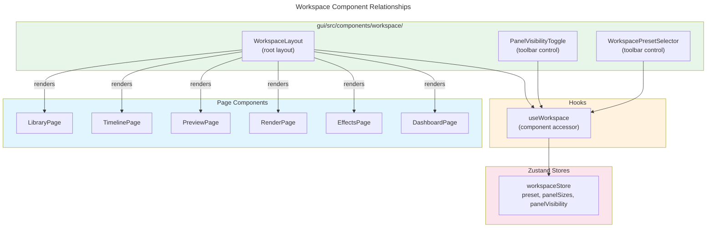

# C4 Code Level: GUI Workspace Components

## Overview

- **Name**: GUI Workspace Components
- **Description**: React components implementing the unified workspace layout introduced in v044 (BL-291/BL-292). Provides the resizable panel shell, per-panel visibility toggles, and preset selector that together compose the workspace UI.
- **Location**: `gui/src/components/workspace/`
- **Language**: TypeScript / React (TSX)
- **Purpose**: Renders the six-panel workspace (library, timeline, effects, preview, render-queue, batch) in a resizable layout, persists layout state through `workspaceStore`, and exposes preset and visibility controls in the toolbar.
- **Parent Component**: [Web GUI](./c4-component-web-gui.md)

## Code Elements

### Components

#### WorkspaceLayout

- **Location**: `gui/src/components/workspace/WorkspaceLayout.tsx:183`
- **Signature**: `export default function WorkspaceLayout(): JSX.Element`
- **Props**: None (all state sourced from `useWorkspace()` and `useWorkspaceStore`)
- **State**: `useWorkspace()` — `panelSizes`, `panelVisibility`, `resizePanel`; `useWorkspaceStore` — `preset`, `anchorPreset`
- **Description**: Root workspace layout component. Wraps six canonical panels (library, timeline, effects, preview, render-queue, batch) in nested `react-resizable-panels` Groups. Each panel renders its configured page component based on `PRESETS[effectivePreset].routes`. Separators between panels are conditionally rendered — a separator is omitted when either neighbouring panel is hidden to prevent stacked zero-width separators from claiming pointer events (BL-305).

  **Key behaviours:**
  - Remounts the entire Group tree (`key={layoutKey}`) whenever preset or panel visibility changes, so `react-resizable-panels` re-initialises `defaultSize` correctly (BL-322 workaround).
  - Bidirectional-loop guard (`guardRef`) suppresses transient `onResize` callbacks fired during layout remounts to prevent them from flipping the preset back to `'custom'` (LRN-141 / BL-292 NFR-002). Guard window: 300 ms.
  - Hidden panels use CSS `display: none` (not DOM removal) to preserve component state (LRN-140).
  - `computeRelativeSizes(panelSizes, panelVisibility)` converts absolute percentages (whole-layout) into per-Group relative percentages that `react-resizable-panels` expects.

- **Internal Sub-components**:
  - `WorkspacePanel` (`WorkspaceLayout.tsx:98`) — wraps a single `Panel` with visibility logic, resize callback, and a label placeholder for hidden panels.
  - `PanelContent({ route })` (`WorkspaceLayout.tsx:24`) — resolves a route path to a page component via `ROUTE_COMPONENTS` and renders it.

- **Dependencies**:
  - `react-resizable-panels` — `Group`, `Panel`, `Separator`
  - `gui/src/hooks/useWorkspace` — workspace state and actions
  - `gui/src/stores/workspaceStore` — `PRESETS`, `useWorkspaceStore` (direct subscription for `preset` and `anchorPreset`)
  - Page components: `DashboardPage`, `EffectsPage`, `LibraryPage`, `PreviewPage`, `RenderPage`, `TimelinePage`

---

#### PanelVisibilityToggle

- **Location**: `gui/src/components/workspace/PanelVisibilityToggle.tsx:18`
- **Signature**: `export default function PanelVisibilityToggle(): JSX.Element`
- **Props**: None (all state sourced from `useWorkspace()`)
- **State**: `useWorkspace()` — `panelVisibility`, `togglePanel`, `resetLayout`
- **Description**: Per-panel visibility toggle group rendered in the workspace toolbar. Iterates `PANEL_IDS` (`['library', 'timeline', 'preview', 'effects', 'render-queue', 'batch']`) and renders one toggle button per panel. Each button is styled as active (blue) or inactive (grey) based on `panelVisibility[panelId]` and calls `togglePanel(panelId)` on click. Also includes a **Reset** button that calls `resetLayout()` to return the workspace to its default state.

  **Accessibility**: The container uses `role="group"` with `aria-label="Panel visibility toggles"`. Each toggle button uses `aria-pressed` to communicate checked state to assistive technologies.

- **Dependencies**:
  - `gui/src/hooks/useWorkspace` — `panelVisibility`, `togglePanel`, `resetLayout`
  - `gui/src/stores/workspaceStore` — `PANEL_IDS`, `PanelId` type

---

#### WorkspacePresetSelector

- **Location**: `gui/src/components/workspace/WorkspacePresetSelector.tsx:15`
- **Signature**: `export default function WorkspacePresetSelector(): JSX.Element`
- **Props**: None (all state sourced from `useWorkspace()`)
- **State**: `useWorkspace()` — `preset`, `setPreset`
- **Description**: Dropdown `<select>` for workspace preset selection, rendered in the workspace toolbar. Presents the four preset options (Edit, Review, Render, Custom) defined in `PRESET_OPTIONS`. On change, calls `setPreset(value)` to apply the selected layout to the workspace. The Custom option appears in the list but selecting it in the dropdown is a no-op on sizes/visibility — it only updates the preset label (the preset transitions to Custom automatically when the user manually resizes a panel).

  **Accessibility**: Wrapped in a `<label>` with a screen-reader-only `` and an explicit `aria-label="Workspace preset"` on the select.

- **Dependencies**:
  - `gui/src/hooks/useWorkspace` — `preset`, `setPreset`
  - `gui/src/stores/workspaceStore` — `WorkspacePreset` type

## Dependencies

### Internal Dependencies

- `gui/src/hooks/useWorkspace` — workspace state access hook (all three components)
- `gui/src/stores/workspaceStore` — canonical store; `PANEL_IDS`, `PRESETS`, `useWorkspaceStore`, type exports
- `gui/src/pages/*` — page components rendered inside workspace panels (WorkspaceLayout only)

### External Dependencies

- `react` — `useEffect`, `useRef`, `ComponentType`
- `react-resizable-panels` — `Group`, `Panel`, `Separator` (WorkspaceLayout only)

## Relationships

## Notes

- WorkspaceLayout is the only component in this directory that directly accesses `useWorkspaceStore` (for `preset` and `anchorPreset` subscriptions outside the `useWorkspace` hook). All other state access goes through `useWorkspace`.
- Panel hidden-state uses CSS `display: none` rather than conditional rendering to preserve page component state across visibility toggles (LRN-140).
- The `guardRef` bidirectional-loop prevention in WorkspaceLayout is a React-specific workaround for `react-resizable-panels` firing `onResize` during programmatic layout changes — it is not a general pattern for other components.
- These three components were added in v044 (BL-291 / BL-292) and documented here for the first time in v057.
