# C4 Code Level: GUI Components

## Overview
- **Name**: GUI React Components
- **Description**: React UI components forming the presentation layer of the stoat-and-ferret video editor GUI
- **Location**: `gui/src/components/`
- **Language**: TypeScript (TSX)
- **Purpose**: Renders the application shell, dashboard widgets, video library browser, and project management interfaces

## Code Elements

### Functions/Methods

#### Shell & Layout

- `HealthIndicator(): JSX.Element`
  - Description: Renders a colored dot indicator with label showing overall system health status
  - Location: `gui/src/components/HealthIndicator.tsx:1`
  - Dependencies: `useHealth` hook, `HealthStatus` type

- `Navigation(): JSX.Element`
  - Description: Dynamically renders navigation tabs by checking backend endpoint availability via HEAD requests
  - Location: `gui/src/components/Navigation.tsx:1`
  - Dependencies: `react-router-dom.NavLink`, `react.useState`, `react.useEffect`

- `Shell(): JSX.Element`
  - Description: Root layout component establishing WebSocket connection and rendering header/main/footer structure
  - Location: `gui/src/components/Shell.tsx:1`
  - Dependencies: `react-router-dom.Outlet`, `useWebSocket`, `HealthIndicator`, `Navigation`, `StatusBar`

- `StatusBar(props: StatusBarProps): JSX.Element`
  - Description: Footer component displaying WebSocket connection status with color-coded indicators
  - Location: `gui/src/components/StatusBar.tsx:1`
  - Dependencies: `ConnectionState` type from `useWebSocket`

#### Dashboard Widgets

- `ActivityLog(props: { lastMessage: MessageEvent | null }): JSX.Element`
  - Description: Consumes WebSocket messages, parses JSON events, and displays a scrollable activity log
  - Location: `gui/src/components/ActivityLog.tsx:1`
  - Dependencies: `useActivityStore`, `react.useEffect`

- `formatTimestamp(iso: string): string`
  - Description: Formats ISO timestamp to locale time string for activity log entries
  - Location: `gui/src/components/ActivityLog.tsx`
  - Dependencies: None

- `formatType(type: string): string`
  - Description: Formats event type strings by replacing underscores/dots with spaces and capitalizing
  - Location: `gui/src/components/ActivityLog.tsx`
  - Dependencies: None

- `HealthCards(props: { health: HealthState }): JSX.Element`
  - Description: Renders grid of individual health status cards for system components (Python API, FFmpeg, Rust Core)
  - Location: `gui/src/components/HealthCards.tsx:1`
  - Dependencies: `HealthState` type from `useHealth`

- `HealthCard(props: { name: string; status: string }): JSX.Element`
  - Description: Individual health card with color-coded status indicator dot and label
  - Location: `gui/src/components/HealthCards.tsx`
  - Dependencies: None (internal component)

- `MetricsCards(props: { metrics: Metrics }): JSX.Element`
  - Description: Displays two-column grid showing total request count and average response time
  - Location: `gui/src/components/MetricsCards.tsx:1`
  - Dependencies: `Metrics` type from `useMetrics`

#### Library Components

- `ScanModal(props: { open: boolean; onClose: () => void; onScanComplete: () => void }): JSX.Element | null`
  - Description: Modal for initiating directory scans; posts to scan API, polls job status, shows progress
  - Location: `gui/src/components/ScanModal.tsx:1`
  - Dependencies: `react.useCallback`, `react.useEffect`, `react.useRef`, `react.useState`

- `SearchBar(props: { value: string; onChange: (value: string) => void }): JSX.Element`
  - Description: Controlled text input for video search with placeholder text
  - Location: `gui/src/components/SearchBar.tsx:1`
  - Dependencies: None

- `SortControls(props: SortControlsProps): JSX.Element`
  - Description: Sort field dropdown (date/name/duration) and sort order toggle button (asc/desc)
  - Location: `gui/src/components/SortControls.tsx:1`
  - Dependencies: `SortField`, `SortOrder` types from `libraryStore`

- `VideoCard(props: { video: Video }): JSX.Element`
  - Description: Card displaying video thumbnail (lazy-loaded), filename, and formatted duration overlay
  - Location: `gui/src/components/VideoCard.tsx:1`
  - Dependencies: `Video` type from `useVideos`

- `formatDuration(video: Video): string`
  - Description: Calculates video duration in MM:SS or HH:MM:SS format from frame count and frame rate
  - Location: `gui/src/components/VideoCard.tsx`
  - Dependencies: None (internal helper)

- `VideoGrid(props: { videos: Video[]; loading: boolean; error: string | null }): JSX.Element`
  - Description: Responsive grid (2-5 columns) of VideoCard components with loading/error/empty states
  - Location: `gui/src/components/VideoGrid.tsx:1`
  - Dependencies: `VideoCard`, `Video` type from `useVideos`

#### Project Components

- `CreateProjectModal(props: { open: boolean; onClose: () => void; onCreated: () => void }): JSX.Element | null`
  - Description: Form modal for creating projects with name, resolution (WxH), and fps (1-120) validation
  - Location: `gui/src/components/CreateProjectModal.tsx:1`
  - Dependencies: `createProject` from `useProjects`, `react.useCallback`, `react.useState`

- `parseResolution(value: string): { width: number; height: number } | null`
  - Description: Parses "WxH" format resolution strings into width/height numbers
  - Location: `gui/src/components/CreateProjectModal.tsx`
  - Dependencies: None (internal helper)

- `validateForm(name: string, resolution: string, fps: string): FormErrors`
  - Description: Validates all form fields returning error messages per field
  - Location: `gui/src/components/CreateProjectModal.tsx`
  - Dependencies: `parseResolution`

- `DeleteConfirmation(props: DeleteConfirmationProps): JSX.Element | null`
  - Description: Confirmation dialog for project deletion with cancel/confirm actions
  - Location: `gui/src/components/DeleteConfirmation.tsx:1`
  - Dependencies: `deleteProject` from `useProjects`, `react.useState`

- `ProjectCard(props: { project: Project; clipCount: number; onSelect: (id: string) => void; onDelete: (id: string) => void }): JSX.Element`
  - Description: Card showing project name, creation date, clip count, and output specs
  - Location: `gui/src/components/ProjectCard.tsx:1`
  - Dependencies: `Project` type from `useProjects`

- `formatDate(iso: string): string`
  - Description: Formats ISO date string to locale-specific short format
  - Location: `gui/src/components/ProjectCard.tsx`
  - Dependencies: None (internal helper)

- `ProjectDetails(props: { project: Project; onBack: () => void; onDelete: (id: string) => void }): JSX.Element`
  - Description: Detail view showing project metadata and clip timeline table with timecodes
  - Location: `gui/src/components/ProjectDetails.tsx:1`
  - Dependencies: `fetchClips`, `Clip`, `Project` types from `useProjects`

- `formatTimecode(frames: number, fps: number): string`
  - Description: Converts frame count to MM:SS.SS timecode format
  - Location: `gui/src/components/ProjectDetails.tsx`
  - Dependencies: None (internal helper)

- `ProjectList(props: ProjectListProps): JSX.Element`
  - Description: Responsive 3-column grid of ProjectCard components with loading/error/empty states
  - Location: `gui/src/components/ProjectList.tsx:1`
  - Dependencies: `ProjectCard`, `Project` type from `useProjects`

## Dependencies

### Internal Dependencies
- `gui/src/hooks/useHealth` — HealthIndicator uses `useHealth` hook and `HealthStatus` type
- `gui/src/hooks/useWebSocket` — Shell uses `useWebSocket` hook; StatusBar uses `ConnectionState` type
- `gui/src/hooks/useMetrics` — MetricsCards uses `Metrics` type
- `gui/src/hooks/useVideos` — VideoCard, VideoGrid use `Video` type
- `gui/src/hooks/useProjects` — CreateProjectModal uses `createProject`; DeleteConfirmation uses `deleteProject`; ProjectDetails uses `fetchClips`, `Clip`, `Project`; ProjectCard, ProjectList use `Project` type
- `gui/src/stores/activityStore` — ActivityLog uses `useActivityStore`
- `gui/src/stores/libraryStore` — SortControls uses `SortField`, `SortOrder` types

### External Dependencies
- `react` (useState, useEffect, useCallback, useRef)
- `react-router-dom` (NavLink, Outlet)
- Tailwind CSS (utility classes for all styling)

## Relationships

```mermaid
classDiagram
    class Shell {
        +Shell() JSX.Element
        -wsUrl() string
    }
    class Navigation {
        +Navigation() JSX.Element
        -TABS TabDef[]
    }
    class HealthIndicator {
        +HealthIndicator() JSX.Element
    }
    class StatusBar {
        +StatusBar(connectionState) JSX.Element
    }
    class ActivityLog {
        +ActivityLog(lastMessage) JSX.Element
        +formatTimestamp(iso) string
        +formatType(type) string
    }
    class HealthCards {
        +HealthCards(health) JSX.Element
        -HealthCard(name, status) JSX.Element
    }
    class MetricsCards {
        +MetricsCards(metrics) JSX.Element
    }
    class ScanModal {
        +ScanModal(open, onClose, onScanComplete) JSX.Element
    }
    class SearchBar {
        +SearchBar(value, onChange) JSX.Element
    }
    class SortControls {
        +SortControls(sortField, sortOrder, callbacks) JSX.Element
    }
    class VideoCard {
        +VideoCard(video) JSX.Element
        -formatDuration(video) string
    }
    class VideoGrid {
        +VideoGrid(videos, loading, error) JSX.Element
    }
    class CreateProjectModal {
        +CreateProjectModal(open, onClose, onCreated) JSX.Element
        -parseResolution(value) object
        -validateForm(name, resolution, fps) FormErrors
    }
    class DeleteConfirmation {
        +DeleteConfirmation(props) JSX.Element
    }
    class ProjectCard {
        +ProjectCard(project, clipCount, callbacks) JSX.Element
        -formatDate(iso) string
    }
    class ProjectDetails {
        +ProjectDetails(project, onBack, onDelete) JSX.Element
        -formatTimecode(frames, fps) string
    }
    class ProjectList {
        +ProjectList(projects, clipCounts, callbacks) JSX.Element
    }

    Shell --> Navigation
    Shell --> HealthIndicator
    Shell --> StatusBar
    VideoGrid --> VideoCard
    ProjectList --> ProjectCard
    HealthIndicator ..> useHealth : imports
    Shell ..> useWebSocket : imports
    ActivityLog ..> activityStore : imports
    MetricsCards ..> useMetrics : type
    VideoCard ..> useVideos : type
    SortControls ..> libraryStore : type
    CreateProjectModal ..> useProjects : createProject
    DeleteConfirmation ..> useProjects : deleteProject
    ProjectDetails ..> useProjects : fetchClips
```

