# C4 Code Level: GUI Components

## Overview
- **Name**: GUI React Components
- **Description**: React UI components forming the presentation layer of the stoat-and-ferret video editor GUI
- **Location**: `gui/src/components/`
- **Language**: TypeScript (TSX)
- **Purpose**: Provides reusable, testable UI building blocks for layout, health monitoring, library browsing, project management, clip CRUD, and the effect workshop
- **Parent Component**: [Web GUI](./c4-component-web-gui.md)

## Code Elements

### Layout Components

#### `Shell.tsx`
- **Signature**: `Shell(): JSX.Element`
- **Description**: Application shell layout with header (Navigation + HealthIndicator), main content area (react-router Outlet), and footer (StatusBar). Manages WebSocket connection via `useWebSocket`.
- **Dependencies**: `Navigation`, `HealthIndicator`, `StatusBar`, `useWebSocket`
- **Test IDs**: `navigation`, `health-indicator`, `status-bar`

#### `Navigation.tsx`
- **Signature**: `Navigation(): JSX.Element`
- **Description**: Dynamic tab navigation that checks API endpoint availability via HEAD requests before showing tabs. Tabs: Dashboard (`/health/live`), Library (`/api/v1/videos`), Projects (`/api/v1/projects`), Effects (`/api/v1/effects`). Treats 405 (Method Not Allowed) as available.
- **Constants**: `TABS` array with label, path, and healthCheck URL per tab
- **Dependencies**: `react-router-dom.NavLink`
- **Test IDs**: `nav-tab-dashboard`, `nav-tab-library`, `nav-tab-projects`, `nav-tab-effects`

#### `StatusBar.tsx`
- **Signature**: `StatusBar({ connectionState }: { connectionState: ConnectionState }): JSX.Element`
- **Description**: Displays WebSocket connection state (connected/disconnected/reconnecting) in the footer
- **Dependencies**: `ConnectionState` type from `useWebSocket`
- **Test ID**: `status-bar`

### Dashboard Components

#### `HealthIndicator.tsx`
- **Signature**: `HealthIndicator(): JSX.Element`
- **Description**: Compact health dot with status text (Healthy/Degraded/Unhealthy). Polls `/health/ready` via `useHealth`.
- **Dependencies**: `useHealth`
- **Test IDs**: `health-indicator`, `health-dot`

#### `HealthCards.tsx`
- **Signature**: `HealthCards({ health }: { health: HealthState }): JSX.Element`
- **Description**: Three cards for Python API, FFmpeg, and Rust Core showing individual component health with color-coded dots (ok/error/unknown)
- **Dependencies**: `HealthState` type from `useHealth`
- **Test IDs**: `health-card-{name}`, `health-dot-{name}`

#### `MetricsCards.tsx`
- **Signature**: `MetricsCards({ metrics }: { metrics: Metrics }): JSX.Element`
- **Description**: Displays request count and average response time from Prometheus metrics
- **Dependencies**: `Metrics` type from `useMetrics`
- **Test IDs**: `metric-request-count`, `metric-avg-duration`

#### `ActivityLog.tsx`
- **Signature**: `ActivityLog({ lastMessage }: { lastMessage: MessageEvent | null }): JSX.Element`
- **Description**: Renders a log of WebSocket events. Parses JSON messages, adds entries to Zustand store, displays type/timestamp/details. Max 50 entries with FIFO eviction.
- **Dependencies**: `useActivityStore`
- **Test IDs**: `activity-empty`, `activity-entry`

### Library Components

#### `SearchBar.tsx`
- **Signature**: `SearchBar({ value, onChange }: { value: string, onChange: (val: string) => void }): JSX.Element`
- **Description**: Simple text search input with "Search videos..." placeholder
- **Test ID**: `search-bar`

#### `SortControls.tsx`
- **Signature**: `SortControls({ sortField, sortOrder, onSortFieldChange, onSortOrderChange }): JSX.Element`
- **Description**: Sort field dropdown (date/name/duration) and toggle button for sort order (asc/desc)
- **Test IDs**: `sort-field`, `sort-order`

#### `VideoCard.tsx`
- **Signature**: `VideoCard({ video }: { video: Video }): JSX.Element`
- **Description**: Video thumbnail card showing filename, duration (formatted as M:SS), and thumbnail image from `/api/v1/videos/{id}/thumbnail`
- **Dependencies**: `Video` type from `useVideos`
- **Test IDs**: `video-card-{id}`, `video-filename-{id}`, `video-duration-{id}`, `video-thumbnail-{id}`

#### `VideoGrid.tsx`
- **Signature**: `VideoGrid({ videos, loading, error }): JSX.Element`
- **Description**: Responsive grid of VideoCards with loading, error, and empty states
- **Dependencies**: `VideoCard`, `Video` type
- **Test IDs**: `video-grid`, `video-grid-loading`, `video-grid-error`, `video-grid-empty`

#### `ScanModal.tsx`
- **Signature**: `ScanModal({ open, onClose, onScanComplete }): JSX.Element`
- **Description**: Modal dialog for directory scanning with browse integration. Submits POST to `/api/v1/videos/scan`, polls job status at 1s intervals, shows progress bar, supports scan abort via POST `/api/v1/jobs/{id}/cancel`, and shows completion/cancelled/error states. Includes recursive scan checkbox and Browse button that opens DirectoryBrowser overlay.
- **Internal State**: `ScanStatus` type (`'idle' | 'scanning' | 'cancelling' | 'cancelled' | 'complete' | 'error'`)
- **Dependencies**: `DirectoryBrowser`
- **Test IDs**: `scan-modal-overlay`, `scan-directory-input`, `scan-submit`, `scan-cancel`, `scan-complete`, `scan-error`, `scan-abort`, `scan-cancelled`, `scan-browse-button`, `scan-recursive`, `scan-progress`

#### `DirectoryBrowser.tsx`
- **Signature**: `DirectoryBrowser({ onSelect, onCancel, initialPath? }): JSX.Element`
- **Description**: Server-side directory browser component. Fetches directory listings from GET `/api/v1/filesystem/directories?path=...`, supports navigation into subdirectories, "Up" button for parent navigation, and "Select This Directory" to confirm selection. Shows loading/error/empty states.
- **Internal Types**: `DirectoryEntry { name: string, path: string }`, `DirectoryListResponse { path: string, directories: DirectoryEntry[] }`
- **Internal Functions**: `fetchDirectories(path?)`, `handleNavigate(entry)`, `handleUp()`
- **Test IDs**: `directory-browser-overlay`, `directory-browser-loading`, `directory-browser-list`, `directory-browser-entry`, `directory-browser-empty`, `directory-browser-error`, `directory-browser-path`, `directory-browser-up`, `directory-browser-select`, `directory-browser-cancel`

### Project Components

#### `ProjectCard.tsx`
- **Signature**: `ProjectCard({ project, clipCount, onSelect, onDelete }): JSX.Element`
- **Description**: Project summary card with name, creation date, clip count, and resolution badge. Click navigates to detail view.
- **Dependencies**: `Project` type from `useProjects`
- **Test IDs**: `project-name-{id}`, `project-date-{id}`, `project-clips-{id}`

#### `ProjectList.tsx`
- **Signature**: `ProjectList({ projects, clipCounts, loading, error, onSelect, onDelete }): JSX.Element`
- **Description**: Grid of ProjectCards with loading, error, and empty states
- **Dependencies**: `ProjectCard`, `Project` type
- **Test IDs**: `project-list`, `project-list-loading`, `project-list-error`, `project-list-empty`

#### `ProjectDetails.tsx`
- **Signature**: `ProjectDetails({ project, onBack, onDelete }): JSX.Element`
- **Description**: Project detail view with metadata (resolution, fps) and clips table. Clips show timeline position, in/out points, and duration (all formatted as timecodes at project fps). Includes Add Clip button, per-row Edit/Delete buttons, clip form modal for add/edit, and delete confirmation dialog. Uses `useClipStore` for clip CRUD operations.
- **Internal Function**: `formatTimecode(frames: number, fps: number): string` -- converts frame count to M:SS.ff timecode
- **Dependencies**: `Project`, `Clip` types from `useProjects`, `useClipStore`, `ClipFormModal`, `fetchClips`
- **Test IDs**: `project-detail-name`, `project-metadata`, `clips-table`, `clips-empty`, `clips-error`, `clip-position-{id}`, `clip-in-{id}`, `clip-out-{id}`, `clip-duration-{id}`, `btn-add-clip`, `btn-edit-clip-{id}`, `btn-delete-clip-{id}`, `delete-clip-confirmation`, `btn-cancel-delete-clip`, `btn-confirm-delete-clip`

#### `CreateProjectModal.tsx`
- **Signature**: `CreateProjectModal({ open, onClose, onCreated }): JSX.Element`
- **Description**: Modal form for project creation with validation. Fields: name (required), resolution (WxH format), fps (1-120). Submits POST to `/api/v1/projects`.
- **Test IDs**: `create-project-modal`, `input-project-name`, `input-resolution`, `input-fps`, `btn-create`, `btn-cancel`, `error-name`, `error-resolution`, `error-fps`

#### `DeleteConfirmation.tsx`
- **Signature**: `DeleteConfirmation({ open, projectId, projectName, onClose, onDeleted }): JSX.Element`
- **Description**: Confirmation dialog for project deletion. Shows project name, calls DELETE `/api/v1/projects/{id}`.
- **Test IDs**: `delete-confirmation`, `delete-project-name`, `btn-cancel-delete`, `btn-confirm-delete`, `delete-error`

#### `ClipFormModal.tsx`
- **Signature**: `ClipFormModal({ mode, clip?, projectId, onClose, onSaved }): JSX.Element`
- **Description**: Modal form for clip add/edit with client-side validation. In add mode shows source video dropdown (fetched via `useVideos`). Fields: source video (add only), in point (frames), out point (frames), timeline position (frames). Validates non-negative numbers and out > in. Uses `useClipStore.createClip` or `updateClip` for submission.
- **Props Interface**: `ClipFormModalProps { mode: 'add' | 'edit', clip?: Clip, projectId: string, onClose: () => void, onSaved: () => void }`
- **Dependencies**: `Clip` type from `useProjects`, `useVideos`, `useClipStore`
- **Test IDs**: `clip-form-modal`, `select-source-video`, `input-in-point`, `input-out-point`, `input-timeline-position`, `btn-clip-save`, `btn-clip-cancel`, `clip-form-error`

### Effect Workshop Components

#### `EffectCatalog.tsx`
- **Signature**: `EffectCatalog(): JSX.Element`
- **Description**: Browsable effect catalog with search input, category filter dropdown, and grid/list view toggle. Categories derived via `deriveCategory()`. Shows loading/error/empty states. Cards have AI hint tooltips (title attribute). Click selects effect in catalog store.
- **Dependencies**: `useEffects`, `useEffectCatalogStore`, `deriveCategory`
- **Test IDs**: `effect-catalog`, `effect-catalog-loading`, `effect-catalog-error`, `effect-catalog-retry`, `effect-catalog-empty`, `effect-card-list`, `effect-card-{type}`, `effect-search-input`, `effect-category-filter`, `effect-view-toggle`, `effect-category-badge`

#### `EffectParameterForm.tsx`
- **Signature**: `EffectParameterForm(): JSX.Element`
- **Description**: Schema-driven parameter form generated from JSON Schema. Renders field types: `NumberField` (with range slider when min/max present), `StringField`, `EnumField` (dropdown), `BooleanField` (checkbox), `ColorField` (color picker for format:"color"). Pre-populates defaults from schema. Displays inline validation errors.
- **Dependencies**: `useEffectFormStore`, `ParameterSchema`
- **Internal Components**: `NumberField`, `StringField`, `EnumField`, `BooleanField`, `ColorField`
- **Test IDs**: `effect-parameter-form`, `field-{name}`, `input-{name}`, `slider-{name}`, `error-{name}`

#### `FilterPreview.tsx`
- **Signature**: `FilterPreview(): JSX.Element`
- **Exported Function**: `highlightFilter(str: string): (string | JSX.Element)[]` -- highlights filter names (blue) and pad labels like `[0:v]` (green) using regex matching
- **Description**: Displays the FFmpeg filter string with syntax highlighting and copy-to-clipboard button. Shows loading and error states.
- **Dependencies**: `useEffectPreviewStore`
- **Test IDs**: `filter-preview`, `filter-string`, `preview-loading`, `preview-error`, `copy-button`, `filter-name`, `pad-label`

#### `ClipSelector.tsx`
- **Signature**: `ClipSelector({ clips, selectedClipId, onSelect }): JSX.Element`
- **Description**: Horizontal button list of available clips for effect targeting. Shows source_video_id and timeline position. Highlights selected clip with blue border.
- **Dependencies**: `Clip` type from `useProjects`
- **Test IDs**: `clip-selector`, `clip-selector-empty`, `clip-option-{id}`

#### `EffectStack.tsx`
- **Signature**: `EffectStack({ effects, isLoading, onEdit, onRemove }): JSX.Element`
- **Description**: Ordered list of effects applied to a clip. Each entry shows effect type, parameter summary (up to 3 params), filter string (syntax-highlighted via `highlightFilter`), edit button, and remove button with confirmation dialog.
- **Dependencies**: `AppliedEffect` type, `highlightFilter` from `FilterPreview`
- **Test IDs**: `effect-stack`, `effect-stack-loading`, `effect-stack-empty`, `effect-entry-{idx}`, `effect-type-{idx}`, `effect-params-{idx}`, `effect-filter-{idx}`, `edit-effect-{idx}`, `remove-effect-{idx}`, `confirm-delete-{idx}`, `confirm-yes-{idx}`, `confirm-no-{idx}`

## Dependencies

### Internal Dependencies
- `gui/src/hooks/useHealth` -- health polling
- `gui/src/hooks/useWebSocket` -- WebSocket connection
- `gui/src/hooks/useEffects` -- effect list and category derivation
- `gui/src/hooks/useProjects` -- project/clip types and API functions
- `gui/src/hooks/useVideos` -- video type and fetching
- `gui/src/stores/activityStore` -- activity log entries
- `gui/src/stores/clipStore` -- clip CRUD operations
- `gui/src/stores/effectCatalogStore` -- catalog search/filter/selection state
- `gui/src/stores/effectFormStore` -- parameter form state and schema
- `gui/src/stores/effectPreviewStore` -- filter preview state
- `gui/src/stores/effectStackStore` -- applied effects state

### External Dependencies
- `react` (useState, useEffect, useCallback, useRef)
- `react-router-dom` (NavLink, Outlet)
- Tailwind CSS (utility classes)

## Relationships

```mermaid
classDiagram
    class Shell {
        +Shell() JSX
        useWebSocket()
    }
    class Navigation {
        +Navigation() JSX
        TABS array
        HEAD requests
    }
    class StatusBar {
        +StatusBar(state) JSX
    }
    class HealthIndicator {
        +HealthIndicator() JSX
        useHealth()
    }

    class EffectCatalog {
        +EffectCatalog() JSX
        search + category filter
        grid/list toggle
    }
    class EffectParameterForm {
        +EffectParameterForm() JSX
        NumberField
        StringField
        EnumField
        BooleanField
        ColorField
    }
    class FilterPreview {
        +FilterPreview() JSX
        +highlightFilter(str)
        copy-to-clipboard
    }
    class ClipSelector {
        +ClipSelector(clips) JSX
    }
    class EffectStack {
        +EffectStack(effects) JSX
        edit/remove actions
        confirmation dialog
    }

    class VideoGrid {
        +VideoGrid(videos) JSX
    }
    class VideoCard {
        +VideoCard(video) JSX
    }
    class ScanModal {
        +ScanModal(open) JSX
        POST /videos/scan
        job polling + abort
    }
    class DirectoryBrowser {
        +DirectoryBrowser(onSelect, onCancel) JSX
        GET /filesystem/directories
        navigate + select
    }

    class ProjectList {
        +ProjectList(projects) JSX
    }
    class ProjectCard {
        +ProjectCard(project) JSX
    }
    class ProjectDetails {
        +ProjectDetails(project) JSX
        clips table + CRUD
        formatTimecode()
    }
    class CreateProjectModal {
        +CreateProjectModal(open) JSX
        form validation
    }
    class DeleteConfirmation {
        +DeleteConfirmation(open) JSX
    }
    class ClipFormModal {
        +ClipFormModal(mode, clip?) JSX
        add/edit modes
        client validation
    }

    Shell --> Navigation
    Shell --> HealthIndicator
    Shell --> StatusBar

    VideoGrid --> VideoCard
    ScanModal --> DirectoryBrowser

    ProjectList --> ProjectCard
    ProjectDetails --> ClipFormModal

    EffectStack ..> FilterPreview : uses highlightFilter

    EffectCatalog ..> effectCatalogStore : reads/writes
    EffectParameterForm ..> effectFormStore : reads/writes
    FilterPreview ..> effectPreviewStore : reads
    EffectStack ..> effectStackStore : reads
    ProjectDetails ..> clipStore : reads/writes
    ClipFormModal ..> clipStore : writes
```

