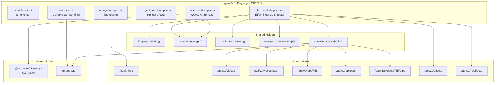

# C4 Code Level: GUI End-to-End Tests

## Overview
- **Name**: GUI End-to-End Tests
- **Description**: Playwright-based E2E test suite covering navigation, CRUD operations, effect workflows, and WCAG AA accessibility compliance
- **Location**: `gui/e2e/`
- **Language**: TypeScript
- **Purpose**: Validates full user workflows through the browser against the running application, including API interactions, DOM assertions, and accessibility audits
- **Parent Component**: [Web GUI](./c4-component-web-gui.md)

## Code Elements

### Test Specifications

#### `example.spec.ts` (1 test)
- **Test**: "has title" -- verifies the Playwright environment loads a page with "Vite" in the title
- **Scope**: Smoke test for Playwright configuration
- **Dependencies**: `@playwright/test`

#### `navigation.spec.ts` (1 test)
- **Test**: "navigates between Dashboard, Library, and Projects tabs" -- clicks each nav tab and verifies the corresponding heading appears
- **Scope**: Client-side SPA routing via Navigation component
- **Dependencies**: `@playwright/test`

#### `scan.spec.ts` (1 test)
- **Test**: "scans a directory for videos and displays results in the library" -- opens ScanModal, submits a directory, polls for job completion, and verifies videos appear in VideoGrid
- **Scope**: Library scan workflow (POST /api/v1/videos/scan + job polling)
- **Dependencies**: `@playwright/test`, `child_process.execSync`, `fs.mkdtempSync`, `os.tmpdir`, `path.join`
- **Prerequisite**: ffmpeg must be available on PATH to generate test video

#### `project-creation.spec.ts` (1 test)
- **Test**: "creates a project via modal and verifies it appears in list" -- navigates to Projects tab, opens CreateProjectModal, fills name/resolution/fps, submits, verifies modal closes with 10s timeout, verifies project appears in list
- **Scope**: Project CRUD workflow (POST /api/v1/projects)
- **Dependencies**: `@playwright/test`
- **Note**: Modal close timeout increased to 10_000ms (from previous version) to handle slower systems

#### `accessibility.spec.ts` (5 tests)
- **Tests**:
  - "dashboard has no WCAG AA violations"
  - "library has no WCAG AA violations"
  - "projects has no WCAG AA violations"
  - "effect catalog has no WCAG AA violations" (disables color-contrast, select-name rules)
  - "effect parameter form has no WCAG AA violations" (disables color-contrast, select-name rules)
- **Scope**: Automated WCAG 2.0 Level A and AA compliance via axe-core
- **Dependencies**: `@playwright/test`, `@axe-core/playwright.AxeBuilder`

#### `effect-workshop.spec.ts` (7 tests across 4 describe blocks)

**Describe: Effect Workshop - Catalog** (1 test)
- "browses effect catalog and selects an effect" -- navigates to Effects, verifies card list, searches "volume", filters by "audio" category, clicks to select and verifies parameter form

**Describe: Effect Workshop - Parameters and Preview** (1 test)
- "configures parameters and verifies filter preview updates" -- selects volume effect, changes parameter to "2", waits for debounced filter preview

**Describe: Effect Workshop - Apply, Edit, Remove** (3 tests, serial mode)
- "applies effect to clip and verifies effect stack" -- sets up project with clip via API, selects clip, selects volume effect, applies via POST, verifies stack entry
- "edits applied effect with pre-filled form" -- clicks edit on applied effect, verifies "Update Effect" button text, changes parameter, submits PATCH
- "removes applied effect with confirmation dialog" -- clicks remove, verifies confirmation dialog, confirms deletion, verifies empty stack

**Describe: Effect Workshop - Keyboard Navigation** (1 test)
- "navigates full workflow with Tab, Enter, and Space" -- focuses and activates effects with keyboard, tabs through form inputs

### Helper Functions

- `ffmpegAvailable(): boolean`
  - Description: Checks if ffmpeg is on PATH by running `ffmpeg -version`
  - Location: `gui/e2e/effect-workshop.spec.ts:9`
  - Returns: `true` if ffmpeg is available, `false` otherwise

- `checkEffectsApi(request: APIRequestContext): Promise<boolean>`
  - Description: Probes GET /api/v1/effects to check if the Rust effects module is available
  - Location: `gui/e2e/effect-workshop.spec.ts:23` and `gui/e2e/accessibility.spec.ts:5`
  - Returns: `true` if response is OK

- `navigateToEffects(page: Page): Promise<void>`
  - Description: Navigates to the Effects page via SPA routing and waits for catalog to load (15s timeout)
  - Location: `gui/e2e/effect-workshop.spec.ts:33`

- `navigateAndSelectClip(page: Page, projectId: string, clipId: string): Promise<void>`
  - Description: Navigates to effects page, selects project from dropdown if needed, waits for and clicks the clip button
  - Location: `gui/e2e/effect-workshop.spec.ts:44`

- `setupProjectWithClip(request: APIRequestContext): Promise<{projectId: string, clipId: string}>`
  - Description: Creates a test video with ffmpeg, scans it via API, creates a project, adds a clip, returns IDs
  - Location: `gui/e2e/effect-workshop.spec.ts:74`
  - API calls: POST /api/v1/videos/scan, GET /api/v1/jobs/{id}, GET /api/v1/videos, POST /api/v1/projects, POST /api/v1/projects/{id}/clips

### Constants

- `HAS_FFMPEG: boolean` -- cached result of `ffmpegAvailable()`, evaluated at module load time

## Dependencies

### Internal Dependencies
- Playwright test configuration (`gui/playwright.config.ts`)
- Running application server (backend API + GUI)

### External Dependencies
- `@playwright/test` (test runner, Page, APIRequestContext, expect)
- `@axe-core/playwright` (AxeBuilder for WCAG audits)
- `child_process` (execSync for ffmpeg)
- `fs` (mkdtempSync for temp directories)
- `os` (tmpdir)
- `path` (join)

### API Endpoints Tested
| Endpoint | Method | Test File |
|----------|--------|-----------|
| `/gui/` | GET | all specs |
| `/api/v1/effects` | GET | accessibility, effect-workshop |
| `/api/v1/effects/preview` | POST | effect-workshop (Parameters) |
| `/api/v1/videos/scan` | POST | scan, effect-workshop |
| `/api/v1/jobs/{id}` | GET | scan, effect-workshop |
| `/api/v1/videos` | GET | scan, effect-workshop |
| `/api/v1/projects` | POST | project-creation, effect-workshop |
| `/api/v1/projects/{id}/clips` | POST | effect-workshop |
| `/api/v1/projects/{id}/clips/{id}/effects` | POST | effect-workshop (Apply) |
| `/api/v1/projects/{id}/clips/{id}/effects/{idx}` | PATCH | effect-workshop (Edit) |
| `/api/v1/projects/{id}/clips/{id}/effects/{idx}` | DELETE | effect-workshop (Remove) |

## Relationships

