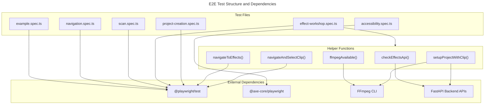

# C4 Code Level: GUI E2E Tests

## Overview

- **Name**: GUI End-to-End Test Suite
- **Description**: Playwright-based end-to-end tests covering navigation, scanning, accessibility, effects workflow, and project creation.
- **Location**: gui/e2e/
- **Language**: TypeScript
- **Purpose**: Validates GUI functionality through full user workflows, accessibility compliance (WCAG AA), and API integration with FastAPI backend.
- **Parent Component**: [Web GUI](./c4-component-web-gui.md)

## Test Inventory

**Total Tests**: 15 test cases across 6 test files

### Test Files Summary

| File | Tests | Focus |
|------|-------|-------|
| example.spec.ts | 1 | Basic frontend load verification |
| navigation.spec.ts | 1 | SPA navigation between pages |
| scan.spec.ts | 1 | Library scan modal workflow |
| accessibility.spec.ts | 4 | WCAG AA compliance on 4 pages |
| effect-workshop.spec.ts | 7 | Effects catalog, parameters, apply/edit/remove, keyboard nav |
| project-creation.spec.ts | 1 | Project creation via modal |

## Code Elements

### Test Helpers

- `checkEffectsApi(request: APIRequestContext): Promise<boolean>`
  - Description: Verifies Effects API (/api/v1/effects) availability; skips tests if unavailable.
  - Location: gui/e2e/accessibility.spec.ts:5-12, effect-workshop.spec.ts:23-30
  - Dependencies: Playwright APIRequestContext

- `ffmpegAvailable(): boolean`
  - Description: Checks if FFmpeg is installed and available in PATH.
  - Location: gui/e2e/effect-workshop.spec.ts:9-16

- `navigateToEffects(page: Page): Promise<void>`
  - Description: Navigate to Effects page via SPA routing and wait for effect catalog load.
  - Location: gui/e2e/effect-workshop.spec.ts:33-41
  - Dependencies: Playwright Page

- `navigateAndSelectClip(page: Page, projectId: string, clipId: string): Promise<void>`
  - Description: Navigate to Effects and select a specific project clip from dropdown.
  - Location: gui/e2e/effect-workshop.spec.ts:44-71
  - Dependencies: Playwright Page, test project setup

- `setupProjectWithClip(request: APIRequestContext): Promise<{projectId: string, clipId: string}>`
  - Description: Creates test project with video clip via API; generates test video with FFmpeg.
  - Location: gui/e2e/effect-workshop.spec.ts:74-134
  - Dependencies: APIRequestContext, execSync, mkdtempSync, fs, path modules

### Test Suites

**example.spec.ts**
- "frontend loads from FastAPI" - Verifies app loads at /gui/ with correct title and Dashboard visible

**navigation.spec.ts**
- "navigates between Dashboard, Library, and Projects tabs" - Tests SPA client-side routing

**scan.spec.ts**
- "triggers scan from library browser and shows feedback" - Tests library scan modal workflow with directory input

**accessibility.spec.ts** (4 tests)
- "dashboard has no WCAG AA violations"
- "library has no WCAG AA violations"
- "projects has no WCAG AA violations"
- "effect catalog has no WCAG AA violations" - Skips color-contrast and select-name rules
- "effect parameter form has no WCAG AA violations" - Tests form after effect selection

**effect-workshop.spec.ts** (7 tests)
- Catalog: "browses effect catalog and selects an effect"
- Parameters: "configures parameters and verifies filter preview updates"
- Apply: "applies effect to clip and verifies effect stack"
- Edit: "edits applied effect with pre-filled form"
- Remove: "removes applied effect with confirmation dialog"
- Keyboard: "navigates full workflow with Tab, Enter, and Space"

**project-creation.spec.ts**
- "creates a project via modal and verifies it appears in list"

## Dependencies

### Internal Dependencies

- GUI application at /gui/ (served by FastAPI backend)
- Backend APIs: /api/v1/effects, /api/v1/videos, /api/v1/projects, /api/v1/jobs
- Components with data-testid selectors (nav-tab-*, button-*, modal-*, form-input-*)

### External Dependencies

- **@playwright/test** (^1.58.2) - End-to-end testing framework
- **@axe-core/playwright** (^4.11.1) - Accessibility scanning via Axe
- **node:child_process** (execSync) - Execute FFmpeg
- **node:fs** (mkdtempSync) - Create temporary directories
- **node:path** (join) - Path manipulation

## Test Configuration

**playwright.config.ts**:
- testDir: ./e2e
- baseURL: http://localhost:8765/gui/
- fullyParallel: true
- webServer: FastAPI app at http://localhost:8765
- reporter: HTML
- Chromium only (not multi-browser)
- retries: 2 in CI, 0 locally
- workers: 1 in CI (serial), unlimited locally

## Relationships

```mermaid
---
title: E2E Test Structure and Dependencies
---
flowchart TB
    subgraph TestFiles["Test Files"]
        Example["example.spec.ts"]
        Navigation["navigation.spec.ts"]
        Scan["scan.spec.ts"]
        Accessibility["accessibility.spec.ts"]
        EffectWorkshop["effect-workshop.spec.ts"]
        ProjectCreation["project-creation.spec.ts"]
    end
    
    subgraph Helpers["Helper Functions"]
        CheckAPI["checkEffectsApi()"]
        FFmpegCheck["ffmpegAvailable()"]
        NavEffects["navigateToEffects()"]
        NavSelectClip["navigateAndSelectClip()"]
        SetupClip["setupProjectWithClip()"]
    end
    
    subgraph Dependencies["External Dependencies"]
        PlaywrightAPI["@playwright/test"]
        AxeCore["@axe-core/playwright"]
        FFmpeg["FFmpeg CLI"]
        BackendAPI["FastAPI Backend APIs"]
    end
    
    Example --> PlaywrightAPI
    Navigation --> PlaywrightAPI
    Scan --> PlaywrightAPI
    Accessibility --> AxeCore
    EffectWorkshop --> PlaywrightAPI
    EffectWorkshop --> Helpers
    ProjectCreation --> PlaywrightAPI
    
    CheckAPI --> BackendAPI
    FFmpegCheck --> FFmpeg
    NavEffects --> PlaywrightAPI
    NavSelectClip --> PlaywrightAPI
    SetupClip --> FFmpeg
    SetupClip --> BackendAPI
```

## Notes

- Tests use data-testid selectors for element targeting (nav-tab-library, effect-card-volume, etc.)
- Accessibility tests use Axe with WCAG 2a/2aa tags; effect catalog tests disable color-contrast and select-name rules (pre-existing issues)
- Effect workshop tests require FFmpeg for video generation; tests skip if unavailable
- Effect tests skip if Effects API unavailable (Rust module not compiled)
- Project creation and effect tests wait for POST/PATCH API responses to complete before asserting UI state
- Serial test mode used in effect apply/edit/remove suite to share project/clip setup across tests
