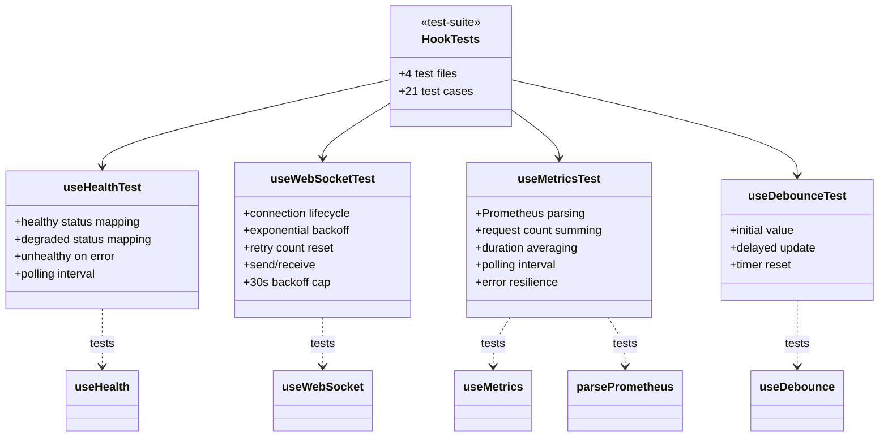

# C4 Code Level: GUI Hook Tests

## Overview
- **Name**: GUI Hook Tests
- **Description**: Vitest test suites validating the custom React hooks that provide data fetching, WebSocket, and utility functionality
- **Location**: `gui/src/hooks/__tests__/`
- **Language**: TypeScript
- **Purpose**: Ensures correctness of health polling, WebSocket reconnection, Prometheus metrics parsing, and debounce behavior

## Test Inventory

| Test File | Test Count | Hook Under Test |
|-----------|-----------|----------------|
| useHealth.test.ts | 4 | useHealth |
| useWebSocket.test.ts | 8 | useWebSocket |
| useMetrics.test.ts | 6 | useMetrics, parsePrometheus |
| useDebounce.test.ts | 3 | useDebounce |
| **Total** | **21** | **4 hooks** |

## Coverage Summary

### useHealth.test.ts (4 tests)
- Returns `healthy` when API returns `status: 'ok'`
- Returns `degraded` when API returns `status: 'degraded'`
- Returns `unhealthy` when fetch throws a network error
- Polls at the configured interval using fake timers

### useWebSocket.test.ts (8 tests)
- Connects to the given URL
- Reports `connected` state after `onopen`
- Reports `reconnecting` state after `onclose`
- Reconnects with exponential backoff (1s, 2s, 4s...)
- Resets retry count on successful connection
- Sends data when connected via `send()` method
- Stores the last received message
- Caps backoff delay at 30 seconds

### useMetrics.test.ts (6 tests)
- `parsePrometheus`: Sums `http_requests_total` across all labels
- `parsePrometheus`: Computes average duration in milliseconds from sum/count
- `parsePrometheus`: Returns null duration when no data present
- `useMetrics`: Fetches and parses metrics from `/metrics` endpoint
- `useMetrics`: Keeps last known metrics on fetch error
- `useMetrics`: Polls at the configured interval

### useDebounce.test.ts (3 tests)
- Returns initial value immediately
- Debounces value changes at configured delay (300ms)
- Resets timer on rapid changes (only emits final value)

## Test Patterns

### Mock Strategies
- `vi.spyOn(globalThis, 'fetch')` for API endpoint mocking
- `MockWebSocket` class with `simulateOpen()`, `simulateClose()`, `simulateMessage()` methods
- `vi.useFakeTimers()` / `vi.advanceTimersByTime()` for timer-dependent tests
- `renderHook()` from `@testing-library/react` for hook isolation

### Timer Testing
- Fake timers used for polling interval verification (useHealth, useMetrics)
- Fake timers used for exponential backoff testing (useWebSocket)
- Fake timers used for debounce delay testing (useDebounce)
- `act()` wrapper for state updates during timer advancement

## Dependencies

### External Dependencies
- `vitest` (describe, it, expect, vi, beforeEach, afterEach)
- `@testing-library/react` (renderHook, waitFor, act)

### Internal Dependencies
- `gui/src/hooks/useHealth` — useHealth hook
- `gui/src/hooks/useWebSocket` — useWebSocket hook
- `gui/src/hooks/useMetrics` — useMetrics hook, parsePrometheus function
- `gui/src/hooks/useDebounce` — useDebounce hook

## Relationships

