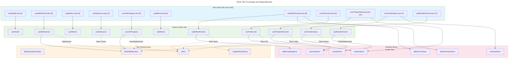

# C4 Code Level: GUI Hook Tests

## Overview
- **Name**: GUI Hook Tests
- **Description**: Vitest test suites validating 14 custom React hooks covering data fetching, WebSocket connectivity, UI state synchronization, and event handling
- **Location**: `gui/src/hooks/__tests__/`
- **Language**: TypeScript
- **Purpose**: Unit tests for hooks covering polling behavior, WebSocket reconnection, debouncing, debounced effect preview, keyboard shortcuts, timeline sync, job progress tracking, and render event dispatch
- **Parent Component**: [Web GUI](./c4-component-web-gui.md)

## Code Elements

### Test Suites

#### `useHealth.test.ts` (4 tests)
- "returns healthy when all checks pass" -- 200 response with ok status
- "returns degraded when status is degraded" -- 503 response with degraded status
- "returns unhealthy when fetch fails" -- network error handling
- "polls at the configured interval" -- fake timers verify 2 fetches at interval boundary
- **Mocking**: `globalThis.fetch`, fake timers
- **Coverage**: Health status mapping, error handling, polling lifecycle

#### `useWebSocket.test.ts` (8 tests)
- "connects to the given URL" -- constructor verification
- "reports connected state after onopen" -- simulateOpen triggers state change
- "reports reconnecting state after onclose" -- transition to reconnecting
- "reconnects with exponential backoff" -- 1s → 2s delays verified
- "resets retry count on successful connection" -- retry count resets on onopen
- "sends data when connected" -- message buffering in sentData array
- "stores the last received message" -- lastMessage state updates
- "caps backoff delay at 30 seconds" -- multiple failures capped at 30s
- **Mocking**: `MockWebSocket` with simulateOpen/Close/Message, fake timers
- **Coverage**: Retry logic, connection state, exponential backoff ceiling

#### `useMetrics.test.ts` (6 tests)
- **parsePrometheus** unit tests (3):
  - "sums request count across all labels" -- 5+3=8 total
  - "computes average duration in milliseconds" -- (0.07/8)*1000 = 8.75ms
  - "returns null duration when no data" -- empty input handling
- **useMetrics** hook tests (3):
  - "fetches and parses metrics from /metrics" -- success path
  - "keeps last metrics on fetch error" -- graceful degradation
  - "polls at the configured interval" -- timing verification
- **Fixture**: `SAMPLE_METRICS` (Prometheus text format with counters, sums, counts)
- **Coverage**: Parser edge cases, polling, error resilience

#### `useDebounce.test.ts` (3 tests)
- "returns initial value immediately" -- no delay on first render
- "debounces value changes" -- 299ms returns old, 300ms updates to new
- "resets timer on rapid changes" -- multiple rapid updates settle to final value
- **Mocking**: Fake timers
- **Coverage**: Debounce delay, timer reset, initial value behavior

#### `useEffects.test.ts` (6 tests)
- **useEffects** hook tests (3):
  - "fetches effects successfully" -- loading → false, effects array populated
  - "handles fetch errors" -- network error message capture
  - "handles non-ok response" -- HTTP 500 error formatting
- **deriveCategory** unit tests (3):
  - "classifies audio effects" -- audio_*, volume, acrossfade → audio
  - "classifies transition effects" -- xfade → transition
  - "classifies video effects" -- default category fallback
- **Fixture**: `mockEffects` with Effect object samples
- **Coverage**: Category classification, error handling, loading states

#### `useJobProgress.test.ts` (9 tests)
- "returns null state initially" -- initial state null
- "updates progress from matching JOB_PROGRESS events" -- event parsing and state update
- "ignores events for different job IDs" -- jobId filtering
- "ignores non-job_progress event types" -- type validation
- "ignores non-JSON messages" -- malformed JSON handling
- "tracks progressive updates" -- sequential progress values
- "returns null state when jobId is null" -- null jobId handling
- "resets state when jobId changes" -- jobId change cleanup
- **Mocking**: `MockWebSocket`, fake timers
- **Helper**: `makeProgressEvent()` factory
- **Coverage**: Event filtering, state lifecycle, jobId transitions

#### `useEffectPreview.test.ts` (8 tests)
- "resets preview store when no effect is selected" -- cleanup on deselect
- "fetches preview when effect is selected and parameters change" -- debounced POST
- "debounces rapid parameter changes into a single API call" -- only final value sent
- "sets error state when API call fails" -- error capture and propagation
- **Thumbnail tests (4)**:
  - "fetches thumbnail when effect selected and videoPath set" -- 500ms debounce
  - "does not fetch thumbnail when videoPath is null" -- null check
  - "falls back to null thumbnail on API error" -- error resilience
  - "debounces thumbnail updates at 500ms" -- separate debounce timing
- **Mocking**: `mockFetchSuccess()`, `mockFetchError()`, `mockFetchMulti()`, URL.createObjectURL, fake timers
- **Coverage**: Dual debounce (filter 300ms, thumbnail 500ms), required field validation, error handling

#### `useFullscreen.test.ts` (6 tests)
- "calls requestFullscreen on enter" -- API invocation
- "does not call requestFullscreen when already fullscreen" -- idempotency
- "calls document.exitFullscreen on exit" -- exit API call
- "does not call exitFullscreen when not fullscreen" -- guard condition
- "updates theater store on fullscreenchange — entering" -- event listener integration
- "updates theater store on fullscreenchange — exiting" -- state synchronization
- "cleans up fullscreenchange listener on unmount" -- cleanup verification
- **Mocking**: HTMLElement.requestFullscreen, document.exitFullscreen, fullscreenElement property, `useTheaterStore`
- **Coverage**: Fullscreen API, event listeners, state sync, cleanup

#### `useTheaterShortcuts.test.ts` (11 tests)
- **Play/pause (Space)**:
  - "plays when paused" -- play() called
  - "pauses when playing" -- pause() called
- **Exit (Escape)**: "Escape calls onExit"
- **Fullscreen (F)**:
  - "calls onToggleFullscreen on lowercase f"
  - "calls onToggleFullscreen on uppercase F"
- **Mute (M)**:
  - "mutes when unmuted" -- video.muted=true, store updated
  - "unmutes when muted" -- video.muted=false, store updated
- **Seek (Arrow keys)**: 
  - "ArrowLeft seeks backward 5 seconds"
  - "ArrowRight seeks forward 5 seconds"
  - "ArrowLeft clamps to 0"
  - "ArrowRight clamps to duration"
- **Jump (Home/End)**:
  - "Home jumps to start"
  - "End jumps to end"
- **Focus scoping (FR-007)**:
  - "ignores shortcuts when target is an input element"
  - "ignores shortcuts when target is a textarea"
- **Edge cases**:
  - "does nothing when videoRef is null"
  - "does not register shortcuts when enabled is false"
- **Cleanup**: "removes keydown listener on unmount"
- **Mocking**: `createMockVideo()` helper, `fireKey()` helper, `usePreviewStore`
- **Coverage**: All 8 shortcut bindings, focus scoping, lifecycle management

#### `useTimelineSync.test.ts` (9 tests)
- "syncs player position to timeline playhead after debounce" -- debounce timing
- "does not sync when difference is below threshold" -- threshold guard (0.5s)
- "syncs when difference exceeds threshold" -- threshold trigger
- "seeks video on seekFromTimeline call" -- bidirectional seek
- "guard flag prevents loop during seek" -- isSeeking guard logic
- "resumes sync after guard resets" -- guard timeout cleanup
- "debounces rapid position updates" -- only final value synced
- "does nothing when videoRef is null" -- null safety
- **Constants**: `SYNC_DEBOUNCE_MS=100`, `SYNC_THRESHOLD_S=0.5`
- **Mocking**: `createMockVideo()` helper, fake timers, `usePreviewStore`, `useTimelineStore`
- **Coverage**: Bidirectional sync, debounce + threshold, guard logic, rapid updates

#### `useRenderEvents.test.ts` (12 tests)
- **Lifecycle events (5 tests)**:
  - "dispatches render_queued to updateJob"
  - "dispatches render_started to updateJob"
  - "dispatches render_completed to updateJob"
  - "dispatches render_failed to updateJob"
  - "dispatches render_cancelled to updateJob"
- **Progress and queue (3 tests)**:
  - "dispatches render_progress to setProgress" -- basic progress
  - "dispatches render_progress with eta_seconds and speed_ratio to store" -- optional fields
  - "handles render_progress without eta_seconds gracefully" -- null handling
  - "dispatches render_frame_available to setProgress" -- frame event update
- **Queue status**: "dispatches render_queue_status to setQueueStatus with partial merge" -- partial update merging
- **Filtering (2 tests)**:
  - "ignores non-render events" -- type validation
  - "ignores malformed JSON messages" -- JSON parse error handling
- **Reconnection**: "re-fetches jobs and queue status on reconnection" -- state transition (reconnecting → connected)
- **Mocking**: `MockWebSocket`, fake timers, `useRenderStore`, `makeEvent()` helper
- **Coverage**: All 8 event types, optional payload fields, reconnection logic, JSON resilience

## Test Coverage Summary

| Test File | Total Tests | Hooks/Functions Tested | Coverage Focus |
|-----------|------------|----------------------|-----------------|
| useHealth.test.ts | 4 | useHealth | Polling, status mapping, error handling |
| useWebSocket.test.ts | 8 | useWebSocket | Reconnection, exponential backoff, messaging |
| useMetrics.test.ts | 6 | useMetrics, parsePrometheus | Prometheus parsing, polling, error resilience |
| useDebounce.test.ts | 3 | useDebounce | Debounce timing, rapid updates |
| useEffects.test.ts | 6 | useEffects, deriveCategory | Effect fetching, categorization |
| useJobProgress.test.ts | 9 | useJobProgress | Event filtering, state lifecycle |
| useEffectPreview.test.ts | 8 | useEffectPreview | Dual debounce, validation, thumbnails |
| useFullscreen.test.ts | 6 | useFullscreen | Fullscreen API, event sync |
| useTheaterShortcuts.test.ts | 11 | useTheaterShortcuts | 8 keyboard bindings, focus scoping |
| useTimelineSync.test.ts | 9 | useTimelineSync | Bidirectional sync, guard logic, debounce |
| useRenderEvents.test.ts | 12 | useRenderEvents | 8 event types, reconnection |
| **Total** | **82** | **14 hooks + 2 utilities** | Comprehensive coverage |

## Dependencies

### Internal Dependencies
- All hooks from `gui/src/hooks/`
- Zustand stores: `previewStore`, `timelineStore`, `renderStore`, `effectCatalogStore`, `effectFormStore`, `effectPreviewStore`, `theaterStore`
- Mock utilities: `MockWebSocket` from `gui/src/__tests__/mockWebSocket`

### External Dependencies
- `vitest` (describe, it, expect, vi, beforeEach, afterEach)
- `@testing-library/react` (renderHook, waitFor, act)
- `react` (for hook testing)

## Relationships

```mermaid
---
title: Hook Test Coverage and Dependencies
---
flowchart TD
    subgraph HookTests["Test Suites (82 tests total)"]
        HT["useHealth.test (4)"]
        WT["useWebSocket.test (8)"]
        MT["useMetrics.test (6)"]
        DT["useDebounce.test (3)"]
        JT["useJobProgress.test (9)"]
        ET["useEffects.test (6)"]
        EPT["useEffectPreview.test (8)"]
        FT["useFullscreen.test (6)"]
        TT["useTheaterShortcuts.test (11)"]
        TST["useTimelineSync.test (9)"]
        RET["useRenderEvents.test (12)"]
    end

    subgraph Hooks["Hooks Under Test"]
        H1["useHealth"]
        H2["useWebSocket"]
        H3["useMetrics"]
        H4["useDebounce"]
        H5["useJobProgress"]
        H6["useEffects"]
        H7["useEffectPreview"]
        H8["useFullscreen"]
        H9["useTheaterShortcuts"]
        H10["useTimelineSync"]
        H11["useRenderEvents"]
    end

    subgraph Stores["Zustand Stores<br/>Under Test"]
        PS["previewStore"]
        TS["timelineStore"]
        RS["renderStore"]
        ECS["effectCatalogStore"]
        EFS["effectFormStore"]
        EPS["effectPreviewStore"]
        THS["theaterStore"]
    end

    subgraph TestUtils["Test Infrastructure"]
        RTL["@testing-library/react"]
        VI["vitest"]
        MW["MockWebSocket"]
        MV["createMockVideo()"]
    end

    HT --> H1
    WT --> H2 --> MW
    MT --> H3
    DT --> H4
    JT --> H5 --> MW
    ET --> H6
    EPT --> H7 --> ECS
    EPT --> EFS
    EPT --> EPS
    FT --> H8 --> THS
    TT --> H9 --> PS
    TT --> THS
    TST --> H10 --> PS
    TST --> TS
    RET --> H11 --> RS

    H2 -.->|WebSocket| VI
    H4 -.->|Fake Timers| VI
    H5 -.->|MockWebSocket| MW
    H7 -.->|Mock fetch| VI
    H8 -.->|Mock API| VI
    H9 -.->|Mock video| MV
    H10 -.->|Fake Timers| VI
    H11 -.->|MockWebSocket| MW

    style Hooks fill:#e8f5e9
    style Stores fill:#fce4ec
    style TestUtils fill:#fff3e0
    style HookTests fill:#e1f5ff
```
