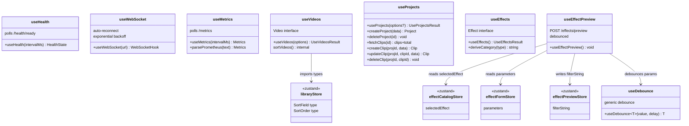

# C4 Code Level: GUI Hooks

## Overview
- **Name**: GUI Custom React Hooks
- **Description**: Custom hooks providing data fetching, WebSocket connectivity, and utility functions for the GUI
- **Location**: `gui/src/hooks/`
- **Language**: TypeScript
- **Purpose**: Encapsulates side effects (API polling, WebSocket management, debouncing) and data fetching logic, keeping components focused on presentation
- **Parent Component**: TBD

## Code Elements

### Functions/Methods

#### `useHealth(intervalMs?: number): HealthState`
- **Location**: `gui/src/hooks/useHealth.ts`
- **Description**: Polls `/health/ready` at the given interval (default 30s). Maps API responses to three statuses: `healthy` (ok response), `degraded` (503 with partial check failures), `unhealthy` (fetch error or non-ok)
- **Internal Function**: `mapStatus(response: HealthResponse): HealthStatus`
- **Exports**: `HealthState` interface (`{ status: HealthStatus, checks: Record<string, HealthCheck> }`), `HealthStatus` type (`'healthy' | 'degraded' | 'unhealthy'`)
- **Dependencies**: `react.useState`, `react.useEffect`

#### `useWebSocket(url: string): WebSocketHook`
- **Location**: `gui/src/hooks/useWebSocket.ts`
- **Description**: Manages a WebSocket connection with automatic reconnection using exponential backoff (base 1s, max 30s). Resets retry count on successful connection. Provides send function and last received message.
- **Constants**: `BASE_DELAY = 1000`, `MAX_DELAY = 30_000`
- **Exports**: `ConnectionState` type (`'connected' | 'disconnected' | 'reconnecting'`), `WebSocketHook` interface (`{ state, lastMessage, send }`)
- **Dependencies**: `react.useState`, `react.useEffect`, `react.useCallback`, `react.useRef`

#### `useMetrics(intervalMs?: number): Metrics`
- **Location**: `gui/src/hooks/useMetrics.ts`
- **Description**: Polls `/metrics` (Prometheus text format) at the given interval (default 30s). Parses request count and average duration.
- **Exported Function**: `parsePrometheus(text: string): Metrics` -- sums `http_requests_total` values, computes average from `http_request_duration_seconds_sum` / `_count`
- **Exports**: `Metrics` interface (`{ requestCount: number, avgDurationMs: number | null }`)
- **Dependencies**: `react.useState`, `react.useEffect`

#### `useDebounce<T>(value: T, delayMs?: number): T`
- **Location**: `gui/src/hooks/useDebounce.ts`
- **Description**: Generic debounce hook. Returns the debounced value after the specified delay (default 300ms). Resets timer on rapid changes.
- **Dependencies**: `react.useState`, `react.useEffect`

#### `useVideos(options: UseVideosOptions): UseVideosResult`
- **Location**: `gui/src/hooks/useVideos.ts`
- **Description**: Fetches video list with search, sort, and pagination. When `searchQuery` is set, uses GET `/api/v1/videos/search?q=...&limit=...`; otherwise uses GET `/api/v1/videos?limit=...&offset=...`. Client-side sort via `sortVideos()`.
- **Options Interface**: `UseVideosOptions { searchQuery: string, sortField: SortField, sortOrder: SortOrder, page: number, pageSize: number }`
- **Internal Function**: `sortVideos(videos: Video[], field: SortField, order: SortOrder): Video[]` -- sorts by name (localeCompare), duration (frame math), or date (created_at)
- **Exports**: `Video` interface (id, path, filename, duration_frames, frame_rate_numerator/denominator, width, height, video_codec, audio_codec, file_size, thumbnail_path, created_at, updated_at), `UseVideosResult` interface (`{ videos, total, loading, error, refetch }`)
- **Dependencies**: `react.useState`, `react.useEffect`, `react.useCallback`, `SortField`/`SortOrder` types from `libraryStore`

#### `useProjects(options?: UseProjectsOptions): UseProjectsResult`
- **Location**: `gui/src/hooks/useProjects.ts`
- **Description**: Fetches project list from GET `/api/v1/projects?limit=...&offset=...` with pagination support.
- **Options Interface**: `UseProjectsOptions { page?: number, pageSize?: number }` (defaults: page=0, pageSize=100)
- **Exported Functions**:
  - `createProject(data: { name, output_width, output_height, output_fps }): Promise<Project>` -- POST `/api/v1/projects`
  - `deleteProject(id: string): Promise<void>` -- DELETE `/api/v1/projects/{id}`
  - `fetchClips(projectId: string): Promise<{ clips: Clip[], total: number }>` -- GET `/api/v1/projects/{id}/clips`
  - `createClip(projectId: string, data: { source_video_id, in_point, out_point, timeline_position }): Promise<Clip>` -- POST `/api/v1/projects/{id}/clips`
  - `updateClip(projectId: string, clipId: string, data: { in_point?, out_point?, timeline_position? }): Promise<Clip>` -- PATCH `/api/v1/projects/{id}/clips/{id}`
  - `deleteClip(projectId: string, clipId: string): Promise<void>` -- DELETE `/api/v1/projects/{id}/clips/{id}`
- **Exports**: `Project` interface (id, name, output_width, output_height, output_fps, created_at, updated_at), `Clip` interface (id, project_id, source_video_id, in_point, out_point, timeline_position, created_at, updated_at), `UseProjectsResult` interface (`{ projects, total, loading, error, refetch }`)
- **Dependencies**: `react.useState`, `react.useEffect`, `react.useCallback`

#### `useEffects(): UseEffectsResult`
- **Location**: `gui/src/hooks/useEffects.ts`
- **Description**: Fetches effects list from GET `/api/v1/effects`. Returns array of Effect definitions.
- **Exported Function**: `deriveCategory(effectType: string): string` -- classifies effect types into categories: `audio` (volume, audio_*, acrossfade), `transition` (xfade), `video` (everything else)
- **Exports**: `Effect` interface (effect_type, name, description, parameter_schema, ai_hints, filter_preview)
- **Dependencies**: `react.useState`, `react.useEffect`, `react.useCallback`

#### `useEffectPreview(): void`
- **Location**: `gui/src/hooks/useEffectPreview.ts`
- **Description**: Connects the effect catalog store, form store, and preview store. When an effect is selected and parameters change, debounces (300ms) and calls POST `/api/v1/effects/preview` with `{ effect_type, parameters }`. Updates preview store with filter_string or error. Resets preview when no effect selected.
- **Dependencies**: `useDebounce`, `useEffectCatalogStore`, `useEffectFormStore`, `useEffectPreviewStore`

## Dependencies

### Internal Dependencies
- `gui/src/stores/libraryStore` -- `SortField`/`SortOrder` types used by `useVideos`
- `gui/src/stores/effectCatalogStore` -- used by `useEffectPreview`
- `gui/src/stores/effectFormStore` -- used by `useEffectPreview`
- `gui/src/stores/effectPreviewStore` -- used by `useEffectPreview`

### External Dependencies
- `react` (useState, useEffect, useCallback, useRef)

### API Endpoints

| Hook/Function | Endpoint | Method | Trigger |
|---------------|----------|--------|---------|
| useHealth | `/health/ready` | GET | Configurable interval |
| useMetrics | `/metrics` | GET | Configurable interval |
| useVideos | `/api/v1/videos` | GET | On options change |
| useVideos | `/api/v1/videos/search` | GET | When searchQuery set |
| useProjects | `/api/v1/projects` | GET | On mount/pagination |
| createProject | `/api/v1/projects` | POST | On call |
| deleteProject | `/api/v1/projects/{id}` | DELETE | On call |
| fetchClips | `/api/v1/projects/{id}/clips` | GET | On call |
| createClip | `/api/v1/projects/{id}/clips` | POST | On call |
| updateClip | `/api/v1/projects/{id}/clips/{id}` | PATCH | On call |
| deleteClip | `/api/v1/projects/{id}/clips/{id}` | DELETE | On call |
| useEffects | `/api/v1/effects` | GET | On mount |
| useEffectPreview | `/api/v1/effects/preview` | POST | Debounced on param change |

## Relationships

