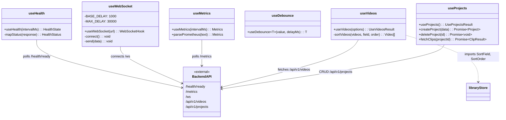

# C4 Code Level: GUI Hooks

## Overview
- **Name**: GUI Custom React Hooks
- **Description**: Custom hooks providing data fetching, WebSocket connectivity, and utility functions for the GUI
- **Location**: `gui/src/hooks/`
- **Language**: TypeScript
- **Purpose**: Encapsulates backend API communication, real-time WebSocket management, Prometheus metrics parsing, and UI utilities

## Code Elements

### Functions/Methods

- `useHealth(intervalMs = 30_000): HealthState`
  - Description: Polls `/health/ready` endpoint at configurable interval; maps API status to `healthy | degraded | unhealthy`
  - Location: `gui/src/hooks/useHealth.ts:1`
  - Dependencies: `react.useEffect`, `react.useState`, `fetch(/health/ready)`

- `mapStatus(response: HealthResponse): HealthStatus`
  - Description: Maps API response status string to typed health status enum
  - Location: `gui/src/hooks/useHealth.ts`
  - Dependencies: None (internal helper)

- `useWebSocket(url: string): WebSocketHook`
  - Description: Manages WebSocket connection with exponential backoff reconnection (1s base, 30s max); tracks connection state and last message
  - Location: `gui/src/hooks/useWebSocket.ts:1`
  - Dependencies: `react.useCallback`, `react.useEffect`, `react.useRef`, `react.useState`, `WebSocket` API

- `useMetrics(intervalMs = 30_000): Metrics`
  - Description: Polls `/metrics` endpoint at configurable interval; parses Prometheus text format into structured metrics
  - Location: `gui/src/hooks/useMetrics.ts:1`
  - Dependencies: `react.useEffect`, `react.useState`, `parsePrometheus`, `fetch(/metrics)`

- `parsePrometheus(text: string): Metrics`
  - Description: Parses Prometheus text format; sums `http_requests_total` samples and computes average duration from `http_request_duration_seconds_sum` / `http_request_duration_seconds_count`
  - Location: `gui/src/hooks/useMetrics.ts`
  - Dependencies: None (pure function)

- `useDebounce<T>(value: T, delayMs = 300): T`
  - Description: Generic debounce hook; delays value updates by configurable milliseconds, resets timer on rapid changes
  - Location: `gui/src/hooks/useDebounce.ts:1`
  - Dependencies: `react.useEffect`, `react.useState`

- `useVideos(options: UseVideosOptions): UseVideosResult`
  - Description: Fetches videos with search, sorting, and pagination; dual fetch paths for search vs paginated listing
  - Location: `gui/src/hooks/useVideos.ts:1`
  - Dependencies: `react.useCallback`, `react.useEffect`, `react.useState`, `SortField`/`SortOrder` from `libraryStore`, `fetch(/api/v1/videos)`, `fetch(/api/v1/videos/search)`

- `sortVideos(videos: Video[], field: SortField, order: SortOrder): Video[]`
  - Description: Client-side sorting by name (localeCompare), duration (frame-rate calculation), or date
  - Location: `gui/src/hooks/useVideos.ts`
  - Dependencies: None (internal helper)

- `useProjects(): UseProjectsResult`
  - Description: Fetches all projects from API with refetch capability
  - Location: `gui/src/hooks/useProjects.ts:1`
  - Dependencies: `react.useCallback`, `react.useEffect`, `react.useState`, `fetch(/api/v1/projects)`

- `createProject(data: { name: string; output_width: number; output_height: number; output_fps: number }): Promise<Project>`
  - Description: Creates a new project via POST request; returns created project or throws with error detail
  - Location: `gui/src/hooks/useProjects.ts`
  - Dependencies: `fetch(POST /api/v1/projects)`

- `deleteProject(id: string): Promise<void>`
  - Description: Deletes a project via DELETE request; throws on failure
  - Location: `gui/src/hooks/useProjects.ts`
  - Dependencies: `fetch(DELETE /api/v1/projects/{id})`

- `fetchClips(projectId: string): Promise<{ clips: Clip[]; total: number }>`
  - Description: Fetches clips for a given project
  - Location: `gui/src/hooks/useProjects.ts`
  - Dependencies: `fetch(GET /api/v1/projects/{projectId}/clips)`

### Types/Interfaces

- `HealthStatus = 'healthy' | 'degraded' | 'unhealthy'` — `gui/src/hooks/useHealth.ts`
- `HealthState { status: HealthStatus; checks: Record<string, HealthCheck> }` — `gui/src/hooks/useHealth.ts`
- `ConnectionState = 'connected' | 'disconnected' | 'reconnecting'` — `gui/src/hooks/useWebSocket.ts`
- `WebSocketHook { state: ConnectionState; send: (data: string) => void; lastMessage: MessageEvent | null }` — `gui/src/hooks/useWebSocket.ts`
- `Metrics { requestCount: number; avgDurationMs: number | null }` — `gui/src/hooks/useMetrics.ts`
- `Video { id, path, filename, duration_frames, frame_rate_numerator, frame_rate_denominator, width, height, video_codec, audio_codec, file_size, thumbnail_path, created_at, updated_at }` — `gui/src/hooks/useVideos.ts`
- `Project { id, name, output_width, output_height, output_fps, created_at, updated_at }` — `gui/src/hooks/useProjects.ts`
- `Clip { id, project_id, source_video_id, in_point, out_point, timeline_position, created_at, updated_at }` — `gui/src/hooks/useProjects.ts`

## Dependencies

### Internal Dependencies
- `gui/src/stores/libraryStore` — `useVideos` imports `SortField`, `SortOrder` types

### External Dependencies
- `react` (useState, useEffect, useCallback, useRef)
- Browser `WebSocket` API
- Browser `fetch` API

### API Endpoints Consumed
| Endpoint | Method | Hook |
|----------|--------|------|
| `/health/ready` | GET | useHealth |
| `/metrics` | GET | useMetrics |
| `/ws` | WebSocket | useWebSocket |
| `/api/v1/videos` | GET | useVideos |
| `/api/v1/videos/search` | GET | useVideos |
| `/api/v1/projects` | GET | useProjects |
| `/api/v1/projects` | POST | createProject |
| `/api/v1/projects/{id}` | DELETE | deleteProject |
| `/api/v1/projects/{id}/clips` | GET | fetchClips |

## Relationships

