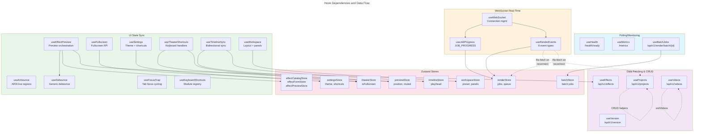

# C4 Code Level: GUI React Hooks

## Overview
- **Name**: GUI React Hooks
- **Description**: Reusable React hooks for state management, data fetching, event handling, and WebSocket communication in the stoat-and-ferret GUI
- **Location**: `gui/src/hooks/`
- **Language**: TypeScript
- **Purpose**: Encapsulates side effects (API polling, WebSocket management, debouncing, keyboard shortcuts, fullscreen control) and provides bidirectional data synchronization between UI components and application stores
- **Parent Component**: [Web GUI](./c4-component-web-gui.md)

## Code Elements

### Functions/Methods

#### `useHealth(intervalMs?: number): HealthState`
- **Location**: `gui/src/hooks/useHealth.ts:26`
- **Description**: Polls `/health/ready` at the given interval (default 30s). Maps API responses to three statuses: `healthy` (ok response), `degraded` (partial failures), `unhealthy` (fetch error or non-ok). Cancels polling on unmount.
- **Signature**: `useHealth(intervalMs = 30_000): HealthState`
- **Internal Function**: `mapStatus(response: HealthResponse): HealthStatus`
- **Exports**: `HealthState` interface, `HealthStatus` type (`'healthy' | 'degraded' | 'unhealthy'`)
- **Dependencies**: `react.useState`, `react.useEffect`, fetch API

#### `useWebSocket(url: string): WebSocketHook`
- **Location**: `gui/src/hooks/useWebSocket.ts:14`
- **Description**: Manages a WebSocket connection with exponential backoff reconnection (1s → 2s → 4s ... max 30s). Resets retry count on successful connection. Uses a ref-queue pattern (`queueRef` + `tick` counter) to survive React 18 automatic batching: `onmessage` pushes events to `queueRef` and increments `tick`; a drain `useEffect([tick])` flushes the queue into `messages[]` each render cycle. Exposes `messages: MessageEvent[]` (all messages received since last drain) and `lastMessage` (backward-compat alias for `messages.at(-1)`).
- **Signature**: `useWebSocket(url: string): WebSocketHook`
- **Constants**: `BASE_DELAY = 1000`, `MAX_DELAY = 30_000`
- **Exports**: `ConnectionState` type, `WebSocketHook` interface (`{ state, lastMessage, messages, send }`)
- **Dependencies**: `react.useState`, `react.useEffect`, `react.useCallback`, `react.useRef`, WebSocket API
- **Tests**: 10 tests in `gui/src/hooks/__tests__/useWebSocket.test.ts` (8 existing + 2 new: burst delivery, backward-compat)

#### `useMetrics(intervalMs?: number): Metrics`
- **Location**: `gui/src/hooks/useMetrics.ts:40`
- **Description**: Polls `/metrics` (Prometheus text format) at configurable intervals. Parses http_requests_total (summed) and computes average duration from sum/count.
- **Signature**: `useMetrics(intervalMs = 30_000): Metrics`
- **Exported Function**: `parsePrometheus(text: string): Metrics` (pure utility)
- **Exports**: `Metrics` interface (`{ requestCount: number, avgDurationMs: number | null }`)
- **Dependencies**: `react.useState`, `react.useEffect`, fetch API

#### `useAnnounce(): { announce: (message: string, priority?: 'polite' | 'assertive') => void }`
- **Location**: `gui/src/hooks/useAnnounce.ts:3`
- **Description**: Accessibility announcement hook for ARIA live regions. Locates `#announcements` (polite) and `#announcements-assertive` DOM elements on mount and exposes an `announce()` callback that writes messages to the appropriate live region. Both DOM elements must exist in the page's static HTML (e.g., in `Shell.tsx`). No-op when the element is absent.
- **Signature**: `useAnnounce(): { announce: (message: string, priority?: 'polite' | 'assertive') => void }`
- **Dependencies**: `react.useCallback`, `react.useRef`, `react.useEffect`, DOM getElementById

#### `useBatchJobs(batchId: string | null): UseBatchJobsResult`
- **Location**: `gui/src/hooks/useBatchJobs.ts:70`
- **Description**: Polls batch progress for a given `batch_id` and feeds updates into `batchStore`. Pass `null` to disable polling. Implements 1s normal cadence, exponential backoff on error (1s → 2s → 4s capped at 10s), and auto-stops when all jobs reach terminal status. Uses ref-queue pattern (LRN-188 / NFR-001) to prevent React state batching from collapsing concurrent updates.
- **Signature**: `useBatchJobs(batchId: string | null): UseBatchJobsResult`
- **Constants**: `NORMAL_INTERVAL_MS = 1000`, `INITIAL_BACKOFF_MS = 1000`, `MAX_BACKOFF_MS = 10_000`, `RECONNECTING_THRESHOLD = 2`
- **Exports**: `UseBatchJobsResult` interface (`{ hasError: boolean, isReconnecting: boolean, refresh: () => void }`)
- **Dependencies**: `react.useCallback`, `react.useEffect`, `react.useRef`, `react.useState`, `useBatchStore`, fetch API

#### `useDebounce<T>(value: T, delayMs?: number): T`
- **Location**: `gui/src/hooks/useDebounce.ts:3`
- **Description**: Generic debounce hook returning the debounced value after delay (default 300ms). Resets timer on rapid changes; returns initial value immediately.
- **Signature**: `useDebounce<T>(value: T, delayMs = 300): T`
- **Dependencies**: `react.useState`, `react.useEffect`

#### `useVideos(options: UseVideosOptions): UseVideosResult`
- **Location**: `gui/src/hooks/useVideos.ts:63`
- **Description**: Fetches video list with search, sort (by name/duration/date), and pagination. Search and list use separate endpoints; client-side sort via `sortVideos()`. Error state retained on failures.
- **Signature**: `useVideos(options: UseVideosOptions): UseVideosResult`
- **Options Interface**: `UseVideosOptions { searchQuery, sortField, sortOrder, page, pageSize }`
- **Internal Function**: `sortVideos(videos: Video[], field: SortField, order: SortOrder): Video[]`
- **Dependencies**: `react.useState`, `react.useEffect`, `react.useCallback`, fetch API

#### `useProjects(options?: UseProjectsOptions): UseProjectsResult`
- **Location**: `gui/src/hooks/useProjects.ts:27`
- **Description**: Fetches paginated projects from `/api/v1/projects`. Also exports project, clip CRUD functions (create/update/delete/fetch).
- **Signature**: `useProjects(options?): UseProjectsResult`
- **Exported Functions**: 
  - `createProject(data: {name, output_width, output_height, output_fps}): Promise<Project>`
  - `deleteProject(id: string): Promise<void>`
  - `fetchClips(projectId: string): Promise<{clips, total}>`
  - `createClip(projectId: string, data: {...}): Promise<Clip>`
  - `updateClip(projectId: string, clipId: string, data: {...}): Promise<Clip>`
  - `deleteClip(projectId: string, clipId: string): Promise<void>`
- **Dependencies**: `react.useState`, `react.useEffect`, `react.useCallback`, fetch API

#### `useEffects(): UseEffectsResult`
- **Location**: `gui/src/hooks/useEffects.ts:37`
- **Description**: Fetches effects catalog from `/api/v1/effects`. Also exports `deriveCategory()` utility for categorizing effects into audio/transition/video.
- **Signature**: `useEffects(): UseEffectsResult`
- **Exported Function**: `deriveCategory(effectType: string): string` (audio, transition, video classification)
- **Dependencies**: `react.useState`, `react.useEffect`, `react.useCallback`, fetch API

#### `useEffectPreview(): void`
- **Location**: `gui/src/hooks/useEffectPreview.ts:28`
- **Description**: Orchestrates effect preview (filter string at 300ms debounce and thumbnail at 500ms debounce). Validates required schema fields before API calls. Resets on effect change or schema/params mismatch.
- **Signature**: `useEffectPreview(): void`
- **Internal Function**: `hasRequiredFields(schema, params): boolean`
- **Dependencies**: `useDebounce`, `useEffectCatalogStore`, `useEffectFormStore`, `useEffectPreviewStore`, fetch API

#### `useFocusTrap(containerRef: RefObject<HTMLElement | null>): void`
- **Location**: `gui/src/hooks/useFocusTrap.ts:30`
- **Description**: Traps keyboard focus inside the container referenced by `containerRef` while mounted. Tab/Shift+Tab cycle through focusable descendants (wraps at boundaries). Focuses the first focusable descendant on mount. Handles containers with zero focusable elements gracefully (no-op on Tab). Caller is responsible for restoring prior focus on unmount.
- **Signature**: `useFocusTrap(containerRef: RefObject<HTMLElement | null>): void`
- **Internal Function**: `focusableWithin(container: HTMLElement): HTMLElement[]` — queries focusable selector and filters out tabindex="-1"
- **Dependencies**: `react.useEffect`, DOM querySelectorAll, window keydown event

#### `useFullscreen(containerRef: React.RefObject<HTMLElement | null>): {enter, exit}`
- **Location**: `gui/src/hooks/useFullscreen.ts:8`
- **Description**: Wraps Fullscreen API with fullscreenchange event listener. Derives fullscreen state from browser events (not click state). Synchronizes with theater store.
- **Signature**: `useFullscreen(containerRef): {enter, exit}`
- **Dependencies**: `react.useCallback`, `react.useEffect`, `useTheaterStore`, Fullscreen API

#### `useTheaterShortcuts(options: UseTheaterShortcutsOptions): void`
- **Location**: `gui/src/hooks/useTheaterShortcuts.ts:26`
- **Description**: Keyboard shortcut handler scoped to Theater Mode. Bindings: Space (play/pause), Escape (exit), F (fullscreen toggle), M (mute), Left/Right arrows (seek ±5s), Home (start), End (end). Ignores input/textarea/select elements.
- **Signature**: `useTheaterShortcuts(options): void`
- **Shortcut Bindings**: SKIP_SECONDS=5, IGNORED_TAGS={INPUT, TEXTAREA, SELECT}
- **Dependencies**: `react.useEffect`, `react.useCallback`, `usePreviewStore`, keyboard event API

#### `useTimelineSync(videoRef: React.RefObject<HTMLVideoElement | null>): {seekFromTimeline}`
- **Location**: `gui/src/hooks/useTimelineSync.ts:18`
- **Description**: Bidirectional sync between preview player and timeline playhead. Player → Timeline syncs with 100ms debounce and 0.5s threshold. Timeline → Player seeks with guard flag to prevent loops.
- **Signature**: `useTimelineSync(videoRef): {seekFromTimeline}`
- **Constants**: `SYNC_DEBOUNCE_MS=100`, `SYNC_THRESHOLD_S=0.5`
- **Dependencies**: `react.useEffect`, `react.useRef`, `react.useCallback`, `usePreviewStore`, `useTimelineStore`

#### `useKeyboardShortcuts(bindings: ShortcutBinding[]): void`
- **Location**: `gui/src/hooks/useKeyboardShortcuts.ts:115`
- **Description**: Registers keyboard shortcut bindings into a module-level registry while the calling component is mounted; removes them on unmount. First-registered-wins: duplicate combo registrations emit `console.warn` and are ignored. Form input guard: combos do not fire when an INPUT, TEXTAREA, or SELECT element is the event target. Callers must pass a stable bindings array (module-level constant or `useMemo`) to avoid unintended re-registrations.
- **Signature**: `useKeyboardShortcuts(bindings: ShortcutBinding[]): void`
- **Exports**: `ShortcutBinding` interface (`{ combo, action, handler, description?, section? }`), `getRegisteredShortcuts(): ShortcutBinding[]` (read-only snapshot of registry for overlay rendering)
- **Dependencies**: `react.useEffect`, module-level `registry: Map<string, RegistryEntry>`, window keydown event

#### `useJobProgress(jobId: string | null): JobProgressState`
- **Location**: `gui/src/hooks/useJobProgress.ts:38`
- **Description**: Subscribes to real-time job progress via WebSocket. Iterates `messages[]` from `useWebSocket` each effect cycle with `for (const msg of messages)`. Filters for JOB_PROGRESS events matching jobId. Effect dependency is `[messages, jobId]`; guard skips when `messages.length === 0` or jobId is null. Resets state on jobId change.
- **Signature**: `useJobProgress(jobId: string | null): JobProgressState`
- **Dependencies**: `useWebSocket`, `react.useEffect`, `react.useState`, JSON parsing

#### `useRenderEvents(): void`
- **Location**: `gui/src/hooks/useRenderEvents.ts:28`
- **Description**: Subscribes to all 8 render event types (queued, started, progress, completed, failed, cancelled, frame_available, queue_status) via WebSocket. Iterates `messages[]` from `useWebSocket` each effect cycle with `for (const msg of messages)`. Effect dependency is `[messages]`; guard skips when `messages.length === 0`. Dispatches to renderStore. Re-fetches jobs/queue on reconnection. Consumed at `gui/src/components/Shell.tsx` (not RenderPage) — WebSocket subscription consolidated to shell level for cross-page access (BL-235).
- **Signature**: `useRenderEvents(): void`
- **Event Types**: 8 render-prefixed event types (internal set constant)
- **Dependencies**: `useWebSocket`, `react.useEffect`, `react.useRef`, `useRenderStore`, JSON parsing

#### `useSettings(): { theme, shortcuts, setTheme, updateShortcut, resetDefaults }`
- **Location**: `gui/src/hooks/useSettings.ts:11`
- **Description**: Component-level access hook for `settingsStore`. Subscribes to individual store slices (theme, shortcuts, and action methods) to avoid unnecessary re-renders. Intended for use inside React components; non-React modules should import `useSettingsStore` directly.
- **Signature**: `useSettings(): { theme: Theme, shortcuts: ShortcutMap, setTheme: (theme: Theme) => void, updateShortcut: (action: string, combo: string) => void, resetDefaults: () => void }`
- **Exports**: re-exports `Theme` and `ShortcutMap` types from `settingsStore`
- **Dependencies**: `useSettingsStore` (from `../stores/settingsStore`)

#### `useVersion(): VersionState`
- **Location**: `gui/src/hooks/useVersion.ts:17`
- **Description**: Fetches application version information from `/api/v1/version` on mount. Returns a discriminated union state: `loading` (initial), `ready` (data available), or `error` (fetch failed). Uses an `active` flag to prevent state updates after unmount.
- **Signature**: `useVersion(): VersionState`
- **Exports**: `VersionInfo` interface (`{ app_version, core_version, build_timestamp, git_sha, python_version, database_version }`), `VersionState` discriminated union
- **Dependencies**: `react.useEffect`, `react.useState`, fetch API (`/api/v1/version`)

#### `useWorkspace(): { preset, panelSizes, panelVisibility, setPreset, togglePanel, resizePanel, resetLayout }`
- **Location**: `gui/src/hooks/useWorkspace.ts:11`
- **Description**: Component-level access hook for `workspaceStore`. Subscribes to individual store slices to provide granular re-render control. Intended for use inside React components; non-React modules should import `useWorkspaceStore` directly.
- **Signature**: `useWorkspace(): { preset: WorkspacePreset, panelSizes: PanelSizes, panelVisibility: PanelVisibility, setPreset: (preset: WorkspacePreset) => void, togglePanel: (panelId: PanelId) => void, resizePanel: (panelId: PanelId, size: number) => void, resetLayout: () => void }`
- **Exports**: re-exports `PanelId` and `WorkspacePreset` types from `workspaceStore`
- **Dependencies**: `useWorkspaceStore` (from `../stores/workspaceStore`)

### Consumer Notes

`ActivityLog` (`gui/src/components/ActivityLog.tsx`) is NOT a hook but consumes `messages[]` as a prop. `DashboardPage` calls `useWebSocket` and passes `messages={messages}` to `<ActivityLog />`. `ActivityLog`'s prop interface is `{ messages: MessageEvent[] }` and its `useEffect` iterates `for (const msg of messages)` with dependency `[messages, addEntry]`. This follows the same parity pattern as the hook consumers (useRenderEvents, useJobProgress).

## Dependencies

### Internal Dependencies
- `gui/src/stores/previewStore` -- playback position, muted state (useTheaterShortcuts, useTimelineSync)
- `gui/src/stores/timelineStore` -- playhead position sync (useTimelineSync)
- `gui/src/stores/renderStore` -- render job/queue state (useRenderEvents)
- `gui/src/stores/effectCatalogStore` -- selected effect (useEffectPreview)
- `gui/src/stores/effectFormStore` -- effect parameters and schema (useEffectPreview)
- `gui/src/stores/effectPreviewStore` -- filter string, thumbnail URL (useEffectPreview)
- `gui/src/stores/theaterStore` -- fullscreen/theater mode state (useFullscreen)
- `gui/src/stores/batchStore` -- batch job tracking (useBatchJobs)
- `gui/src/stores/settingsStore` -- theme and shortcut state (useSettings)
- `gui/src/stores/workspaceStore` -- panel layout state (useWorkspace)
- `gui/src/generated/types` -- Effect, Project, Clip, Video, SortField, SortOrder

### External Dependencies
- `react` (useState, useEffect, useCallback, useRef)
- Fetch API for HTTP requests
- WebSocket API for real-time events
- Fullscreen API (useFullscreen)
- Keyboard Events API (useTheaterShortcuts)

### API Endpoints

| Hook/Function | Endpoint | Method | Trigger |
|---------------|----------|--------|---------|
| useHealth | `/health/ready` | GET | Configurable interval (30s) |
| useMetrics | `/metrics` | GET | Configurable interval (30s) |
| useVideos | `/api/v1/videos` | GET | Options change |
| useVideos | `/api/v1/videos/search` | GET | Search query set |
| useProjects | `/api/v1/projects` | GET | Mount/pagination |
| createProject | `/api/v1/projects` | POST | On call |
| deleteProject | `/api/v1/projects/{id}` | DELETE | On call |
| fetchClips | `/api/v1/projects/{id}/clips` | GET | On call |
| createClip | `/api/v1/projects/{id}/clips` | POST | On call |
| updateClip | `/api/v1/projects/{id}/clips/{id}` | PATCH | On call |
| deleteClip | `/api/v1/projects/{id}/clips/{id}` | DELETE | On call |
| useEffects | `/api/v1/effects` | GET | On mount |
| useEffectPreview | `/api/v1/effects/preview` | POST | Debounced (300ms) |
| useEffectPreview | `/api/v1/effects/preview/thumbnail` | POST | Debounced (500ms) |
| useRenderEvents | `/api/v1/render` | GET | On reconnection |
| useRenderEvents | `/api/v1/render/queue` | GET | On reconnection |
| useBatchJobs | `/api/v1/render/batch/{batchId}` | GET | 1s polling (backoff on error) |
| useVersion | `/api/v1/version` | GET | On mount |

## Relationships

```mermaid
---
title: Hook Dependencies and Data Flow
---
flowchart TB
    subgraph Polling["Polling/Monitoring"]
        Health["useHealth<br/>/health/ready"]
        Metrics["useMetrics<br/>/metrics"]
        BatchJobs["useBatchJobs<br/>/api/v1/render/batch/{id}"]
    end

    subgraph WebSocket["WebSocket Real-Time"]
        WS["useWebSocket<br/>Connection mgmt"]
        JobProg["useJobProgress<br/>JOB_PROGRESS"]
        RenderEv["useRenderEvents<br/>8 event types"]
    end

    subgraph DataCRUD["Data Fetching & CRUD"]
        Effects["useEffects<br/>/api/v1/effects"]
        Projects["useProjects<br/>/api/v1/projects"]
        Videos["useVideos<br/>/api/v1/videos"]
        Version["useVersion<br/>/api/v1/version"]
    end

    subgraph UISync["UI State Sync"]
        Announce["useAnnounce<br/>ARIA live regions"]
        Debounce["useDebounce<br/>Generic debounce"]
        EffectPreview["useEffectPreview<br/>Preview orchestration"]
        FocusTrap["useFocusTrap<br/>Tab focus cycling"]
        Fullscreen["useFullscreen<br/>Fullscreen API"]
        KbShortcuts["useKeyboardShortcuts<br/>Module registry"]
        Settings["useSettings<br/>Theme + shortcuts"]
        Theater["useTheaterShortcuts<br/>Keyboard handlers"]
        Timeline["useTimelineSync<br/>Bidirectional sync"]
        Workspace["useWorkspace<br/>Layout + panels"]
    end

    subgraph Stores["Zustand Stores"]
        PreviewStore["previewStore<br/>position, muted"]
        TimelineStore["timelineStore<br/>playhead"]
        RenderStore["renderStore<br/>jobs, queue"]
        BatchStore["batchStore<br/>batch jobs"]
        EffectStores["effectCatalogStore<br/>effectFormStore<br/>effectPreviewStore"]
        TheaterStore["theaterStore<br/>isFullscreen"]
        SettingsStore["settingsStore<br/>theme, shortcuts"]
        WorkspaceStore["workspaceStore<br/>preset, panels"]
    end

    WS --> JobProg
    WS --> RenderEv
    JobProg --> RenderStore
    RenderEv --> RenderStore
    RenderEv -.->|Re-fetch on<br/>reconnect| Projects
    RenderEv -.->|Re-fetch on<br/>reconnect| RenderStore

    BatchJobs --> BatchStore

    EffectPreview --> Debounce
    EffectPreview --> EffectStores
    EffectPreview --> Effects

    Fullscreen --> TheaterStore
    Theater --> PreviewStore
    Theater --> TheaterStore
    Timeline --> PreviewStore
    Timeline --> TimelineStore

    Settings --> SettingsStore
    Workspace --> WorkspaceStore

    Videos -.->|sortVideos| Videos
    Projects -.->|CRUD helpers| Projects

    style Polling fill:#e1f5ff
    style WebSocket fill:#fff3e0
    style DataCRUD fill:#f3e5f5
    style UISync fill:#e8f5e9
    style Stores fill:#fce4ec
```
