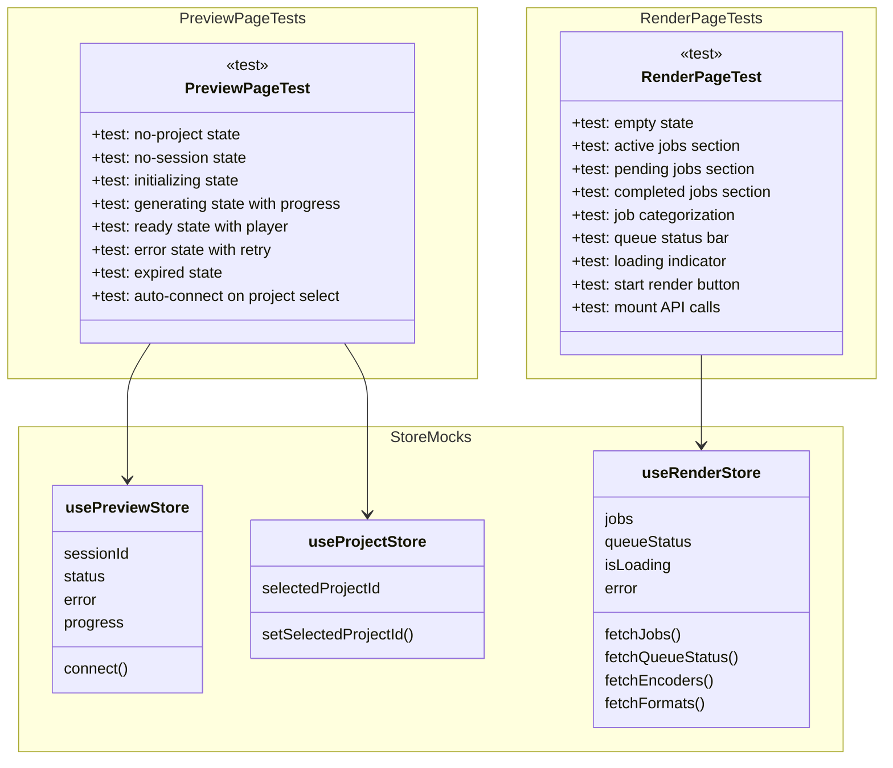

# C4 Code Level: GUI Pages Test Suite

## Overview

- **Name**: GUI Pages Test Suite
- **Description**: Test suite for two page components (PreviewPage and RenderPage) using Vitest and React Testing Library with store mocks
- **Location**: `gui/src/pages/__tests__`
- **Language**: TypeScript (Vitest)
- **Purpose**: Verify PreviewPage and RenderPage components render correctly across various states and user interactions
- **Parent Component**: [Web GUI](./c4-component-web-gui.md)

## Code Elements

### Test Files

#### PreviewPage.test.tsx
- **Location**: `gui/src/pages/__tests__/PreviewPage.test.tsx`
- **Total Tests**: 10
- **Tested Page**: PreviewPage
- **Key Test Scenarios**:
  - Renders without errors when no active session
  - Shows no-project message when no project selected
  - Shows start button when project selected with no session
  - Shows initializing status spinner
  - Shows progress bar with percentage during generation (50% example)
  - Shows lazy-loaded PreviewPlayer in Suspense fallback when ready
  - Shows error message with retry button on failure
  - Shows expired status with restart button
  - Auto-connects to existing session via POST /api/v1/projects/{id}/preview/start
- **Test IDs**: `preview-page`, `no-project-message`, `no-session`, `start-preview-btn`, `status-initializing`, `status-generating`, `progress-bar`, `player-suspense-fallback`, `error-message`, `retry-preview-btn`, `status-expired`, `restart-preview-btn`
- **Store Mocks**: `usePreviewStore`, `useProjectStore`
- **Setup**: MemoryRouter context, fetch spy default rejection, state reset before each test

#### RenderPage.test.tsx
- **Location**: `gui/src/pages/__tests__/RenderPage.test.tsx`
- **Total Tests**: 13
- **Tested Page**: RenderPage
- **Mock Utility**: `useRenderEvents` hook mocked to prevent WebSocket connections
- **Key Test Scenarios**:
  - Page renders with data-testid="render-page" and title
  - Shows empty state when no jobs exist
  - Active jobs section displays running jobs with progress (50% example)
  - Pending jobs section displays queued jobs
  - Completed jobs section displays completed/failed/cancelled jobs
  - Jobs correctly categorized across three sections without bleed
  - Queue status bar shows active (1), pending (2), and capacity (4) counts
  - Loading indicator shown when queue status null and isLoading=true
  - Start Render button visible and enabled
  - All required data-testid attributes present
  - Calls fetch on mount for /api/v1/render, /api/v1/render/queue, /api/v1/render/encoders, /api/v1/render/formats
- **Test IDs**: `render-page`, `empty-state`, `active-jobs-section`, `pending-jobs-section`, `completed-jobs-section`, `queue-status-bar`, `start-render-btn`, `job-list`
- **Mock Data**: QueueStatus object with active_count=1, pending_count=2, max_concurrent=4, RenderJob factory function
- **Store Mocks**: `useRenderStore`
- **Setup**: MemoryRouter context, fetch spy default rejection, store reset before each test

## Dependencies

### Internal Dependencies
- `../PreviewPage` -- actual PreviewPage component under test
- `../RenderPage` -- actual RenderPage component under test
- `../../stores/previewStore` -- usePreviewStore
- `../../stores/projectStore` -- useProjectStore
- `../../stores/renderStore` -- useRenderStore (types: RenderJob, QueueStatus)
- `../../hooks/useRenderEvents` -- mocked to prevent WebSocket in tests

### External Dependencies
- `@testing-library/react` -- render, screen, waitFor
- `vitest` -- describe, it, expect, vi, beforeEach
- `react-router-dom` -- MemoryRouter (test wrapper)

## Test Summary

- **Total Test Count**: 23 tests (10 for PreviewPage, 13 for RenderPage)
- **Test Coverage**: State transitions, error handling, API calls, store integration, component rendering
- **Testing Pattern**: Arrange-Act-Assert with store state injection and fetch mocking

## Relationships

