# C4 Code Level: GUI Pages

## Overview
- **Name**: GUI Page Components
- **Description**: Top-level page components that compose hooks, stores, and UI components into complete application views
- **Location**: `gui/src/pages/`
- **Language**: TypeScript (TSX)
- **Purpose**: Each page implements a major application feature by orchestrating data fetching, state management, and component composition
- **Parent Component**: [Web GUI](./c4-component-web-gui.md)

## Code Elements

### Functions/Methods

#### `DashboardPage(): JSX.Element`
- **Location**: `gui/src/pages/DashboardPage.tsx`
- **Description**: Real-time monitoring dashboard composing HealthCards, MetricsCards, and ActivityLog. Polls health and metrics at 30-second intervals. Connects to WebSocket for live activity feed.
- **Internal Function**: `wsUrl(): string` -- constructs WebSocket URL from current window location (wss: for https:, ws: for http:)
- **State Management**: Uses `useHealth(30_000)`, `useMetrics(30_000)`, and `useWebSocket(wsUrl())`
- **Components Used**: `HealthCards`, `MetricsCards`, `ActivityLog`
- **Test ID**: Renders as index route (`/`)

#### `LibraryPage(): JSX.Element`
- **Location**: `gui/src/pages/LibraryPage.tsx`
- **Description**: Video library browser with debounced search, sort, and pagination. Features directory scanning via modal dialog with directory browser integration. Uses Zustand library store for search/sort/page state.
- **State Management**: `useVideos(options)` for data (passes options from store), `useLibraryStore` for search/sort/page state, `useDebounce(searchQuery, 300)` for search
- **Components Used**: `SearchBar`, `SortControls`, `VideoGrid`, `ScanModal`
- **Pagination**: Previous/Next buttons with page info, computed `totalPages` from total/pageSize
- **User Flows**: Search videos (debounced), change sort field/order, navigate pages, scan new directory (with browse)
- **Test IDs**: `library-page`, `scan-button`, `pagination`, `page-prev`, `page-info`, `page-next`

#### `ProjectsPage(): JSX.Element`
- **Location**: `gui/src/pages/ProjectsPage.tsx`
- **Description**: Project management with list/detail views, create/delete modals, clip count fetching, and pagination. Switches between list view and detail view based on selection.
- **State Management**: `useProjects({ page, pageSize })` for data, `useProjectStore` for modal/selection/pagination state, local state for clip counts and delete target
- **Components Used**: `ProjectList`, `ProjectDetails`, `CreateProjectModal`, `DeleteConfirmation`
- **Pagination**: Previous/Next buttons with page info, uses store `page`/`pageSize`/`setPage`/`resetPage`
- **User Flows**: Browse projects (paginated), create new project, view project details with clips (add/edit/delete), delete project with confirmation
- **Test IDs**: `projects-page`, `btn-new-project`, `pagination`, `page-prev`, `page-info`, `page-next`

#### `EffectsPage(): JSX.Element`
- **Location**: `gui/src/pages/EffectsPage.tsx`
- **Description**: Full effect workshop integrating project/clip selection, effect catalog browsing, schema-driven parameter forms, filter preview, apply/edit/remove operations, and the effect stack. Handles both POST (apply new) and PATCH (update existing) API calls.
- **State Management**:
  - `useEffects()` for effect definitions
  - `useProjects()` for project list
  - `useEffectCatalogStore` for selected effect
  - `useEffectFormStore` for parameter schema and values
  - `useEffectStackStore` for applied effects on selected clip
  - `useEffectPreview()` for debounced filter preview
  - Local state: `selectedProjectId`, `clips`, `applyStatus`, `editIndex`
- **Components Used**: `ClipSelector`, `EffectCatalog`, `EffectParameterForm`, `FilterPreview`, `EffectStack`
- **User Flows**:
  1. Select project (auto-selects first) and clip
  2. Browse/search/filter effect catalog
  3. Select effect, configure parameters via schema-driven form
  4. Preview FFmpeg filter string in real-time
  5. Apply effect to clip (POST) or update existing (PATCH)
  6. View effect stack, edit applied effects, remove with confirmation
- **API Interactions**:
  - GET `/api/v1/projects/{id}/clips` -- fetch clips on project change
  - POST `/api/v1/projects/{id}/clips/{id}/effects` -- apply new effect
  - PATCH `/api/v1/projects/{id}/clips/{id}/effects/{idx}` -- update existing effect
- **Test IDs**: `effects-page`, `project-select`, `apply-section`, `apply-effect-btn`, `cancel-edit-btn`, `apply-status`, `visual-preview-placeholder`

## Dependencies

### Internal Dependencies
- `gui/src/components/` -- all UI components (HealthCards, MetricsCards, ActivityLog, SearchBar, SortControls, VideoGrid, ScanModal, ProjectList, ProjectDetails, CreateProjectModal, DeleteConfirmation, ClipSelector, EffectCatalog, EffectParameterForm, FilterPreview, EffectStack)
- `gui/src/hooks/` -- useHealth, useMetrics, useWebSocket, useDebounce, useVideos, useProjects, useEffects, useEffectPreview
- `gui/src/stores/` -- libraryStore, projectStore, effectCatalogStore, effectFormStore, effectStackStore

### External Dependencies
- `react` (useState, useEffect, useCallback)

## Relationships

```mermaid
classDiagram
    class DashboardPage {
        +DashboardPage() JSX
        useHealth(30s)
        useMetrics(30s)
        useWebSocket(wsUrl)
    }
    class LibraryPage {
        +LibraryPage() JSX
        useVideos(options)
        useDebounce(query)
        libraryStore
        pagination
    }
    class ProjectsPage {
        +ProjectsPage() JSX
        useProjects(page, pageSize)
        projectStore
        fetchClips for counts
        pagination
    }
    class EffectsPage {
        +EffectsPage() JSX
        useEffects()
        useProjects()
        useEffectPreview()
        effectCatalogStore
        effectFormStore
        effectStackStore
        editIndex state
    }

    class HealthCards { }
    class MetricsCards { }
    class ActivityLog { }
    class SearchBar { }
    class SortControls { }
    class VideoGrid { }
    class ScanModal { }
    class ProjectList { }
    class ProjectDetails { }
    class CreateProjectModal { }
    class DeleteConfirmation { }
    class ClipSelector { }
    class EffectCatalog { }
    class EffectParameterForm { }
    class FilterPreview { }
    class EffectStack { }

    DashboardPage --> HealthCards
    DashboardPage --> MetricsCards
    DashboardPage --> ActivityLog

    LibraryPage --> SearchBar
    LibraryPage --> SortControls
    LibraryPage --> VideoGrid
    LibraryPage --> ScanModal

    ProjectsPage --> ProjectList
    ProjectsPage --> ProjectDetails
    ProjectsPage --> CreateProjectModal
    ProjectsPage --> DeleteConfirmation

    EffectsPage --> ClipSelector
    EffectsPage --> EffectCatalog
    EffectsPage --> EffectParameterForm
    EffectsPage --> FilterPreview
    EffectsPage --> EffectStack
```

