# C4 Code Level: GUI Pages

## Overview
- **Name**: GUI Page Components
- **Description**: Top-level page components that compose hooks, stores, and UI components into complete application views
- **Location**: `gui/src/pages/`
- **Language**: TypeScript (TSX)
- **Purpose**: Orchestrates data flow between hooks/stores and presentation components for each route in the application

## Code Elements

### Functions/Methods

- `DashboardPage(): JSX.Element`
  - Description: Real-time monitoring dashboard displaying health cards, metrics cards, and WebSocket activity log; polls at 30-second intervals
  - Location: `gui/src/pages/DashboardPage.tsx:1`
  - Dependencies: `useHealth`, `useMetrics`, `useWebSocket`, `HealthCards`, `MetricsCards`, `ActivityLog`

- `wsUrl(): string` (in DashboardPage)
  - Description: Constructs WebSocket URL with protocol matching (ws:/wss:) based on current window location
  - Location: `gui/src/pages/DashboardPage.tsx`
  - Dependencies: `window.location`

- `LibraryPage(): JSX.Element`
  - Description: Video library browser with debounced search, sort controls, paginated video grid, and directory scan modal
  - Location: `gui/src/pages/LibraryPage.tsx:1`
  - Dependencies: `useLibraryStore`, `useDebounce`, `useVideos`, `SearchBar`, `SortControls`, `VideoGrid`, `ScanModal`

- `ProjectsPage(): JSX.Element`
  - Description: Project management page with list/detail views, create/delete modals, and clip count aggregation
  - Location: `gui/src/pages/ProjectsPage.tsx:1`
  - Dependencies: `useProjects`, `useProjectStore`, `fetchClips`, `ProjectList`, `ProjectDetails`, `CreateProjectModal`, `DeleteConfirmation`

## Dependencies

### Internal Dependencies
- `gui/src/components/ActivityLog` — DashboardPage
- `gui/src/components/HealthCards` — DashboardPage
- `gui/src/components/MetricsCards` — DashboardPage
- `gui/src/components/SearchBar` — LibraryPage
- `gui/src/components/SortControls` — LibraryPage
- `gui/src/components/VideoGrid` — LibraryPage
- `gui/src/components/ScanModal` — LibraryPage
- `gui/src/components/CreateProjectModal` — ProjectsPage
- `gui/src/components/DeleteConfirmation` — ProjectsPage
- `gui/src/components/ProjectDetails` — ProjectsPage
- `gui/src/components/ProjectList` — ProjectsPage
- `gui/src/hooks/useHealth` — DashboardPage
- `gui/src/hooks/useMetrics` — DashboardPage
- `gui/src/hooks/useWebSocket` — DashboardPage
- `gui/src/hooks/useDebounce` — LibraryPage
- `gui/src/hooks/useVideos` — LibraryPage
- `gui/src/hooks/useProjects` — ProjectsPage (useProjects hook + fetchClips, Project type)
- `gui/src/stores/libraryStore` — LibraryPage
- `gui/src/stores/projectStore` — ProjectsPage

### External Dependencies
- `react` (useState, useEffect, useCallback)

## Relationships

```mermaid
classDiagram
    class DashboardPage {
        +DashboardPage() JSX.Element
        -wsUrl() string
        -REFRESH_INTERVAL: 30000
    }
    class LibraryPage {
        +LibraryPage() JSX.Element
        -scanOpen: boolean
        -totalPages: number
    }
    class ProjectsPage {
        +ProjectsPage() JSX.Element
        -clipCounts: Record
        -deleteTargetId: string
        -handleSelect(id) void
        -handleDelete(id) void
        -handleDeleted() void
        -handleCreated() void
    }

    DashboardPage --> HealthCards : renders
    DashboardPage --> MetricsCards : renders
    DashboardPage --> ActivityLog : renders
    DashboardPage ..> useHealth : data
    DashboardPage ..> useMetrics : data
    DashboardPage ..> useWebSocket : connection

    LibraryPage --> SearchBar : renders
    LibraryPage --> SortControls : renders
    LibraryPage --> VideoGrid : renders
    LibraryPage --> ScanModal : renders
    LibraryPage ..> useLibraryStore : state
    LibraryPage ..> useDebounce : utility
    LibraryPage ..> useVideos : data

    ProjectsPage --> ProjectList : renders
    ProjectsPage --> ProjectDetails : renders
    ProjectsPage --> CreateProjectModal : renders
    ProjectsPage --> DeleteConfirmation : renders
    ProjectsPage ..> useProjects : data
    ProjectsPage ..> useProjectStore : state
```

