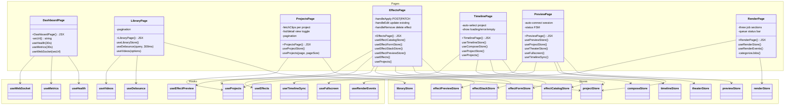

# C4 Code Level: GUI Pages

## Overview

- **Name**: GUI Page Components
- **Description**: Seven top-level page components (Dashboard, Library, Projects, Effects, Timeline, Preview, Render) that orchestrate hooks, stores, and UI components into complete application views
- **Location**: `gui/src/pages/`
- **Language**: TypeScript (TSX)
- **Purpose**: Each page implements a major application feature by composing state management, data fetching, and component trees
- **Parent Component**: [Web GUI](./c4-component-web-gui.md)

## Code Elements

### Page Components

#### `DashboardPage(): JSX.Element`
- **Location**: `gui/src/pages/DashboardPage.tsx:15`
- **Description**: Real-time monitoring dashboard composing HealthCards, MetricsCards, and ActivityLog. Polls health and metrics at 30-second intervals via useHealth/useMetrics hooks. Connects to WebSocket for live activity feed.
- **Props**: None (stateless page component)
- **Internal Function**: `wsUrl(): string` -- constructs WebSocket URL from window.location (wss: for https:, ws: for http:)
- **State Management**: 
  - `useHealth(30_000)` -- health status data
  - `useMetrics(30_000)` -- performance metrics data
  - `useWebSocket(wsUrl())` -- returns `{ lastMessage }`
- **Child Components**: HealthCards, MetricsCards, ActivityLog
- **Data Flow**: Health/Metrics via HTTP polling, Activity via WebSocket messages
- **Test IDs**: None defined

#### `LibraryPage(): JSX.Element`
- **Location**: `gui/src/pages/LibraryPage.tsx:10`
- **Description**: Video library browser with search, sort, pagination. Features debounced search (300ms), sort field/order control, directory scanning via modal dialog with directory browser integration.
- **Props**: None
- **State Management**:
  - `useLibraryStore()` -- searchQuery, sortField, sortOrder, page, pageSize, setters
  - `useDebounce(searchQuery, 300)` -- debouncedQuery for fetch
  - `useVideos({ searchQuery, sortField, sortOrder, page, pageSize })` -- returns { videos, total, loading, error, refetch }
- **Local State**: `scanOpen` (boolean)
- **Child Components**: SearchBar, SortControls, VideoGrid, ScanModal
- **Pagination**: Previous/Next buttons with computed totalPages = max(1, ceil(total/pageSize))
- **User Flows**: 
  1. Search videos (debounced 300ms)
  2. Change sort field or order
  3. Navigate pages with Previous/Next
  4. Scan new directory via modal with browser dialog
- **API Calls**: Uses useVideos hook for GET with pagination
- **Test IDs**: `library-page`, `scan-button`, `pagination`, `page-prev`, `page-info`, `page-next`

#### `ProjectsPage(): JSX.Element`
- **Location**: `gui/src/pages/ProjectsPage.tsx:10`
- **Description**: Project management with list/detail view toggle, create/delete modals, dynamic clip count fetching, and pagination. Switches between list view and detail view based on selectedProjectId selection.
- **Props**: None
- **State Management**:
  - `useProjectStore()` -- selectedProjectId, createModalOpen, deleteModalOpen, page, pageSize, setters, resetPage
  - `useProjects({ page, pageSize })` -- returns { projects, total, loading, error, refetch }
- **Local State**: 
  - `clipCounts` -- Record<projectId, clipCount> fetched on mount
  - `deleteTargetId` -- target for delete confirmation modal
- **Child Components**: ProjectList, ProjectDetails, CreateProjectModal, DeleteConfirmation
- **Pagination**: Previous/Next buttons with page info, disabled when page >= totalPages
- **User Flows**:
  1. Browse projects (paginated list or detail view)
  2. Select project to view details (clips, metadata)
  3. Create new project via modal
  4. Delete project with confirmation
  5. Navigate between pages
- **API Calls**: 
  - GET `/api/v1/projects` via useProjects
  - `fetchClips(projectId)` -- fetches clips for count display
- **Test IDs**: `projects-page`, `btn-new-project`, `pagination`, `page-prev`, `page-info`, `page-next`

#### `EffectsPage(): JSX.Element`
- **Location**: `gui/src/pages/EffectsPage.tsx:21`
- **Description**: Full effect workshop with project/clip selection, effect catalog, schema-driven parameter forms, filter preview, apply/edit/remove operations, and effect stack. Handles both new effects (POST) and existing effect updates (PATCH). Optional transitions tab via WorkshopTab union type.
- **Props**: None
- **State Management**:
  - `useEffectCatalogStore()` -- selectedEffect, selectEffect
  - `useEffectFormStore()` -- parameters, setParameter, setSchema, resetForm
  - `useEffectStackStore()` -- selectedClipId, effects, isLoading, selectClip, fetchEffects, removeEffect
  - `useEffectPreviewStore()` -- thumbnailUrl, setVideoPath
  - `useEffects()` -- returns { effects } with definitions and parameter_schema
  - `useProjects()` -- returns { projects }
  - `useEffectPreview()` -- hook for filter preview
- **Local State**:
  - `selectedProjectId` -- auto-selects first project
  - `clips` -- fetched from API on project change
  - `applyStatus` -- success/error message from apply action
  - `editIndex` -- null or number indicating effect being edited
  - `activeTab` -- 'effects' or 'transitions'
- **Child Components**: ClipSelector, EffectCatalog, EffectParameterForm, FilterPreview, EffectStack, TransitionPanel
- **Effect Lifecycle**:
  1. Auto-select first project if available
  2. Fetch clips for selected project
  3. Select clip (fetches effect stack)
  4. Select effect from catalog (populates form schema)
  5. Configure parameters via form
  6. Preview FFmpeg filter in real-time (debounced)
  7. Apply (POST) or Update (PATCH) to API
  8. Effect stack updates and success message displayed
- **API Calls**:
  - GET `/api/v1/projects/{id}/clips` -- fetch clips on project change
  - GET `/api/v1/videos/{videoId}` -- fetch video path for preview thumbnail
  - POST `/api/v1/projects/{id}/clips/{clipId}/effects` -- apply new effect
  - PATCH `/api/v1/projects/{id}/clips/{clipId}/effects/{index}` -- update existing effect
  - DELETE via `useEffectStackStore.removeEffect()` -- remove effect from stack
- **Test IDs**: `effects-page`, `project-select`, `workshop-tabs`, `tab-effects`, `tab-transitions`, `apply-section`, `apply-effect-btn`, `cancel-edit-btn`, `apply-status`, `effect-preview-thumbnail`, `visual-preview-placeholder`

#### `TimelinePage(): JSX.Element`
- **Location**: `gui/src/pages/TimelinePage.tsx:11`
- **Description**: Timeline editor with track visualization, layout presets, and composition controls. Auto-selects first project, fetches timeline and presets on mount. Shows loading/error states and empty state message. Header includes a Start Render button (added in BL-236) that opens StartRenderModal; button disabled when no project is selected.
- **Props**: None
- **State Management**:
  - `useTimelineStore()` -- tracks, duration, isLoading, error, fetchTimeline
  - `useComposeStore()` -- presets, isLoading, error, fetchPresets
  - `useProjectStore()` -- selectedProjectId, setSelectedProjectId
  - `useProjects()` -- returns { projects }
- **Local State**: `startModalOpen` (boolean) -- controls StartRenderModal visibility
- **Child Components**: TimelineCanvas, LayoutSelector, LayoutPreview, LayerStack, StartRenderModal
- **Lifecycle**:
  1. Auto-select first project if none selected
  2. Fetch timeline for selected project
  3. Fetch composition presets on mount
  4. Show loading state while fetching
  5. Show error state if fetch fails
  6. Show empty state if no tracks and no presets
  7. Render timeline canvas and layout panel (3-column grid)
- **API Calls**: Via useTimelineStore.fetchTimeline() and useComposeStore.fetchPresets()
- **Debug Logging**: Logs track count, duration, preset count, loading state
- **Test IDs**: `timeline-page`, `timeline-loading`, `timeline-error`, `timeline-empty`, `timeline-content`, `timeline-tracks`, `timeline-presets`

#### `PreviewPage(): JSX.Element`
- **Location**: `gui/src/pages/PreviewPage.tsx:14`
- **Description**: Preview player with quality selector and theater mode. Auto-connects to existing preview session via POST. Shows status progression from no-session → initializing → generating (with progress bar) → ready (lazy-loaded player). Handles error and expired states with retry/restart buttons.
- **Props**: None
- **State Management**:
  - `usePreviewStore()` -- sessionId, status, error, progress, quality, connect, setError
  - `useProjectStore()` -- selectedProjectId
  - `useTheaterStore()` -- isFullscreen
  - `useFullscreen(theaterContainerRef)` -- returns { enter: enterFullscreen }
- **Hooks**:
  - `useTimelineSync(videoRef)` -- syncs video playback with timeline
- **Local Refs**: `videoRef` (HTMLVideoElement), `theaterContainerRef` (HTMLDivElement)
- **Child Components**: QualitySelector, PlayerControls, PreviewStatus, PreviewPlayer (lazy-loaded), TheaterMode
- **Auto-Connect Effect**: On mount, if selectedProjectId exists and no sessionId, POST to /api/v1/projects/{id}/preview/start with quality parameter
- **Status States**:
  - `no-session`: Shows "Start Preview" button (no selectedProjectId shows "Select a project")
  - `initializing`: Shows loading message
  - `generating`: Shows progress bar with percentage
  - `ready`: Shows lazy-loaded PreviewPlayer in Suspense + controls
  - `error`: Shows error message with "Retry" button
  - `expired`: Shows "Restart Preview" button
- **Test IDs**: `preview-page`, `no-project-message`, `no-session`, `start-preview-btn`, `status-initializing`, `status-generating`, `progress-bar`, `player-suspense-fallback`, `error-message`, `retry-preview-btn`, `status-expired`, `restart-preview-btn`, `theater-mode-button`

#### `RenderPage(): JSX.Element`
- **Location**: `gui/src/pages/RenderPage.tsx:34`
- **Description**: Render queue manager with job sections (active, pending, completed), queue status bar, and start render modal. Categorizes jobs by status and displays each with RenderJobCard. Uses useRenderEvents hook for WebSocket updates.
- **Props**: None
- **State Management**:
  - `useRenderStore()` -- jobs, queueStatus, isLoading, error, fetchJobs, fetchQueueStatus, fetchEncoders, fetchFormats
- **Local State**: `startModalOpen` (boolean)
- **Helper Function**: `categorizeJobs(jobs)` -- returns { active (running), pending (queued), completed (completed|failed|cancelled) }
- **Child Components**: RenderJobCard (map over each job), StartRenderModal
- **Lifecycle**:
  - On mount: fetchJobs, fetchQueueStatus, fetchEncoders, fetchFormats
  - WebSocket connection via useRenderEvents for real-time job updates
- **Queue Status Display**: Active count, Pending count, Max Concurrent capacity; shows "Loading queue status..." if null and isLoading
- **Job Sections**:
  - Active: Running jobs with progress
  - Pending: Queued jobs awaiting execution
  - Completed: Finished (completed|failed|cancelled) jobs
- **Empty State**: Shows "No render jobs" when jobs.length === 0
- **Error Display**: Shows error message banner if error exists
- **API Calls**:
  - GET `/api/v1/render` -- fetch jobs
  - GET `/api/v1/render/queue` -- fetch queue status
  - GET `/api/v1/render/encoders` -- fetch available encoders
  - GET `/api/v1/render/formats` -- fetch output formats
- **Test IDs**: `render-page`, `queue-status-bar`, `active-jobs-section`, `pending-jobs-section`, `completed-jobs-section`, `start-render-btn`, `empty-state`, `job-list`

## Dependencies

### Internal Dependencies
- `gui/src/components/` -- All UI components (HealthCards, MetricsCards, ActivityLog, SearchBar, SortControls, VideoGrid, ScanModal, ProjectList, ProjectDetails, CreateProjectModal, DeleteConfirmation, ClipSelector, EffectCatalog, EffectParameterForm, FilterPreview, EffectStack, TransitionPanel, PlayerControls, QualitySelector, PreviewStatus, PreviewPlayer, TheaterMode, TimelineCanvas, LayoutSelector, LayoutPreview, LayerStack, RenderJobCard, StartRenderModal)
- `gui/src/hooks/` -- useHealth, useMetrics, useWebSocket, useDebounce, useVideos, useProjects, useEffects, useEffectPreview, useFullscreen, useTimelineSync, useRenderEvents
- `gui/src/stores/` -- previewStore, projectStore, theaterStore, libraryStore, effectCatalogStore, effectFormStore, effectPreviewStore, effectStackStore, composeStore, timelineStore, renderStore
- `gui/src/generated/types` -- Clip, Project, AppliedEffect, ParameterSchema, RenderJob, QueueStatus

### External Dependencies
- `react` -- lazy, Suspense, useEffect, useRef, useState, useCallback
- `react-router-dom` -- MemoryRouter (for tests)

## Relationships

```mermaid
classDiagram
    namespace Pages {
        class DashboardPage {
            +DashboardPage() JSX
            -wsUrl() string
            useHealth(30s)
            useMetrics(30s)
            useWebSocket(wsUrl)
        }

        class LibraryPage {
            +LibraryPage() JSX
            useLibraryStore()
            useDebounce(query, 300ms)
            useVideos(options)
            -pagination
        }

        class ProjectsPage {
            +ProjectsPage() JSX
            useProjectStore()
            useProjects(page, pageSize)
            -fetchClips per project
            -list/detail view toggle
            -pagination
        }

        class EffectsPage {
            +EffectsPage() JSX
            useEffectCatalogStore()
            useEffectFormStore()
            useEffectStackStore()
            useEffectPreviewStore()
            useEffects()
            useProjects()
            -handleApply POST|PATCH
            -handleEdit update existing
            -handleRemove delete effect
        }

        class TimelinePage {
            +TimelinePage() JSX
            useTimelineStore()
            useComposeStore()
            useProjectStore()
            useProjects()
            -auto-select project
            -show loading/error/empty
        }

        class PreviewPage {
            +PreviewPage() JSX
            usePreviewStore()
            useProjectStore()
            useTheaterStore()
            useFullscreen()
            useTimelineSync()
            -auto-connect session
            -status FSM
        }

        class RenderPage {
            +RenderPage() JSX
            useRenderStore()
            useRenderEvents()
            -categorizeJobs()
            -three job sections
            -queue status bar
        }
    }

    namespace Stores {
        class libraryStore
        class projectStore
        class previewStore
        class theaterStore
        class effectCatalogStore
        class effectFormStore
        class effectStackStore
        class effectPreviewStore
        class composeStore
        class timelineStore
        class renderStore
    }

    namespace Hooks {
        class useHealth
        class useMetrics
        class useWebSocket
        class useDebounce
        class useVideos
        class useProjects
        class useEffects
        class useEffectPreview
        class useFullscreen
        class useTimelineSync
        class useRenderEvents
    }

    DashboardPage --> useHealth
    DashboardPage --> useMetrics
    DashboardPage --> useWebSocket

    LibraryPage --> libraryStore
    LibraryPage --> useDebounce
    LibraryPage --> useVideos

    ProjectsPage --> projectStore
    ProjectsPage --> useProjects

    EffectsPage --> effectCatalogStore
    EffectsPage --> effectFormStore
    EffectsPage --> effectStackStore
    EffectsPage --> effectPreviewStore
    EffectsPage --> useEffects
    EffectsPage --> useProjects
    EffectsPage --> useEffectPreview

    TimelinePage --> timelineStore
    TimelinePage --> composeStore
    TimelinePage --> projectStore
    TimelinePage --> useProjects

    PreviewPage --> previewStore
    PreviewPage --> projectStore
    PreviewPage --> theaterStore
    PreviewPage --> useFullscreen
    PreviewPage --> useTimelineSync

    RenderPage --> renderStore
    RenderPage --> useRenderEvents
```
