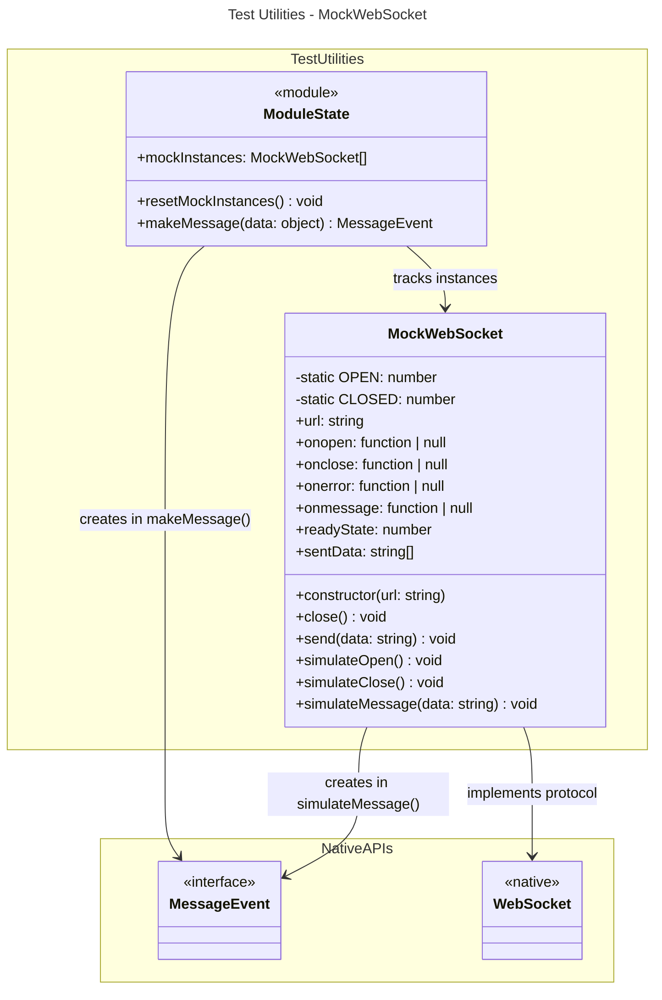

# C4 Code Level: GUI Source Test Utilities

## Overview

- **Name**: GUI Source Test Utilities
- **Description**: Shared test utilities providing a mock WebSocket implementation for testing real-time communication in GUI components.
- **Location**: gui/src/__tests__
- **Language**: TypeScript
- **Purpose**: Enable unit and integration tests to simulate WebSocket connections without requiring a live backend server.
- **Parent Component**: [Web GUI](./c4-component-web-gui.md)

## Code Elements

### MockWebSocket Class

A complete mock implementation of the native WebSocket API for testing purposes.

#### Static Constants
- `OPEN = 1` - Ready state constant matching native WebSocket
- `CLOSED = 3` - Closed state constant matching native WebSocket

#### Instance Properties
- `url: string` - WebSocket URL passed to constructor
- `onopen: (() => void) | null` - Open event handler
- `onclose: (() => void) | null` - Close event handler
- `onerror: (() => void) | null` - Error event handler
- `onmessage: ((e: MessageEvent) => void) | null` - Message event handler
- `readyState: number` - Current connection state (defaults to OPEN)
- `sentData: string[]` - Array recording all sent messages for assertion

#### Constructor
```typescript
constructor(url: string)
```
- Initializes WebSocket with given URL
- Auto-registers instance in global `mockInstances` array
- Sets initial `readyState` to `OPEN`

#### Methods

##### close()
```typescript
close(): void
```
- Closes the mock WebSocket
- Sets `readyState` to `CLOSED`
- Does not trigger close handler

##### send(data: string)
```typescript
send(data: string): void
```
- Records outgoing message in `sentData` array
- Does not actually transmit
- Used for assertion on sent messages

##### simulateOpen()
```typescript
simulateOpen(): void
```
- Sets `readyState` to `OPEN`
- Invokes `onopen` handler if registered
- Simulates server accepting connection

##### simulateClose()
```typescript
simulateClose(): void
```
- Sets `readyState` to `CLOSED`
- Invokes `onclose` handler if registered
- Simulates server closing connection

##### simulateMessage(data: string)
```typescript
simulateMessage(data: string): void
```
- Creates and dispatches a `MessageEvent` with given data
- Invokes `onmessage` handler if registered
- Allows tests to simulate incoming server messages

### Module-Level State

#### mockInstances
```typescript
let mockInstances: MockWebSocket[]
```
- Global array tracking all created MockWebSocket instances
- Automatically populated in constructor
- Used for bulk testing and teardown

### Utility Functions

#### resetMockInstances()
```typescript
resetMockInstances(): void
```
- Clears the `mockInstances` array
- Called between tests to prevent cross-test contamination
- Should be invoked in test `beforeEach()` or `afterEach()` hooks

#### makeMessage(data: object): MessageEvent
```typescript
makeMessage(data: object): MessageEvent
```
- Creates a `MessageEvent` with JSON-stringified data
- Convenience function for generating test messages
- Usage: `mockWebSocket.simulateMessage(makeMessage({status: 'ready'}))`

## Test Summary

### Test File Inventory
This is a test utilities module (not a test file itself). Used by test files throughout the GUI codebase:
- WebSocket-based real-time tests (render updates, preview status)
- Component integration tests using streaming APIs
- Event handler and state management tests

### Purpose of Utilities

The `mockWebSocket.ts` module provides:
1. **WebSocket Protocol Fidelity**: Matches native WebSocket API surface (readyState, event handlers)
2. **Test Lifecycle Support**: `resetMockInstances()` for test isolation
3. **Message Testing**: `sentData` tracking and `simulateMessage()` for assertion
4. **Event Simulation**: `simulateOpen()`, `simulateClose()`, `simulateMessage()` for full lifecycle testing
5. **JSON Message Convenience**: `makeMessage()` auto-serialization for data payloads

### Common Test Patterns

**Test Setup**:
```typescript
beforeEach(() => {
  resetMockInstances()
})
```

**Creating Mock Connection**:
```typescript
const ws = new MockWebSocket('ws://localhost:8000/updates')
expect(ws.readyState).toBe(MockWebSocket.OPEN)
```

**Simulating Server Events**:
```typescript
ws.simulateMessage(makeMessage({status: 'rendering', progress: 45}))
expect(onMessage).toHaveBeenCalledWith(expect.stringContaining('rendering'))
```

**Asserting Client Sent Data**:
```typescript
ws.send('{"action":"start"}')
expect(ws.sentData).toContain('{"action":"start"}')
```

## Dependencies

### Internal Dependencies
- None (pure test utility)

### External Dependencies
- None (uses only native TypeScript/JavaScript APIs: `MessageEvent`)
- Designed to replace native `WebSocket` via Jest mocks or global replacement

## Relationships



## Notes

- **Mock Fidelity**: The implementation is intentionally simplified. It implements the event handler interface but does not implement the full WebSocket API (e.g., no `bufferedAmount`, no `binaryType`). Extend if tests require additional properties.
- **Replacement Strategy**: Tests should mock the global `WebSocket` constructor to return `MockWebSocket` instances:
  ```typescript
  global.WebSocket = MockWebSocket as any
  ```
- **Synchronous**: All event handlers and state changes are synchronous. No actual async/await is needed.
- **Message Format**: `simulateMessage()` expects a string (raw message data). Use `makeMessage()` to auto-serialize objects to JSON.
- **Lifecycle Testing**: Full lifecycle can be tested: `simulateOpen()` → `simulateMessage()` → `simulateClose()` with handlers invoked at each stage.
- **Test Isolation**: Always call `resetMockInstances()` between tests to prevent one test's WebSocket instances from leaking into another.
