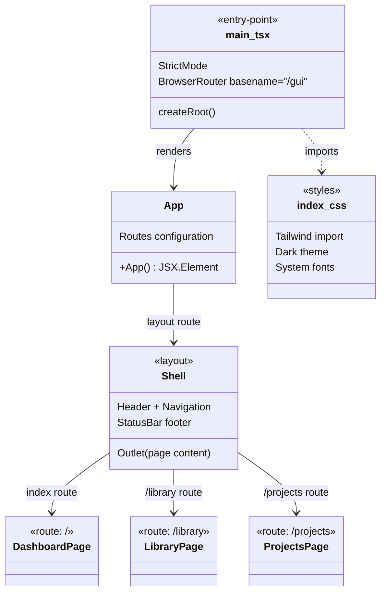

# C4 Code Level: GUI Application Root

## Overview
- **Name**: GUI Application Root
- **Description**: Entry point, routing configuration, and global styles for the React single-page application
- **Location**: `gui/src/`
- **Language**: TypeScript (TSX), CSS
- **Purpose**: Bootstraps the React application with routing, renders the shell layout, and defines global styles

## Code Elements

### Functions/Methods

- `App(): JSX.Element`
  - Description: Root component defining application routes — Dashboard (index), Library, and Projects — wrapped in Shell layout
  - Location: `gui/src/App.tsx:1`
  - Dependencies: `react-router-dom.Route`, `react-router-dom.Routes`, `Shell`, `DashboardPage`, `LibraryPage`, `ProjectsPage`

- `main.tsx` (entry point)
  - Description: Application bootstrap — creates React root, wraps in StrictMode and BrowserRouter with `/gui` basename
  - Location: `gui/src/main.tsx:1`
  - Dependencies: `react.StrictMode`, `react-dom/client.createRoot`, `react-router-dom.BrowserRouter`, `App`

### Routes

| Path | Component | Description |
|------|-----------|-------------|
| `/` (index) | DashboardPage | Real-time health, metrics, and activity monitoring |
| `/library` | LibraryPage | Video browsing with search, sort, and pagination |
| `/projects` | ProjectsPage | Project management with create/delete/detail views |

All routes are nested under `Shell` which provides the application chrome (header, navigation, status bar).

### Styles

- `gui/src/index.css`: Global styles — Tailwind CSS import, dark color scheme, system font stack, optimized text rendering, full-viewport body
- `gui/src/App.css`: Empty placeholder (all styles managed by Tailwind utility classes)

### Test

- `App.test.tsx` (4 tests)
  - Renders shell layout with status bar
  - Renders Dashboard page at root route
  - Renders Library page at `/library`
  - Renders Projects page at `/projects`
  - Setup: MockWebSocket, mocked fetch returning health OK

## Dependencies

### Internal Dependencies
- `gui/src/components/Shell` — layout wrapper
- `gui/src/pages/DashboardPage` — index route
- `gui/src/pages/LibraryPage` — `/library` route
- `gui/src/pages/ProjectsPage` — `/projects` route

### External Dependencies
- `react` (StrictMode)
- `react-dom/client` (createRoot)
- `react-router-dom` (BrowserRouter, Route, Routes)
- Tailwind CSS (via `@import "tailwindcss"` in index.css)

## Configuration
- **Router basename**: `/gui` — all routes are served under the `/gui` path prefix
- **Color scheme**: Dark mode (`color-scheme: dark`)
- **Minimum viewport**: 320px width, 100vh height

## Relationships

