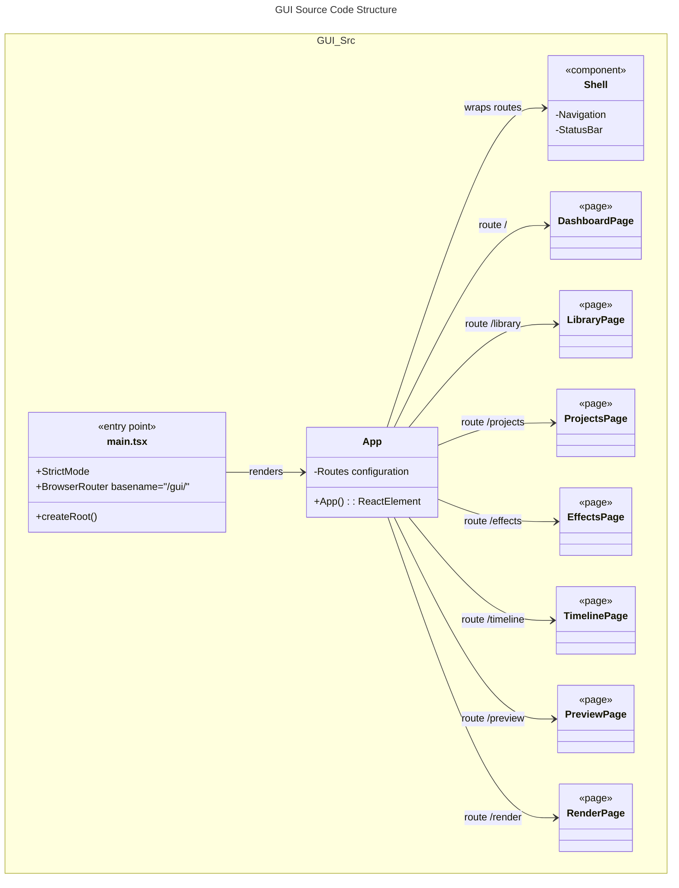

# C4 Code Level: GUI Source Entry Point

## Overview

- **Name**: GUI Source Entry Point
- **Description**: React application root configuration and shell layout for the stoat-and-ferret GUI.
- **Location**: gui/src/
- **Language**: TypeScript/TSX
- **Purpose**: Establishes the main React application structure, routing configuration, styles, and test setup for the GUI frontend.
- **Parent Component**: [Web GUI](./c4-component-web-gui.md)

## Code Elements

### Functions/Methods

- `App(): ReactElement`
  - Description: Main application component that defines routing structure with seven primary routes (Dashboard, Library, Projects, Effects, Timeline, Preview, Render).
  - Location: gui/src/App.tsx:11-25
  - Dependencies: React Router DOM (Route, Routes), Shell component, DashboardPage, EffectsPage, LibraryPage, PreviewPage, ProjectsPage, RenderPage, TimelinePage

### Components

- **Shell**
  - Description: Layout wrapper component that serves as the parent element for all routed pages. Manages the main application shell including navigation and status bar.
  - Location: gui/src/components/Shell (imported)
  - Responsibilities: Renders navigation tabs, status indicators, and page outlet

### CSS Modules

- `App.css`
  - Description: Empty stylesheet; application styles managed by Tailwind CSS framework.
  - Location: gui/src/App.css

- `index.css`
  - Description: Global styles including Tailwind CSS import, root CSS variables for dark theme, and base typography/layout rules.
  - Location: gui/src/index.css

## Entry Point

- **main.tsx**
  - Description: Bootstrap script that mounts React app to DOM element with StrictMode and BrowserRouter wrapper. Base path configured to "/gui/".
  - Location: gui/src/main.tsx:1-13
  - Key Lines:
    - createRoot(document.getElementById('root')!) - Mount to #root DOM element
    - BrowserRouter basename="/gui/" - Configure routing with /gui/ prefix
    - StrictMode wrapper - Enable React strict mode checks

## Test Coverage

- **App.test.tsx**: 3 unit tests
  - Renders shell layout with status bar
  - Renders dashboard page at root route
  - Renders library page at /library route
  - Renders projects page at /projects route
- Mock WebSocket implementation for testing
- Mock fetch for health check responses

## Dependencies

### Internal Dependencies

- Shell component (gui/src/components/Shell)
- DashboardPage (gui/src/pages/DashboardPage)
- EffectsPage (gui/src/pages/EffectsPage)
- LibraryPage (gui/src/pages/LibraryPage)
- PreviewPage (gui/src/pages/PreviewPage)
- ProjectsPage (gui/src/pages/ProjectsPage)
- RenderPage (gui/src/pages/RenderPage)
- TimelinePage (gui/src/pages/TimelinePage)

### External Dependencies

- **react** (^19.2.0) - UI component library
- **react-dom** (^19.2.0) - React DOM rendering
- **react-router-dom** (^7.13.0) - Client-side routing
- **tailwindcss** (^4.1.18) - Utility-first CSS framework

## Relationships

```mermaid
---
title: GUI Source Code Structure
---
classDiagram
    namespace GUI_Src {
        class main.tsx {
            <<entry point>>
            +createRoot()
            +StrictMode
            +BrowserRouter basename="/gui/"
        }
        class App {
            +App(): ReactElement
            -Routes configuration
        }
        class Shell {
            <<component>>
            -Navigation
            -StatusBar
        }
        class DashboardPage {
            <<page>>
        }
        class EffectsPage {
            <<page>>
        }
        class LibraryPage {
            <<page>>
        }
        class ProjectsPage {
            <<page>>
        }
        class PreviewPage {
            <<page>>
        }
        class RenderPage {
            <<page>>
        }
        class TimelinePage {
            <<page>>
        }
    }

    main.tsx --> App : renders
    App --> Shell : wraps routes
    App --> DashboardPage : route /
    App --> LibraryPage : route /library
    App --> ProjectsPage : route /projects
    App --> EffectsPage : route /effects
    App --> TimelinePage : route /timeline
    App --> PreviewPage : route /preview
    App --> RenderPage : route /render
```

## Notes

- Application uses Tailwind CSS for styling; App.css is empty as all styles are defined via Tailwind utilities
- Dark theme configured in index.css with CSS custom properties
- Strict mode enabled for development checks and deprecation warnings
- Router basename "/gui/" ensures compatibility with FastAPI backend serving app at /gui/ endpoint
