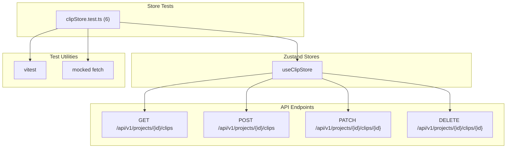

# C4 Code Level: GUI Store Tests

## Overview
- **Name**: GUI Zustand Store Tests
- **Description**: Vitest test suites validating Zustand store logic for the stoat-and-ferret GUI
- **Location**: `gui/src/stores/__tests__/`
- **Language**: TypeScript
- **Purpose**: Unit tests for Zustand stores covering CRUD operations, API interactions, state management, and error handling
- **Parent Component**: TBD

## Code Elements

### Test Suites

#### `clipStore.test.ts` (6 tests)
- "fetchClips populates clips state" -- verifies GET /api/v1/projects/{id}/clips populates clips array
- "createClip calls POST endpoint and refreshes clips" -- verifies POST then GET refresh cycle
- "updateClip calls PATCH endpoint and refreshes clips" -- verifies PATCH then GET refresh cycle
- "deleteClip calls DELETE endpoint and refreshes clips" -- verifies DELETE then GET refresh cycle
- "sets error state on API failure" -- 500 response sets error string
- "createClip sets error state on API failure" -- 422 response with detail message, rejects promise
- **Setup**: Resets `useClipStore` state, mocked fetch with URL-based routing
- **Dependencies**: `useClipStore`

## Dependencies

### Internal Dependencies
- `gui/src/stores/clipStore` -- store under test

### External Dependencies
- `vitest` (describe, it, expect, vi, beforeEach)

## Test Coverage Summary

| Test File | Tests | Store(s) Tested |
|-----------|-------|-----------------|
| clipStore.test.ts | 6 | clipStore (fetchClips, createClip, updateClip, deleteClip, error handling) |
| **Total** | **6** | **1 store** |

## Relationships

