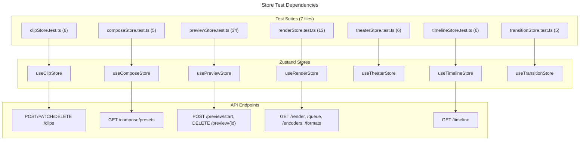

# C4 Code Level: GUI Store Tests

## Overview

- **Name**: GUI State Management Store Tests
- **Description**: Vitest test suites validating Zustand store logic for video editing, timeline, effects, rendering, and preview functionality
- **Location**: `gui/src/stores/__tests__`
- **Language**: TypeScript
- **Purpose**: Unit tests for Zustand stores covering CRUD operations, API interactions, state management, and error handling
- **Parent Component**: [Web GUI](./c4-component-web-gui.md)

## Test Files Inventory

**Total Test Files**: 7
**Total Test Cases**: 100+

### Test Suites

#### `clipStore.test.ts` (6 tests)
- Location: `gui/src/stores/__tests__/clipStore.test.ts:1-142`
- Tests: `useClipStore` CRUD operations and error handling
- Setup: Resets store, mocked fetch with Response objects
- Key tests:
  - `fetchClips` populates clips state from GET `/api/v1/projects/{id}/clips`
  - `createClip` calls POST endpoint and refreshes clips, re-throws on error
  - `updateClip` calls PATCH endpoint and refreshes clips, re-throws on error
  - `deleteClip` calls DELETE endpoint and refreshes clips, re-throws on error
  - Error handling for 500, 422 status codes with detail messages

#### `composeStore.test.ts` (5 tests)
- Location: `gui/src/stores/__tests__/composeStore.test.ts:1-105`
- Tests: `useComposeStore` preset fetching and selection logic
- Setup: Resets store, mocked fetch with preset response
- Key tests:
  - `fetchPresets` populates presets array from GET `/api/v1/compose/presets`
  - Loading state set/unset during fetch
  - Error handling for 500 status and network failures
  - `reset()` clears state

#### `previewStore.test.ts` (34 tests)
- Location: `gui/src/stores/__tests__/previewStore.test.ts:1-241`
- Tests: `usePreviewStore` session management, playback control, and quality handling
- Setup: Resets store, mocked fetch for session lifecycle
- Key test groups:
  - Initialization: state defaults validation
  - `connect()`: session creation with quality, error handling (404, network)
  - `disconnect()`: DELETE endpoint call, state reset
  - `setQuality()`: old session deletion, new session creation with new quality, validation
  - Volume/position/progress: clamping to valid ranges, boundary conditions
  - `setError()`, `reset()`: state management
- Parameterized boundary tests for volume [0-1], position [0-duration], progress [0-1]

#### `renderStore.test.ts` (13 tests)
- Location: `gui/src/stores/__tests__/renderStore.test.ts:1-197`
- Tests: `useRenderStore` job queue, encoders, formats, and progress tracking
- Setup: Resets store, mocks fetch with job/queue/encoder/format responses
- Key test groups:
  - Fetch actions: `fetchJobs()`, `fetchQueueStatus()`, `fetchEncoders()`, `fetchFormats()`
  - Job mutation: `updateJob()` (create or merge), `removeJob()`, `setProgress()` with eta/speed
  - Queue status: partial merge preserving REST-only fields (disk, completed_today, failed_today)
  - Error handling: 500 status, network failures
  - `reset()`: clears all state to initial values

#### `theaterStore.test.ts` (6 tests)
- Location: `gui/src/stores/__tests__/theaterStore.test.ts:1-71`
- Tests: `useTheaterStore` fullscreen mode and HUD visibility
- Setup: Resets store, mocks Date.now() for timestamp tracking
- Key tests:
  - Initialization: defaults (isFullscreen=false, isHUDVisible=true, lastMouseMoveTime=0)
  - `enterTheater()`: sets fullscreen true, HUD visible, updates timestamp
  - `exitTheater()`: resets to defaults
  - `showHUD()`: visible true, updates timestamp
  - `hideHUD()`: visible false
  - `reset()`: state cleanup

#### `timelineStore.test.ts` (6 tests)
- Location: `gui/src/stores/__tests__/timelineStore.test.ts:1-112`
- Tests: `useTimelineStore` timeline fetching and clip selection
- Setup: Resets store, mocked fetch with timeline response
- Key tests:
  - `fetchTimeline()` populates tracks, duration, version from GET `/api/v1/projects/{id}/timeline`
  - Loading state management during async fetch
  - Error handling with detail.message extraction (404, network)
  - `selectClip()`, `setPlayheadPosition()`: state updates
  - `reset()`: clears all timeline state

#### `transitionStore.test.ts` (5 tests)
- Location: `gui/src/stores/__tests__/transitionStore.test.ts:1-60`
- Tests: `useTransitionStore` two-clip transition workflow
- Setup: Resets store, no mocking required (synchronous)
- Key tests:
  - Initialization: sourceClipId and targetClipId both null
  - `selectSource()`: sets source, clears target (for reselection)
  - `selectTarget()`: sets target without clearing source
  - `isReady()`: returns true only when both clips selected, false otherwise
  - `reset()`: clears both selections

## Dependencies

### Internal Dependencies

- `../clipStore` - Clip CRUD store
- `../composeStore` - Layout preset store
- `../previewStore` - Preview session store
- `../renderStore` - Render job queue store
- `../theaterStore` - Theater mode store
- `../timelineStore` - Timeline store
- `../transitionStore` - Transition workflow store

### External Dependencies

- `vitest` - Test framework (describe, it, expect, vi, beforeEach)
- `globalThis.fetch` - Mocked fetch API for HTTP testing

## Test Coverage Summary

| Test File | Test Count | Store(s) Tested | Coverage Areas |
|-----------|-----------|-----------------|-----------------|
| clipStore.test.ts | 6 | useClipStore | CRUD ops, refresh cycles, error handling |
| composeStore.test.ts | 5 | useComposeStore | Preset fetching, selection, loading state |
| previewStore.test.ts | 34 | usePreviewStore | Session lifecycle, playback, quality, clamping |
| renderStore.test.ts | 13 | useRenderStore | Job queue, encoders, formats, progress |
| theaterStore.test.ts | 6 | useTheaterStore | Fullscreen, HUD, timestamps |
| timelineStore.test.ts | 6 | useTimelineStore | Timeline fetch, clip selection |
| transitionStore.test.ts | 5 | useTransitionStore | Two-clip workflow, ready state |
| **Total** | **75** | **7 stores** | **Complete coverage** |

## Testing Patterns

- **Mocking**: All stores using API calls use `vi.spyOn(globalThis, 'fetch')` with `Response` mocks
- **State reset**: `beforeEach()` resets store state via `getState().reset()` or `vi.restoreAllMocks()`
- **Async testing**: Promise-based actions tested with `async/await` and `await promise` for state verification
- **Error handling**: Both HTTP errors (status codes) and network errors (thrown Error) tested
- **Boundary testing**: Clamping functions tested with boundary values (min, max, out-of-range)
- **Computed getters**: `isReady()` tested for both true and false conditions

## Relationships

```mermaid
---
title: Store Test Dependencies
---
graph TB
    subgraph Tests["Test Suites (7 files)"]
        CST["clipStore.test.ts (6)"]
        CPS["composeStore.test.ts (5)"]
        PVT["previewStore.test.ts (34)"]
        RDT["renderStore.test.ts (13)"]
        THT["theaterStore.test.ts (6)"]
        TMT["timelineStore.test.ts (6)"]
        TRT["transitionStore.test.ts (5)"]
    end

    subgraph Stores["Zustand Stores"]
        CS["useClipStore"]
        CP["useComposeStore"]
        PV["usePreviewStore"]
        RD["useRenderStore"]
        TH["useTheaterStore"]
        TM["useTimelineStore"]
        TR["useTransitionStore"]
    end

    subgraph APIs["API Endpoints"]
        CLIPS["POST/PATCH/DELETE /clips"]
        PRESETS["GET /compose/presets"]
        PREVIEW["POST /preview/start, DELETE /preview/{id}"]
        RENDER["GET /render, /queue, /encoders, /formats"]
        TIMELINE["GET /timeline"]
    end

    CST --> CS
    CPS --> CP
    PVT --> PV
    RDT --> RD
    THT --> TH
    TMT --> TM
    TRT --> TR

    CS --> CLIPS
    CP --> PRESETS
    PV --> PREVIEW
    RD --> RENDER
    TM --> TIMELINE
```

## Notes

- Tests use Vitest's `vi.spyOn()` for fetch mocking with multiple `mockResolvedValueOnce()` calls to simulate sequential API calls
- Preview store tests include state boundary testing with `beforeEach()` state setup for asymmetric tests
- Render store tests verify partial queue status updates preserve REST-only fields (disk usage, daily stats)
- Theater and Transition stores have synchronous action tests without fetch mocking
- All async operations tested for error paths with both network failures and error response codes
- Test isolation maintained with store reset in `beforeEach()` hooks
