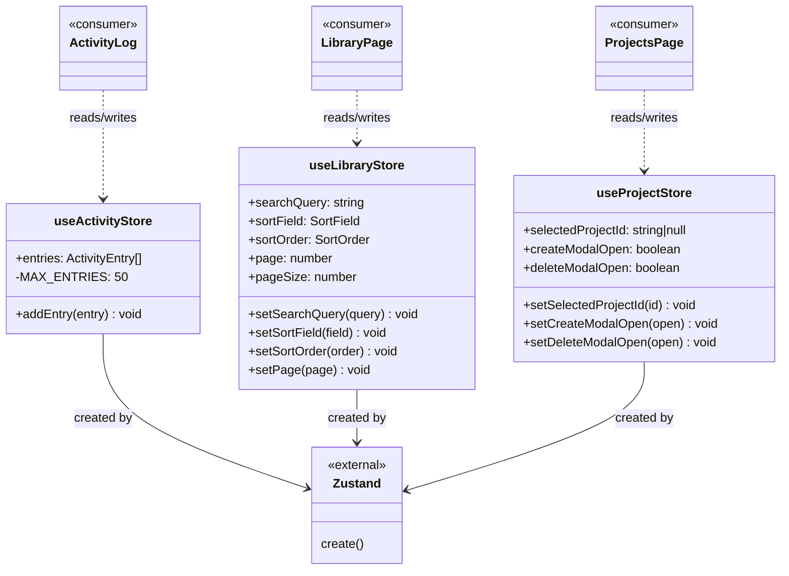

# C4 Code Level: GUI Stores

## Overview
- **Name**: GUI Zustand Stores
- **Description**: Global state management stores using Zustand for the GUI application
- **Location**: `gui/src/stores/`
- **Language**: TypeScript
- **Purpose**: Provides centralized, reactive state for activity logging, video library browsing, and project management UI

## Code Elements

### Classes/Modules

- `useActivityStore`
  - Description: Zustand store managing a capped list of WebSocket activity events (max 50 entries, FIFO eviction)
  - Location: `gui/src/stores/activityStore.ts:1`
  - State: `entries: ActivityEntry[]`
  - Methods: `addEntry(entry: Omit<ActivityEntry, 'id'>): void`
  - Dependencies: `zustand`

- `useLibraryStore`
  - Description: Zustand store managing video library page state including search query, sort settings, and pagination
  - Location: `gui/src/stores/libraryStore.ts:1`
  - State: `searchQuery: string`, `sortField: SortField`, `sortOrder: SortOrder`, `page: number`, `pageSize: number`
  - Methods: `setSearchQuery(query): void`, `setSortField(field): void`, `setSortOrder(order): void`, `setPage(page): void`
  - Dependencies: `zustand`

- `useProjectStore`
  - Description: Zustand store managing project page UI state including selected project and modal visibility
  - Location: `gui/src/stores/projectStore.ts:1`
  - State: `selectedProjectId: string | null`, `createModalOpen: boolean`, `deleteModalOpen: boolean`
  - Methods: `setSelectedProjectId(id): void`, `setCreateModalOpen(open): void`, `setDeleteModalOpen(open): void`
  - Dependencies: `zustand`

### Types/Interfaces

- `ActivityEntry { id: string; type: string; timestamp: string; details: Record<string, unknown> }` — `gui/src/stores/activityStore.ts`
- `SortField = 'date' | 'name' | 'duration'` — `gui/src/stores/libraryStore.ts`
- `SortOrder = 'asc' | 'desc'` — `gui/src/stores/libraryStore.ts`

## Dependencies

### Internal Dependencies
- None (stores are leaf dependencies — consumed by hooks and components)

### External Dependencies
- `zustand` (create)

### Consumed By
| Store | Consumers |
|-------|-----------|
| `useActivityStore` | `gui/src/components/ActivityLog.tsx` |
| `useLibraryStore` | `gui/src/pages/LibraryPage.tsx`, `gui/src/components/SortControls.tsx` (types only) |
| `useProjectStore` | `gui/src/pages/ProjectsPage.tsx` |

## Store Behavior

### activityStore
- New entries are prepended to the array
- Auto-generates sequential string IDs via module-level counter
- Caps at 50 entries; excess entries are trimmed from the end (oldest removed)

### libraryStore
- `setSearchQuery`, `setSortField`, `setSortOrder` all reset `page` to 0
- Default values: `searchQuery=''`, `sortField='date'`, `sortOrder='desc'`, `page=0`, `pageSize=20`

### projectStore
- Purely UI state — no API interaction
- Tracks which project is selected and which modals are open

## Relationships

