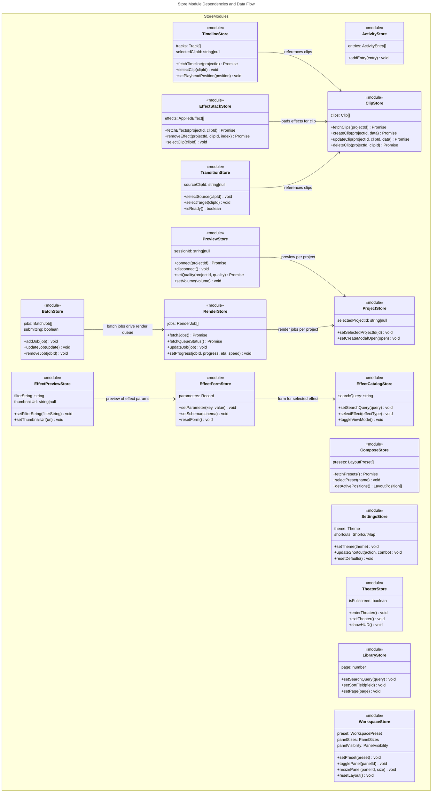

# C4 Code Level: GUI State Management Stores

## Overview

- **Name**: GUI State Management Stores
- **Description**: Zustand-based state management modules providing centralized state for timeline, clips, effects, preview, rendering, and UI features.
- **Location**: `gui/src/stores`
- **Language**: TypeScript
- **Purpose**: Manages application state for video editing features including project metadata, clip data, effect stacks, compose layouts, timeline, preview sessions, render jobs, batch jobs, transitions, workspace layout, settings, and UI modes.
- **Parent Component**: [Web GUI](./c4-component-web-gui.md)

## Code Elements

### Modules (Store Factories)

#### Activity Store
- `useActivityStore(): ActivityState`
  - Description: Manages activity/audit log entries with size-limited circular buffer (MAX_ENTRIES = 50)
  - Location: `activityStore.ts:1-27`
  - Exports: `ActivityEntry` interface, `useActivityStore` hook
  - Key state: `entries: ActivityEntry[]`
  - Key actions: `addEntry(entry: Omit<ActivityEntry, 'id'>): void`

#### Batch Store
- `useBatchStore(): BatchStoreState`
  - Description: Session-only store for batch render job tracking. Does not persist to localStorage — jobs live in memory for the current page session only (BL-295 NFR-002).
  - Location: `batchStore.ts:59-107`
  - Exports: `BatchJob` interface, `BatchJobStatus` type, `BatchJobUpdate` type, `TERMINAL_BATCH_STATUSES` constant
  - Key state: `jobs: BatchJob[]`, `submitting: boolean`, `submitError: string | null`
  - Key actions:
    - `addJob(job: BatchJob): void` — idempotent insert; merges into existing record if job_id already present
    - `updateJob(update: BatchJobUpdate): void` — partial update; enforces INV-003 (progress must not decrease unless status is 'queued')
    - `removeJob(jobId: string): void` — removes job by job_id
    - `setSubmitting(submitting: boolean): void`
    - `setSubmitError(error: string | null): void`
    - `reset(): void`

#### Clip Store
- `useClipStore(): ClipStoreState`
  - Description: CRUD operations for video clips via API integration
  - Location: `clipStore.ts:1-107`
  - Key state: `clips: Clip[]`, `isLoading: boolean`, `error: string | null`
  - Key actions:
    - `fetchClips(projectId: string): Promise<void>` - GET `/api/v1/projects/{projectId}/clips`
    - `createClip(projectId: string, data: ClipData): Promise<void>` - POST then refresh
    - `updateClip(projectId: string, clipId: string, data: PartialClipData): Promise<void>` - PATCH then refresh
    - `deleteClip(projectId: string, clipId: string): Promise<void>` - DELETE then refresh
    - `reset(): void`

#### Compose Store
- `useComposeStore(): ComposeStoreState`
  - Description: Layout presets for multi-input video composition and custom position editing
  - Location: `composeStore.ts:1-99`
  - Key state: `presets: LayoutPreset[]`, `selectedPreset: string | null`, `customPositions: LayoutPosition[]`, `isLoading: boolean`, `error: string | null`
  - Key actions:
    - `fetchPresets(): Promise<void>` - fetches from `/api/v1/compose/presets`
    - `selectPreset(name: string): void` - clones preset positions to custom
    - `setCustomPositions(positions: LayoutPosition[]): void` - clears selectedPreset
    - `updateCustomPosition(index: number, field: keyof LayoutPosition, value: number): void` - clamps values
    - `getActivePositions(): LayoutPosition[]` - returns selected preset or custom
    - `reset(): void`

#### Effect Catalog Store
- `useEffectCatalogStore(): EffectCatalogState`
  - Description: UI state for browsing and filtering available effects
  - Location: `effectCatalogStore.ts:1-28`
  - Exports: `ViewMode = 'grid' | 'list'` type
  - Key state: `searchQuery: string`, `selectedCategory: string | null`, `selectedEffect: string | null`, `viewMode: ViewMode`
  - Key actions:
    - `setSearchQuery(query: string): void`
    - `setSelectedCategory(category: string | null): void`
    - `selectEffect(effectType: string | null): void`
    - `toggleViewMode(): void`

#### Effect Form Store
- `useEffectFormStore(): EffectFormState`
  - Description: Dynamic form state management for effect parameter configuration with JSON schema
  - Location: `effectFormStore.ts:1-80`
  - Exports: `SchemaProperty`, `ParameterSchema` interfaces
  - Key state: `parameters: Record<string, unknown>`, `validationErrors: Record<string, string>`, `schema: ParameterSchema | null`, `isDirty: boolean`
  - Key actions:
    - `setParameter(key: string, value: unknown): void` - sets isDirty to true
    - `setSchema(schema: ParameterSchema): void` - loads defaults, clears errors, sets isDirty to false
    - `setValidationErrors(errors: Record<string, string>): void`
    - `resetForm(): void`
  - Helper: `defaultsFromSchema(schema: ParameterSchema): Record<string, unknown>`

#### Effect Preview Store
- `useEffectPreviewStore(): EffectPreviewState`
  - Description: Manages FFmpeg filter preview generation and thumbnail lifecycle with URL cleanup
  - Location: `effectPreviewStore.ts:1-48`
  - Key state: `filterString: string`, `isLoading: boolean`, `error: string | null`, `thumbnailUrl: string | null`, `videoPath: string | null`
  - Key actions:
    - `setFilterString(filterString: string): void` - clears error
    - `setLoading(isLoading: boolean): void`
    - `setError(error: string | null): void` - revokes prev thumbnail URL
    - `setThumbnailUrl(url: string | null): void` - revokes previous object URL
    - `setVideoPath(videoPath: string | null): void`
    - `reset(): void` - with URL cleanup

#### Effect Stack Store
- `useEffectStackStore(): EffectStackState`
  - Description: Manages effects applied to a specific clip with API synchronization
  - Location: `effectStackStore.ts:1-85`
  - Exports: `AppliedEffect` interface
  - Key state: `selectedClipId: string | null`, `effects: AppliedEffect[]`, `isLoading: boolean`, `error: string | null`
  - Key actions:
    - `selectClip(clipId: string | null): void` - clears effects and error
    - `setEffects(effects: AppliedEffect[]): void`
    - `setLoading(isLoading: boolean): void`
    - `setError(error: string | null): void`
    - `fetchEffects(projectId: string, clipId: string): Promise<void>` - GET `/api/v1/projects/{projectId}/clips`
    - `removeEffect(projectId: string, clipId: string, index: number): Promise<void>` - DELETE then refresh
    - `reset(): void`

#### Library Store
- `useLibraryStore(): LibraryState`
  - Description: UI pagination, sorting, and search for media library views
  - Location: `libraryStore.ts:1-26`
  - Key state: `searchQuery: string`, `sortField: SortField`, `sortOrder: SortOrder`, `page: number`, `pageSize: number` (= 20)
  - Key actions:
    - `setSearchQuery(query: string): void` - resets page to 0
    - `setSortField(field: SortField): void` - resets page
    - `setSortOrder(order: SortOrder): void` - resets page
    - `setPage(page: number): void`

#### Preview Store
- `usePreviewStore(): PreviewState`
  - Description: Lifecycle and playback control for video preview sessions with quality management
  - Location: `previewStore.ts:1-148`
  - Exports: `PreviewStatus`, `PreviewQuality` type unions
  - Key state: `sessionId: string | null`, `status: PreviewStatus | null`, `quality: PreviewQuality`, `position: number`, `duration: number`, `volume: number`, `muted: boolean`, `progress: number`, `error: string | null`
  - Key actions:
    - `connect(projectId: string): Promise<void>` - POST `/api/v1/projects/{projectId}/preview/start`
    - `disconnect(): void` - DELETE session, resets to initial state
    - `setQuality(projectId: string, quality: PreviewQuality): Promise<void>` - reconnects at new quality
    - `setVolume(volume: number): void` - clamped [0, 1]
    - `setMuted(muted: boolean): void`
    - `setPosition(position: number): void` - clamped [0, duration]
    - `setProgress(progress: number): void` - clamped [0, 1]
    - `setStatus(status: PreviewStatus): void`
    - `setError(error: string | null): void`
    - `reset(): void`

#### Project Store
- `useProjectStore(): ProjectState`
  - Description: UI state for project listing and selection
  - Location: `projectStore.ts:1-27`
  - Key state: `selectedProjectId: string | null`, `createModalOpen: boolean`, `deleteModalOpen: boolean`, `page: number`, `pageSize: number` (= 20)
  - Key actions:
    - `setSelectedProjectId(id: string | null): void`
    - `setCreateModalOpen(open: boolean): void`
    - `setDeleteModalOpen(open: boolean): void`
    - `setPage(page: number): void`
    - `resetPage(): void`

#### Render Store
- `useRenderStore(): RenderStoreState`
  - Description: Render job queue management with status and encoder/format detection
  - Location: `renderStore.ts:1-199`
  - Exports: `RenderJob`, `QueueStatus`, `Encoder`, `OutputFormat` interfaces
  - Key state: `jobs: RenderJob[]`, `queueStatus: QueueStatus | null`, `encoders: Encoder[]`, `formats: OutputFormat[]`, `isLoading: boolean`, `error: string | null`
  - Key actions (Fetch):
    - `fetchJobs(): Promise<void>` - GET `/api/v1/render`
    - `fetchQueueStatus(): Promise<void>` - GET `/api/v1/render/queue`
    - `fetchEncoders(): Promise<void>` - GET `/api/v1/render/encoders`
    - `fetchFormats(): Promise<void>` - GET `/api/v1/render/formats`
  - Key actions (Mutation):
    - `updateJob(job: Partial<RenderJob> & { id: string }): void` - creates or merges by id
    - `removeJob(jobId: string): void`
    - `setQueueStatus(partial: Partial<QueueStatus>): void` - shallow merge
    - `setProgress(jobId: string, progress: number, etaSeconds?: number | null, speedRatio?: number | null): void`
    - `reset(): void`

#### Settings Store
- `useSettingsStore(): SettingsStore`
  - Description: Persists user preferences (UI theme and keyboard shortcut bindings) to localStorage. Theme is applied immediately to `<html data-theme>` on change. Shortcut updates are validated against a canonical action registry and reject browser-reserved combos.
  - Location: `settingsStore.ts:156-193`
  - Exports: `SettingsState` interface, `SettingsStore` interface, `Theme` type, `ShortcutMap` type, `DEFAULT_SHORTCUTS` constant, `applyThemeToDocument(theme)` function, `SETTINGS_THEME_STORAGE_KEY`, `SETTINGS_SHORTCUTS_STORAGE_KEY`
  - Key state: `theme: Theme` (`'light' | 'dark' | 'system'`), `shortcuts: ShortcutMap` (action key → key combo string)
  - Key actions:
    - `setTheme(theme: Theme): void` — validates theme, applies to document, persists to localStorage
    - `updateShortcut(action: string, combo: string): void` — validates action is registered, combo is non-empty and not browser-reserved; throws RangeError/Error on violation
    - `resetDefaults(): void` — resets to system theme and DEFAULT_SHORTCUTS; clears localStorage

#### Theater Store
- `useTheaterStore(): TheaterState`
  - Description: Fullscreen theater mode and HUD visibility state with mouse timestamp
  - Location: `theaterStore.ts:1-36`
  - Key state: `isFullscreen: boolean`, `isHUDVisible: boolean`, `lastMouseMoveTime: number`
  - Key actions:
    - `enterTheater(): void` - fullscreen true, HUD visible, updates timestamp
    - `exitTheater(): void` - resets to defaults
    - `showHUD(): void` - visible true, updates timestamp
    - `hideHUD(): void` - visible false
    - `reset(): void`

#### Timeline Store
- `useTimelineStore(): TimelineStoreState`
  - Description: Project timeline structure with clip selection and playhead tracking
  - Location: `timelineStore.ts:1-76`
  - Key state: `tracks: Track[]`, `duration: number`, `version: number`, `isLoading: boolean`, `error: string | null`, `selectedClipId: string | null`, `playheadPosition: number`
  - Key actions:
    - `fetchTimeline(projectId: string): Promise<void>` - GET `/api/v1/projects/{projectId}/timeline`
    - `selectClip(clipId: string | null): void`
    - `setPlayheadPosition(position: number): void`
    - `reset(): void`

#### Transition Store
- `useTransitionStore(): TransitionState`
  - Description: Two-clip state manager for transition composition workflows
  - Location: `transitionStore.ts:1-27`
  - Key state: `sourceClipId: string | null`, `targetClipId: string | null`
  - Key actions:
    - `selectSource(clipId: string): void` - clears targetClipId
    - `selectTarget(clipId: string): void`
    - `isReady(): boolean` - computed, returns true when both selected
    - `reset(): void`

#### Workspace Store
- `useWorkspaceStore(): WorkspaceStore`
  - Description: Manages workspace layout preset selection, panel visibility, and panel sizes with localStorage persistence. Supports four presets (edit, review, render, custom). Manual resizing accumulates user overrides under the anchor preset and flips preset to 'custom'. State is hydrated from localStorage on first mount and persisted on every mutation (STORAGE_KEY = `'stoat-workspace-layout'`).
  - Location: `workspaceStore.ts:312-380`
  - Exports: `WorkspaceState` interface, `WorkspaceStore` interface, `WorkspacePreset` type, `NamedPreset` type, `PanelId` type, `PanelSizes` type, `PanelVisibility` type, `SizesByPreset` type, `PANEL_IDS` constant, `PANEL_DEFAULTS` constant, `PRESETS` constant (canonical preset definitions), `DEFAULT_PANEL_SIZES`, `DEFAULT_PANEL_VISIBILITY`, `loadWorkspaceState()` function, `WORKSPACE_STORAGE_KEY`
  - Key state: `preset: WorkspacePreset`, `anchorPreset: NamedPreset`, `panelSizes: PanelSizes` (percentage per panel), `panelVisibility: PanelVisibility` (boolean per panel), `sizesByPreset: SizesByPreset` (user overrides per named preset)
  - Key actions:
    - `setPreset(preset: WorkspacePreset): void` — applies canonical sizes and visibility for named presets; 'custom' only updates the label
    - `togglePanel(panelId: PanelId): void` — flips panel visibility; persists
    - `resizePanel(panelId: PanelId, size: number): void` — records size override under anchorPreset; flips to 'custom'
    - `resetLayout(): void` — returns to initialState; clears localStorage

## Dependencies

### Internal Dependencies

- `../generated/types` - API-generated type definitions (Clip, Track, LayoutPreset, LayoutPosition, TimelineResponse, SortField, SortOrder)
- `../hooks/useProjects` - API integration for clip CRUD operations (createClip, deleteClip, fetchClips, updateClip)

### External Dependencies

- `zustand` - State management library, `create()` factory used in all stores

## Relationships

```mermaid
---
title: Store Module Dependencies and Data Flow
---
classDiagram
    namespace StoreModules {
        class ActivityStore {
            <<module>>
            +addEntry(entry) void
            entries: ActivityEntry[]
        }
        class BatchStore {
            <<module>>
            +addJob(job) void
            +updateJob(update) void
            +removeJob(jobId) void
            jobs: BatchJob[]
            submitting: boolean
        }
        class ClipStore {
            <<module>>
            +fetchClips(projectId) Promise
            +createClip(projectId, data) Promise
            +updateClip(projectId, clipId, data) Promise
            +deleteClip(projectId, clipId) Promise
            clips: Clip[]
        }
        class TimelineStore {
            <<module>>
            +fetchTimeline(projectId) Promise
            +selectClip(clipId) void
            +setPlayheadPosition(position) void
            tracks: Track[]
            selectedClipId: string|null
        }
        class EffectStackStore {
            <<module>>
            +fetchEffects(projectId, clipId) Promise
            +removeEffect(projectId, clipId, index) Promise
            +selectClip(clipId) void
            effects: AppliedEffect[]
        }
        class EffectCatalogStore {
            <<module>>
            +setSearchQuery(query) void
            +selectEffect(effectType) void
            +toggleViewMode() void
            searchQuery: string
        }
        class EffectFormStore {
            <<module>>
            +setParameter(key, value) void
            +setSchema(schema) void
            +resetForm() void
            parameters: Record
        }
        class EffectPreviewStore {
            <<module>>
            +setFilterString(filterString) void
            +setThumbnailUrl(url) void
            filterString: string
            thumbnailUrl: string|null
        }
        class ComposeStore {
            <<module>>
            +fetchPresets() Promise
            +selectPreset(name) void
            +getActivePositions() LayoutPosition[]
            presets: LayoutPreset[]
        }
        class PreviewStore {
            <<module>>
            +connect(projectId) Promise
            +disconnect() void
            +setQuality(projectId, quality) Promise
            +setVolume(volume) void
            sessionId: string|null
        }
        class RenderStore {
            <<module>>
            +fetchJobs() Promise
            +fetchQueueStatus() Promise
            +updateJob(job) void
            +setProgress(jobId, progress, eta, speed) void
            jobs: RenderJob[]
        }
        class SettingsStore {
            <<module>>
            +setTheme(theme) void
            +updateShortcut(action, combo) void
            +resetDefaults() void
            theme: Theme
            shortcuts: ShortcutMap
        }
        class TransitionStore {
            <<module>>
            +selectSource(clipId) void
            +selectTarget(clipId) void
            +isReady() boolean
            sourceClipId: string|null
        }
        class TheaterStore {
            <<module>>
            +enterTheater() void
            +exitTheater() void
            +showHUD() void
            isFullscreen: boolean
        }
        class ProjectStore {
            <<module>>
            +setSelectedProjectId(id) void
            +setCreateModalOpen(open) void
            selectedProjectId: string|null
        }
        class LibraryStore {
            <<module>>
            +setSearchQuery(query) void
            +setSortField(field) void
            +setPage(page) void
            page: number
        }
        class WorkspaceStore {
            <<module>>
            +setPreset(preset) void
            +togglePanel(panelId) void
            +resizePanel(panelId, size) void
            +resetLayout() void
            preset: WorkspacePreset
            panelSizes: PanelSizes
            panelVisibility: PanelVisibility
        }
    }

    TimelineStore --> ClipStore : references clips
    EffectStackStore --> ClipStore : loads effects for clip
    TransitionStore --> ClipStore : references clips
    PreviewStore --> ProjectStore : preview per project
    RenderStore --> ProjectStore : render jobs per project
    BatchStore --> RenderStore : batch jobs drive render queue
    EffectFormStore --> EffectCatalogStore : form for selected effect
    EffectPreviewStore --> EffectFormStore : preview of effect params
```

## Notes

- All stores use Zustand's `create()` factory with immutable state updates via shallow merging
- API-based stores follow consistent error handling patterns with try-catch wrapping
- Loading states managed at store level for all async operations
- URL object cleanup implemented in EffectPreviewStore for memory management
- Input validation with clamping in PreviewStore (volume, progress, position) and ComposeStore (z_index, coordinates)
- TransitionStore's `isReady()` is a computed getter for workflow validation
- All stores export a `reset()` method that returns to initial state
- Test coverage for all stores in `__tests__/` directory
- BatchStore is the only store without localStorage persistence (session-only per BL-295 NFR-002)
- SettingsStore and WorkspaceStore persist to localStorage with graceful degradation when storage is unavailable
