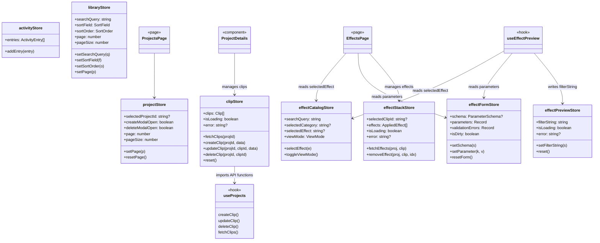

# C4 Code Level: GUI Stores

## Overview
- **Name**: GUI Zustand Stores
- **Description**: Global state management stores using Zustand for the GUI application
- **Location**: `gui/src/stores/`
- **Language**: TypeScript
- **Purpose**: Provides lightweight, hook-based global state management for UI concerns (search/sort/filter state, form state, clip CRUD, effect data) without prop drilling
- **Parent Component**: [Web GUI](./c4-component-web-gui.md)

## Code Elements

### Stores

#### `activityStore.ts`
- **Store**: `useActivityStore`
- **State**:
  - `entries: ActivityEntry[]` -- WebSocket event log entries
- **Actions**:
  - `addEntry(entry: Omit<ActivityEntry, 'id'>): void` -- prepends entry with auto-incremented id, enforces max 50 with FIFO eviction
- **Types**:
  - `ActivityEntry { id: string, type: string, timestamp: string, details: Record<string, unknown> }`
- **Consumers**: `ActivityLog` component

#### `libraryStore.ts`
- **Store**: `useLibraryStore`
- **State**:
  - `searchQuery: string` -- current video search text
  - `sortField: SortField` -- sort column (`'date' | 'name' | 'duration'`)
  - `sortOrder: SortOrder` -- sort direction (`'asc' | 'desc'`)
  - `page: number` -- current page (0-based)
  - `pageSize: number` -- items per page (default 20)
- **Actions**:
  - `setSearchQuery(query: string): void` -- resets page to 0
  - `setSortField(field: SortField): void` -- resets page to 0
  - `setSortOrder(order: SortOrder): void` -- resets page to 0
  - `setPage(page: number): void`
- **Exported Types**: `SortField`, `SortOrder`
- **Consumers**: `LibraryPage`, `useVideos` hook (imports types)

#### `projectStore.ts`
- **Store**: `useProjectStore`
- **State**:
  - `selectedProjectId: string | null` -- currently viewed project
  - `createModalOpen: boolean` -- create project modal visibility
  - `deleteModalOpen: boolean` -- delete confirmation modal visibility
  - `page: number` -- current page (0-based)
  - `pageSize: number` -- items per page (default 20)
- **Actions**:
  - `setSelectedProjectId(id: string | null): void`
  - `setCreateModalOpen(open: boolean): void`
  - `setDeleteModalOpen(open: boolean): void`
  - `setPage(page: number): void`
  - `resetPage(): void` -- resets page to 0
- **Consumers**: `ProjectsPage`

#### `clipStore.ts`
- **Store**: `useClipStore`
- **State**:
  - `clips: Clip[]` -- clips for the current project
  - `isLoading: boolean` -- whether a CRUD operation is in flight
  - `error: string | null` -- error from the last API call
- **Actions**:
  - `fetchClips(projectId: string): Promise<void>` -- GET `/api/v1/projects/{id}/clips`, populates clips
  - `createClip(projectId: string, data: { source_video_id, in_point, out_point, timeline_position }): Promise<void>` -- POST then auto-refreshes clips; re-throws on error
  - `updateClip(projectId: string, clipId: string, data: { in_point?, out_point?, timeline_position? }): Promise<void>` -- PATCH then auto-refreshes; re-throws on error
  - `deleteClip(projectId: string, clipId: string): Promise<void>` -- DELETE then auto-refreshes; re-throws on error
  - `reset(): void` -- clears clips, isLoading, error
- **Dependencies**: Imports `Clip`, `createClip`, `deleteClip`, `fetchClips`, `updateClip` from `gui/src/hooks/useProjects`
- **Consumers**: `ProjectDetails` component, `ClipFormModal` component

#### `effectCatalogStore.ts`
- **Store**: `useEffectCatalogStore`
- **State**:
  - `searchQuery: string` -- effect search text
  - `selectedCategory: string | null` -- active category filter
  - `selectedEffect: string | null` -- currently selected effect type
  - `viewMode: ViewMode` -- catalog display mode (`'grid' | 'list'`)
- **Actions**:
  - `setSearchQuery(query: string): void`
  - `setSelectedCategory(category: string | null): void`
  - `selectEffect(effectType: string | null): void`
  - `toggleViewMode(): void`
- **Exported Types**: `ViewMode`
- **Consumers**: `EffectCatalog` component, `EffectsPage`, `useEffectPreview` hook

#### `effectFormStore.ts`
- **Store**: `useEffectFormStore`
- **State**:
  - `schema: ParameterSchema | null` -- JSON Schema for current effect
  - `parameters: Record<string, unknown>` -- current form values
  - `validationErrors: Record<string, string>` -- field-level errors
  - `isDirty: boolean` -- whether form has been modified
- **Actions**:
  - `setSchema(schema: ParameterSchema): void` -- sets schema, initializes defaults via `defaultsFromSchema()`, clears errors
  - `setParameter(key: string, value: unknown): void` -- sets single param, marks dirty
  - `setValidationErrors(errors: Record<string, string>): void`
  - `resetForm(): void` -- clears schema, params, errors, isDirty
- **Types**:
  - `SchemaProperty { type?, format?, enum?, minimum?, maximum?, default?, description? }`
  - `ParameterSchema { type: 'object', properties?: Record<string, SchemaProperty>, required?: string[] }`
- **Helper**: `defaultsFromSchema(schema: ParameterSchema): Record<string, unknown>` -- extracts default values from schema properties
- **Consumers**: `EffectParameterForm` component, `EffectsPage`, `useEffectPreview` hook

#### `effectPreviewStore.ts`
- **Store**: `useEffectPreviewStore`
- **State**:
  - `filterString: string` -- generated FFmpeg filter string
  - `isLoading: boolean` -- preview request in flight
  - `error: string | null` -- preview error message
- **Actions**:
  - `setFilterString(filterString: string): void` -- also clears error
  - `setLoading(isLoading: boolean): void`
  - `setError(error: string | null): void` -- also sets isLoading to false
  - `reset(): void` -- clears all fields
- **Consumers**: `FilterPreview` component, `useEffectPreview` hook

#### `effectStackStore.ts`
- **Store**: `useEffectStackStore`
- **State**:
  - `selectedClipId: string | null` -- clip targeted for effects
  - `effects: AppliedEffect[]` -- effects applied to selected clip
  - `isLoading: boolean` -- fetch in flight
  - `error: string | null` -- last error
- **Actions**:
  - `selectClip(clipId: string | null): void` -- sets clip, clears effects/error
  - `setEffects(effects: AppliedEffect[]): void`
  - `setLoading(isLoading: boolean): void`
  - `setError(error: string | null): void`
  - `fetchEffects(projectId: string, clipId: string): Promise<void>` -- GET `/api/v1/projects/{id}/clips`, finds clip, extracts effects array
  - `removeEffect(projectId: string, clipId: string, index: number): Promise<void>` -- DELETE `/api/v1/projects/{id}/clips/{id}/effects/{idx}`, then refetches
  - `reset(): void` -- clears all state
- **Types**:
  - `AppliedEffect { effect_type: string, parameters: Record<string, unknown>, filter_string: string }`
- **Consumers**: `EffectsPage`, `EffectStack` component

## Dependencies

### Internal Dependencies
- `gui/src/hooks/useProjects` -- used by `clipStore` for API functions and Clip type

### External Dependencies
- `zustand` (create function)

## Store Relationship Summary

| Store | State Fields | Actions | Primary Consumers |
|-------|-------------|---------|-------------------|
| activityStore | 1 | 1 | ActivityLog |
| libraryStore | 5 | 4 | LibraryPage, useVideos |
| projectStore | 5 | 5 | ProjectsPage |
| clipStore | 3 | 5 | ProjectDetails, ClipFormModal |
| effectCatalogStore | 4 | 4 | EffectCatalog, EffectsPage, useEffectPreview |
| effectFormStore | 4 | 4 | EffectParameterForm, EffectsPage, useEffectPreview |
| effectPreviewStore | 3 | 4 | FilterPreview, useEffectPreview |
| effectStackStore | 4 | 7 | EffectsPage, EffectStack |

## Relationships

