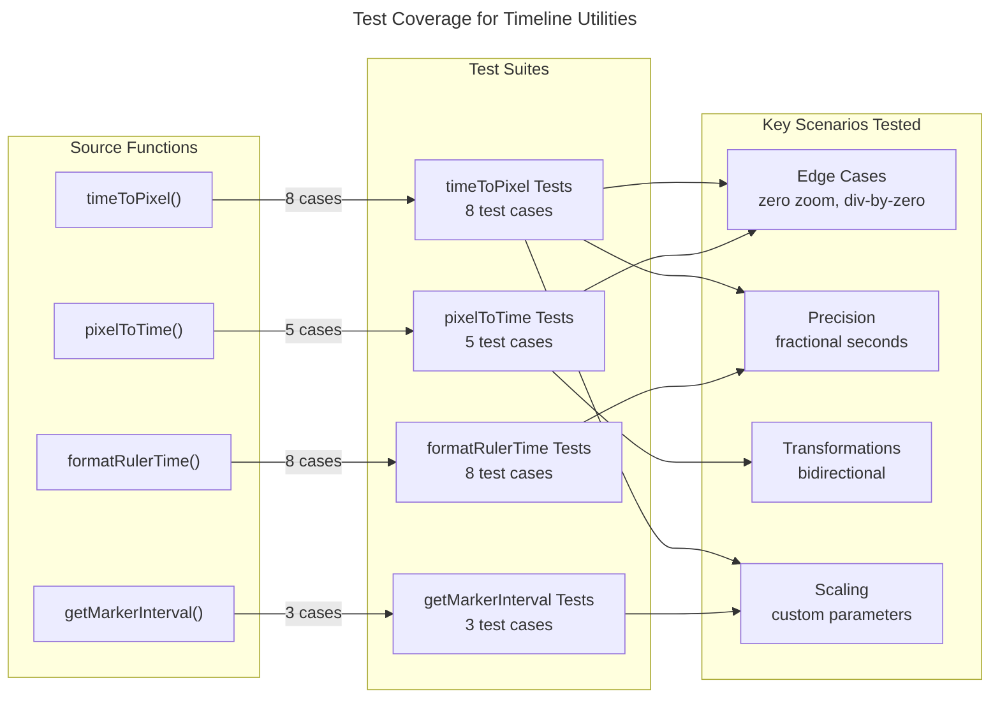

# C4 Code Level: Timeline Utilities Test Suite

## Overview

- **Name**: Timeline Utilities Tests
- **Description**: Comprehensive test suite for timeline coordinate transformation and formatting functions using Vitest.
- **Location**: gui/src/utils/__tests__/timeline.test.ts
- **Language**: TypeScript
- **Purpose**: Validates coordinate math accuracy, edge case handling, and formatter output for timeline canvas utilities.
- **Parent Component**: [Web GUI](./c4-component-web-gui.md)

## Test Inventory

**Test Framework**: Vitest
**Total Test Count**: 24 tests across 4 describe blocks

### Test File Statistics

- **Lines of Code**: 115
- **Coverage Target**: All public exports from timeline.ts

## Code Elements

### Test Suites

#### 1. timeToPixel Tests (8 tests)
- Location: gui/src/utils/__tests__/timeline.test.ts:9-53
- Tests: Basic conversion, zoom multiplier, scroll offset, zero zoom, sub-second clips, long timelines, negative scroll, custom pixelsPerSecond

#### 2. pixelToTime Tests (5 tests)
- Location: gui/src/utils/__tests__/timeline.test.ts:55-76
- Tests: Inverse transformation verification, zoom accounting, scroll offset accounting, zero zoom guard, zero pixelsPerSecond guard

#### 3. getMarkerInterval Tests (3 tests)
- Location: gui/src/utils/__tests__/timeline.test.ts:78-95
- Tests: Default zoom behavior, zoomed-in interval selection, zoomed-out interval selection

#### 4. formatRulerTime Tests (8 tests)
- Location: gui/src/utils/__tests__/timeline.test.ts:97-114
- Tests: Whole seconds formatting, fractional seconds, minute display, various time values

## Test Coverage Summary

### timeToPixel Coverage

| Scenario | Test Case | Lines |
|----------|-----------|-------|
| Basic conversion | 1s @ zoom 1, no scroll = 100px | 10-13 |
| Zoom application | Multiplier applied correctly | 15-18 |
| Scroll subtraction | Offset subtracted from result | 20-23 |
| Zero zoom edge case | Returns 0 when zoom=0 | 25-27 |
| Fractional seconds | Sub-second precision | 29-32 |
| Long timelines | 7200s (2 hours) = 720000px | 34-37 |
| Negative scroll | Canvas shift right | 39-42 |
| Custom pixelsPerSecond | Parameter override | 44-47 |
| Zero time | Returns -scrollOffset | 49-52 |

### pixelToTime Coverage

| Scenario | Test Case | Lines |
|----------|-----------|-------|
| Inverse transform | 100px @ zoom 1, no scroll = 1s | 56-59 |
| Zoom accounting | 200px @ zoom 2, no scroll = 1s | 61-63 |
| Scroll accounting | 50px @ zoom 1, 50px scroll = 1s | 65-67 |
| Zero zoom guard | Returns 0 safely | 69-71 |
| Zero pixelsPerSecond guard | Returns 0 safely | 73-75 |

### getMarkerInterval Coverage

| Scenario | Test Case | Lines |
|----------|-----------|-------|
| Default zoom | 1s interval @ zoom 1.0 | 79-82 |
| Zoomed in | Returns smaller interval | 84-88 |
| Zoomed out | Returns larger interval | 90-94 |

### formatRulerTime Coverage

| Scenario | Test Case | Lines |
|----------|-----------|-------|
| Whole seconds | 0s → "0:00", 65s → "1:05" | 99-102 |
| Fractional seconds | 0.5s → "0:00.5", 1.5s → "0:01.5" | 104-107 |
| Minutes | 60s → "1:00", 90s → "1:30", 125s → "2:05" | 109-113 |

## Dependencies

### Internal Dependencies
- `../timeline.ts`: Tests all four exported functions from timeline utility module

### External Dependencies
- `vitest`: Test framework (`describe`, `it`, `expect`)

## Relationships

## Notes

- Uses `.toBeCloseTo()` for floating-point assertions (e.g., 0.1 pixels for sub-second clips)
- Comprehensive edge case coverage including zero values, negative offsets, and extreme timeline lengths
- Bidirectional transformation tests confirm `timeToPixel` and `pixelToTime` are true inverses
- No mocking or fixtures required; all tests use pure function calls with literal values
- All 24 tests expected to pass; validates complete coordinate math correctness
