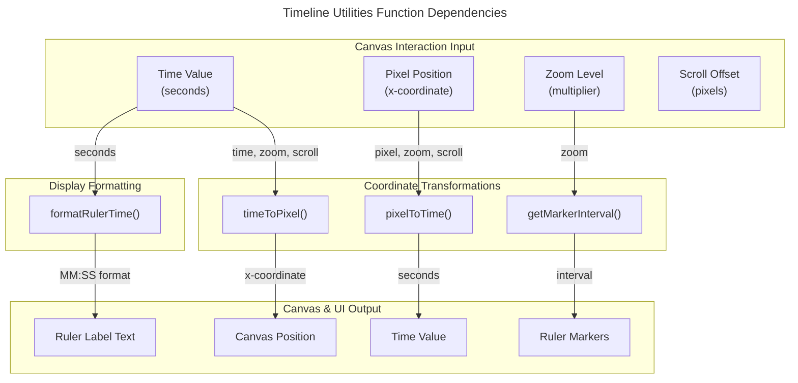

# C4 Code Level: Timeline Coordinate Utilities

## Overview

- **Name**: Timeline Coordinate Utilities
- **Description**: Provides coordinate transformation functions for timeline canvas rendering, including time-to-pixel conversions, dynamic marker intervals, and time formatting for the ruler.
- **Location**: gui/src/utils/timeline.ts
- **Language**: TypeScript
- **Purpose**: Enables precise coordinate mathematics for the interactive timeline canvas, supporting zoom, scroll, and ruler label display in video rendering UI.
- **Parent Component**: [Web GUI](./c4-component-web-gui.md)

## Code Elements

### Functions/Methods

- `timeToPixel(time: number, zoom: number, scrollOffset: number, pixelsPerSecond?: number): number`
  - Description: Converts a time value (in seconds) to a pixel x-coordinate on the canvas, accounting for zoom level and horizontal scroll offset.
  - Location: gui/src/utils/timeline.ts:15-22
  - Dependencies: None
  - Formula: `time * pixelsPerSecond * zoom - scrollOffset`

- `pixelToTime(pixel: number, zoom: number, scrollOffset: number, pixelsPerSecond?: number): number`
  - Description: Inverse transformation that converts a pixel x-coordinate back to time in seconds. Handles zero-division edge cases.
  - Location: gui/src/utils/timeline.ts:33-41
  - Dependencies: None
  - Formula: `(pixel + scrollOffset) / (pixelsPerSecond * zoom)` with zero-check guards

- `getMarkerInterval(zoom: number, pixelsPerSecond?: number): number`
  - Description: Calculates the optimal time marker interval (in seconds) for the ruler based on zoom level. Uses a predefined sequence and targets 80-150px spacing between markers.
  - Location: gui/src/utils/timeline.ts:49-58
  - Dependencies: None
  - Interval sequence: [0.1, 0.25, 0.5, 1, 2, 5, 10, 15, 30, 60, 120, 300] seconds

- `formatRulerTime(seconds: number): string`
  - Description: Formats a time value for ruler display. Returns formatted strings like "0:00", "1:30", or "0:00.5" for fractional seconds.
  - Location: gui/src/utils/timeline.ts:66-73
  - Dependencies: None
  - Format: `MM:SS` with zero-padded seconds; fractional seconds shown to 1 decimal place

### Constants

- `BASE_PIXELS_PER_SECOND`: number = 100
  - Description: Default pixels per second at zoom level 1.0
  - Location: gui/src/utils/timeline.ts:4

## Dependencies

### Internal Dependencies
- None

### External Dependencies
- None (pure utility module)

## Relationships

## Notes

- All functions use `pixelsPerSecond` parameter with default `BASE_PIXELS_PER_SECOND = 100`
- `pixelToTime` includes safety checks for zero zoom and zero pixelsPerSecond to prevent division-by-zero errors
- `getMarkerInterval` adaptively selects from 12 standard intervals to maintain 80-150px visual spacing
- Supports fractional seconds for sub-millisecond precision in high-zoom scenarios
- Pure functions with no side effects; suitable for memoization in React components
