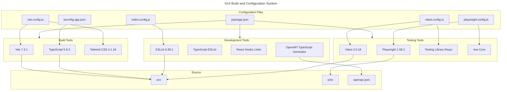

# C4 Code Level: GUI Configuration and Build System

## Overview

- **Name**: GUI Build, Configuration, and Tooling
- **Description**: Build system, testing configuration, TypeScript setup, and development tools for the React GUI application.
- **Location**: gui/
- **Language**: JavaScript, TypeScript, JSON
- **Purpose**: Configures Vite bundler, Playwright E2E testing, Vitest unit testing, TypeScript compilation, linting, and dependency management for the React 19 GUI.
- **Parent Component**: [Web GUI](./c4-component-web-gui.md)

## Build and Development Workflow

```
npm install               # Install dependencies
npm run dev             # Start Vite dev server (localhost:5173)
npm run build           # Type-check and build production bundle
npm run lint            # Run ESLint on .ts/.tsx files
npm run preview         # Preview production build locally
npm run generate:types  # Generate TypeScript types from OpenAPI schema

# Testing
npm run test:unit   # Run Vitest unit tests (via vitest.config.ts)
npm run test:e2e    # Run Playwright E2E tests (via playwright.config.ts)
```

## Code Elements

### Build and Development Configuration

- **vite.config.ts**
  - Description: Vite bundler configuration with React plugin and Tailwind CSS support. Configures base path "/gui/" and API proxying to FastAPI backend (localhost:8765).
  - Location: gui/vite.config.ts
  - Key Configuration:
    - plugins: [react(), tailwindcss()]
    - base: '/gui/'
    - proxy: /api → localhost:8765, /health → localhost:8765, /ws → localhost:8765 (WebSocket)

- **vitest.config.ts**
  - Description: Vitest unit test configuration with jsdom environment for DOM testing.
  - Location: gui/vitest.config.ts
  - Key Configuration:
    - environment: 'jsdom'
    - globals: true
    - exclude: ['e2e/**', 'node_modules/**']

- **playwright.config.ts**
  - Description: Playwright E2E test configuration with FastAPI web server launcher and Chromium browser.
  - Location: gui/playwright.config.ts
  - Key Configuration:
    - testDir: ./e2e
    - baseURL: http://localhost:8765/gui/
    - webServer command: uvicorn app on port 8765
    - fullyParallel: true
    - reporters: html

### TypeScript Configuration

- **tsconfig.json**
  - Description: Composite TypeScript configuration that references app and node build configurations.
  - Location: gui/tsconfig.json
  - Structure: references [tsconfig.app.json, tsconfig.node.json]

- **tsconfig.app.json**
  - Description: TypeScript compiler options for application source code (src/).
  - Location: gui/tsconfig.app.json
  - Target: ES2022
  - Strict mode: true
  - Includes: jsx: "react-jsx"
  - lib: ES2022, DOM, DOM.Iterable
  - Linting: noUnusedLocals, noUnusedParameters, noFallthroughCasesInSwitch

- **tsconfig.node.json**
  - Description: TypeScript compiler options for tooling (vite.config.ts, vitest.config.ts, etc.).
  - Location: gui/tsconfig.node.json
  - Target: ES2023
  - Includes: vite.config.ts only

### Linting Configuration

- **eslint.config.js**
  - Description: ESLint flat configuration for TypeScript and React code quality checks.
  - Location: gui/eslint.config.js
  - Extends:
    - @eslint/js recommended
    - typescript-eslint recommended
    - react-hooks/recommended
    - react-refresh/vite
  - Applies to: **/*.{ts,tsx}
  - Language: ES2020, browser globals

### Dependency Management

- **package.json**
  - Description: Node.js package manifest with dependencies and npm scripts.
  - Location: gui/package.json
  - Scripts:
    - dev: vite
    - build: tsc -b && vite build
    - lint: eslint .
    - preview: vite preview
    - generate:types: openapi-typescript ./openapi.json -o src/generated/api-types.ts
  - Key Dependencies:
    - react 19.2.0, react-dom 19.2.0
    - react-router-dom 7.13.0
    - zustand 5.0.11
    - hls.js 1.6.15

- **openapi.json**
  - Description: OpenAPI schema for backend API; used to generate TypeScript types via openapi-typescript.
  - Location: gui/openapi.json
  - Generation: npm run generate:types

### Documentation and Metadata

- **index.html**
  - Description: HTML entry point; contains <div id="root"></div> mount point for React.
  - Location: gui/index.html

- **README.md**
  - Description: GUI documentation and setup instructions.
  - Location: gui/README.md

- **.gitignore**
  - Description: Git ignore rules for node_modules, build artifacts, and temporary files.
  - Location: gui/.gitignore

## Dependencies

### Internal Dependencies

- src/ directory (application code)
- e2e/ directory (end-to-end tests)
- openapi.json (API schema)

### External Build and Test Tools

- **vite** (^7.3.1) - Frontend build tool and dev server
- **@vitejs/plugin-react** (^5.1.1) - Vite React plugin
- **@tailwindcss/vite** (^4.1.18) - Tailwind CSS Vite plugin
- **tailwindcss** (^4.1.18) - CSS framework
- **typescript** (~5.9.3) - Type checking
- **@types/react** (^19.2.7), @types/react-dom (^19.2.3) - React type definitions
- **eslint** (^9.39.1) - Linter
- **@eslint/js** (^9.39.1), **typescript-eslint** (^8.48.0) - ESLint configs
- **vitest** (^4.0.18) - Unit test framework
- **@testing-library/react** (^16.3.2) - React testing utilities
- **@playwright/test** (^1.58.2) - E2E test framework
- **@axe-core/playwright** (^4.11.1) - Accessibility testing
- **openapi-typescript** (^7.13.0) - API type generation

### Runtime Dependencies

- **react** (^19.2.0), **react-dom** (^19.2.0) - UI library
- **react-router-dom** (^7.13.0) - Client-side routing
- **zustand** (^5.0.11) - State management
- **hls.js** (^1.6.15) - HLS video streaming

## Relationships



## Notes

- Vite dev server proxies /api, /health, /metrics, and /ws to FastAPI backend at localhost:8765
- TypeScript strict mode enabled with strict null checks, unused variable detection
- ESLint rules applied to all .ts/.tsx files with React Hooks and React Refresh plugins
- Playwright uses chromium-only (not multi-browser testing)
- npm run build chain runs TypeScript type checking first (tsc -b) before Vite bundling
- OpenAPI schema used to auto-generate API types, eliminating manual type definition maintenance
