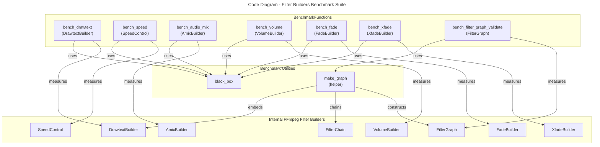

# C4 Code Level: FFmpeg Filter Builders Benchmarks

## Overview

- **Name**: FFmpeg Filter Builders Benchmarks
- **Description**: Criterion benchmarks measuring filter string generation performance for drawtext, speed, audio, transition builders, and filter graph validation.
- **Location**: rust/stoat_ferret_core/benches
- **Language**: Rust
- **Purpose**: Performance testing suite for FFmpeg filter builder components using Criterion micro-benchmarks.
- **Parent Component**: [Rust Core Engine](./c4-component-rust-core-engine.md)

## Code Elements

### Benchmark Functions

- `fn bench_drawtext(c: &mut Criterion)`
  - Description: Benchmarks DrawtextBuilder for basic and complex text rendering scenarios
  - Location: filter_builders.rs:16
  - Tests basic text and full configuration with shadows, background, alpha fade, and conditional enable
  - Dependencies: DrawtextBuilder, Criterion

- `fn bench_speed(c: &mut Criterion)`
  - Description: Benchmarks SpeedControl filter generation for various playback speeds
  - Location: filter_builders.rs:40
  - Tests setpts_filter and atempo_filters at speeds 0.25x, 2x, and 4x
  - Dependencies: SpeedControl, Criterion

- `fn bench_audio_mix(c: &mut Criterion)`
  - Description: Benchmarks AmixBuilder for audio mixing with varying input counts and weights
  - Location: filter_builders.rs:62
  - Tests 2-input basic mix and 4-input weighted mix with duration modes
  - Dependencies: AmixBuilder, Criterion

- `fn bench_volume(c: &mut Criterion)`
  - Description: Benchmarks VolumeBuilder for audio volume adjustments
  - Location: filter_builders.rs:77
  - Tests linear ratio and dB-based volume specifications
  - Dependencies: VolumeBuilder, Criterion

- `fn bench_fade(c: &mut Criterion)`
  - Description: Benchmarks FadeBuilder for fade in/out transitions
  - Location: filter_builders.rs:89
  - Tests fade in and fade out with start time and color options
  - Dependencies: FadeBuilder, Criterion

- `fn bench_xfade(c: &mut Criterion)`
  - Description: Benchmarks XfadeBuilder for crossfade transitions between streams
  - Location: filter_builders.rs:104
  - Tests fade and wipeleft transition types with varying durations
  - Dependencies: XfadeBuilder, TransitionType, Criterion

- `fn bench_filter_graph_validate(c: &mut Criterion)`
  - Description: Benchmarks FilterGraph validation performance with varying chain complexity
  - Location: filter_builders.rs:151
  - Tests validation of filter graphs with 1, 5, and 10 linear filter chains
  - Dependencies: FilterGraph, FilterChain, DrawtextBuilder, Criterion

- `fn make_graph(chain_count: usize) -> FilterGraph`
  - Description: Helper function constructing a filter graph with specified number of linear drawtext filter chains
  - Location: filter_builders.rs:127
  - Creates chains with sequential input/output labels for validation benchmarking
  - Dependencies: FilterGraph, FilterChain, DrawtextBuilder

### Criterion Macros

- `criterion_group!(benches, ...)`
  - Description: Groups all benchmark functions for execution
  - Location: filter_builders.rs:169
  - Aggregates seven benchmark functions

- `criterion_main!(benches)`
  - Description: Entry point for criterion benchmark runner
  - Location: filter_builders.rs:179

## Dependencies

### Internal Dependencies

- `stoat_ferret_core::ffmpeg::audio::AmixBuilder` - Audio mixing filter builder
- `stoat_ferret_core::ffmpeg::audio::VolumeBuilder` - Audio volume adjustment builder
- `stoat_ferret_core::ffmpeg::drawtext::DrawtextBuilder` - Text overlay filter builder
- `stoat_ferret_core::ffmpeg::filter::FilterChain` - Individual filter chain component
- `stoat_ferret_core::ffmpeg::filter::FilterGraph` - Complete filter graph validator
- `stoat_ferret_core::ffmpeg::speed::SpeedControl` - Playback speed modifier
- `stoat_ferret_core::ffmpeg::transitions::FadeBuilder` - Fade transition builder
- `stoat_ferret_core::ffmpeg::transitions::TransitionType` - Transition type enum
- `stoat_ferret_core::ffmpeg::transitions::XfadeBuilder` - Crossfade transition builder

### External Dependencies

- `criterion` - Micro-benchmarking framework (black_box, criterion_group, criterion_main, Criterion)

## Relationships

## Notes

- All benchmark functions follow Criterion pattern: construct builder instances with `black_box()` outside the timed loop, then call `.build()` inside to measure only filter string generation
- The `make_graph()` helper creates realistic filter graph scenarios with sequential label chaining
- HTML reports are automatically generated in `target/criterion/` after running `cargo bench`
- Performance sensitive areas: filter graph validation scales with chain count, audio builder configuration complexity
