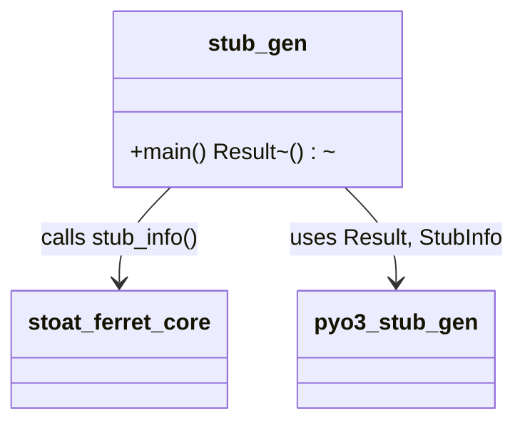

# C4 Code Level: Stub Generator Binary

## Overview
- **Name**: Stub Generator Binary
- **Description**: Binary that generates Python type stubs from PyO3-annotated Rust code
- **Location**: `rust/stoat_ferret_core/src/bin/`
- **Language**: Rust
- **Purpose**: Generates baseline Python `.pyi` type stubs using `pyo3-stub-gen` for the `stoat_ferret_core` crate

## Code Elements

### Functions/Methods

- `main() -> pyo3_stub_gen::Result<()>`
  - Description: Entry point that gathers stub info from the crate and writes generated stub files to disk
  - Location: `rust/stoat_ferret_core/src/bin/stub_gen.rs:7`
  - Dependencies: `stoat_ferret_core::stub_info()`, `pyo3_stub_gen::Result`

## Dependencies

### Internal Dependencies
- `stoat_ferret_core::stub_info` - function that locates `pyproject.toml` and gathers stub metadata

### External Dependencies
- `pyo3_stub_gen` - crate that introspects PyO3 annotations and generates Python type stubs

## Relationships

