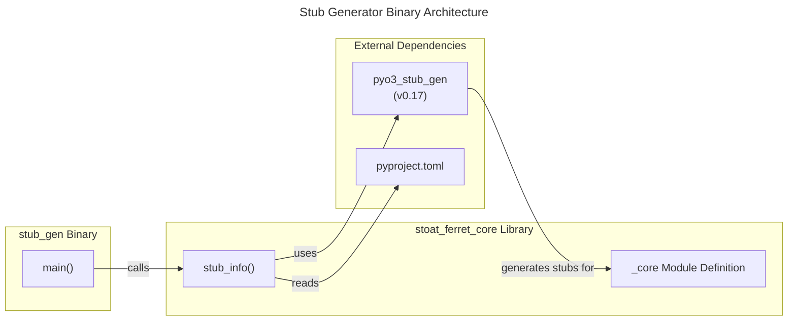

# C4 Code Level: Stoat Ferret Core Binary - Stub Generator

## Overview

- **Name**: Stub Generator Binary
- **Description**: A command-line binary utility that generates Python type stub files for the PyO3 module stoat_ferret_core._core.
- **Location**: rust/stoat_ferret_core/src/bin
- **Language**: Rust
- **Purpose**: Generates type stub files (.pyi) for Python type checking and IDE autocomplete support by reading project metadata from pyproject.toml.
- **Parent Component**: [Rust Core Engine](./c4-component-rust-core-engine.md)

## Code Elements

### Functions/Methods

- `fn main() -> Result<()>`
  - Description: Entry point for the stub generator. Calls stub_info() to gather Python module metadata, then generates type stubs from the stoat_ferret_core library.
  - Location: stub_gen.rs:7-11
  - Dependencies: `stoat_ferret_core::stub_info()`, `pyo3_stub_gen::Result`

### Modules/Dependencies

- **stoat_ferret_core**: The main library crate containing the PyO3 module definition and stub_info() function.
  - Exposes: `stub_info()` function that reads pyproject.toml and creates StubInfo object.
  - Location: ../lib.rs:158-167

## Dependencies

### Internal Dependencies

- `stoat_ferret_core::stub_info()` - Gathers stub information from project root pyproject.toml
- `stoat_ferret_core` library crate - Contains the PyO3 _core module definition

### External Dependencies

- `pyo3_stub_gen` (v0.17) - Python type stub generation framework
  - `pyo3_stub_gen::Result` - Result type for stub generation operations
  - `pyo3_stub_gen::StubInfo` - Contains Python module metadata and stub generation logic

## Relationships

```mermaid
---
title: Stub Generator Binary Architecture
---
flowchart LR
    subgraph Binary["stub_gen Binary"]
        main["main()"]
    end
    
    subgraph CoreLib["stoat_ferret_core Library"]
        stub_info["stub_info()"]
        module_def["_core Module Definition"]
    end
    
    subgraph Deps["External Dependencies"]
        pyo3_stub["pyo3_stub_gen<br/>(v0.17)"]
        pyproject["pyproject.toml"]
    end

    main -->|calls| stub_info
    stub_info -->|reads| pyproject
    stub_info -->|uses| pyo3_stub
    pyo3_stub -->|generates stubs for| module_def
```

## Notes

- Run with: `cargo run --bin stub_gen` from the project root
- Generates `src/stoat_ferret_core/_core.pyi` - Python type stub file
- The stub_info() function handles the custom path resolution needed because pyproject.toml is at the project root, not in rust/stoat_ferret_core/
- This binary is executed as part of the build/development workflow to keep type stubs in sync with the PyO3 module definition
