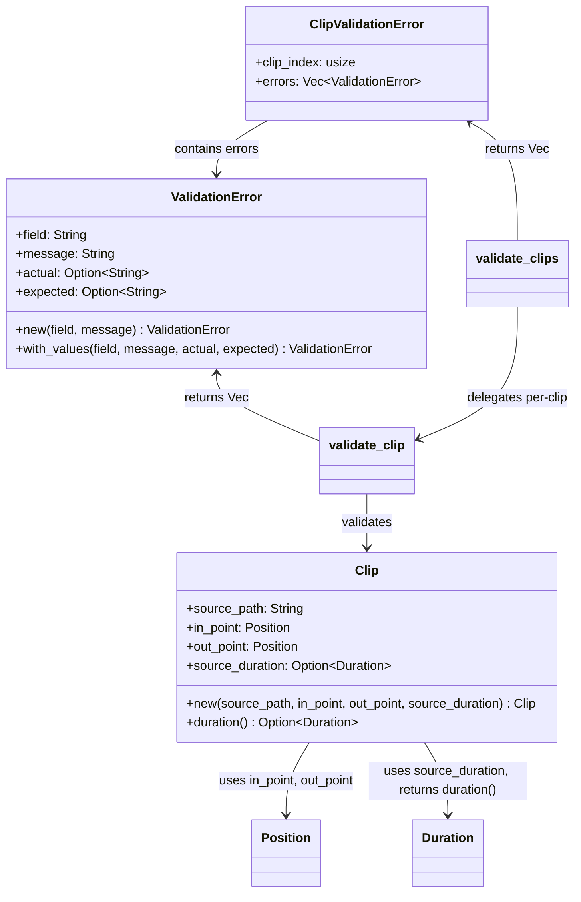

# C4 Code Level: Clip Module

## Overview
- **Name**: Clip Module
- **Description**: Video clip representation, construction, and validation with PyO3 bindings
- **Location**: `rust/stoat_ferret_core/src/clip/`
- **Language**: Rust
- **Purpose**: Provides the `Clip` struct for representing video clip segments and comprehensive validation logic with detailed error reporting

## Code Elements

### Classes/Modules

- `Clip`
  - Description: A video clip representing a segment of a source media file, with source path, in/out points, and optional source duration
  - Location: `rust/stoat_ferret_core/src/clip/mod.rs:63`
  - Fields:
    - `source_path: String` (PyO3 get) - Path to the source media file
    - `in_point: Position` (PyO3 get) - Start position within the source (inclusive)
    - `out_point: Position` (PyO3 get) - End position within the source (exclusive)
    - `source_duration: Option<Duration>` (PyO3 get) - Total duration of source file (optional)
  - Methods:
    - `new(source_path: String, in_point: Position, out_point: Position, source_duration: Option<Duration>) -> Self`
    - `duration(&self) -> Option<Duration>`
  - PyO3 Methods:
    - `py_new(...)` - Python constructor (`#[new]`)
    - `py_duration(&self) -> Option<Duration>` - exposed as `duration()`
    - `__repr__(&self) -> String`
  - Dependencies: `crate::timeline::{Duration, Position}`, `pyo3`, `pyo3_stub_gen`

- `ValidationError` (Python name: `ClipValidationError`)
  - Description: A validation error with field name, message, and optional actual/expected values
  - Location: `rust/stoat_ferret_core/src/clip/validation.rs:71`
  - Fields:
    - `field: String` (PyO3 get) - Field that failed validation
    - `message: String` (PyO3 get) - Human-readable error message
    - `actual: Option<String>` (PyO3 get) - Actual value provided
    - `expected: Option<String>` (PyO3 get) - Expected value or constraint
  - Methods:
    - `new(field: impl Into<String>, message: impl Into<String>) -> Self`
    - `with_values(field, message, actual, expected) -> Self`
  - PyO3 Methods:
    - `py_new(field: String, message: String) -> Self` - Python constructor
    - `with_values_py(field, message, actual, expected) -> Self` - `#[staticmethod]`
    - `__repr__(&self) -> String`
    - `__str__(&self) -> String`
  - Trait Implementations: `Display`, `Error`, `Debug`, `Clone`, `PartialEq`, `Eq`
  - Dependencies: `super::Clip`, `pyo3`, `pyo3_stub_gen`

- `ClipValidationError`
  - Description: Batch validation result pairing a clip index with its errors (Rust-only, not exposed to Python)
  - Location: `rust/stoat_ferret_core/src/clip/validation.rs:318`
  - Fields:
    - `clip_index: usize` - 0-based index of the clip
    - `errors: Vec<ValidationError>` - Validation errors for this clip

### Functions/Methods

- `validate_clip(clip: &Clip) -> Vec<ValidationError>`
  - Description: Validates a single clip checking source path, in/out ordering, and temporal bounds against source duration
  - Location: `rust/stoat_ferret_core/src/clip/validation.rs:250`
  - Dependencies: `Clip`, `ValidationError`

- `validate_clips(clips: &[Clip]) -> Vec<ClipValidationError>`
  - Description: Batch-validates multiple clips, returning errors with clip indices
  - Location: `rust/stoat_ferret_core/src/clip/validation.rs:357`
  - Dependencies: `validate_clip`, `ClipValidationError`

- `py_validate_clip(clip: &Clip) -> Vec<ValidationError>`
  - Description: Python-exposed wrapper for `validate_clip`
  - Location: `rust/stoat_ferret_core/src/clip/validation.rs:393`
  - Dependencies: `validate_clip`

- `py_validate_clips(clips: Vec<Clip>) -> Vec<(usize, ValidationError)>`
  - Description: Python-exposed wrapper for `validate_clips`, flattened to `(index, error)` tuples
  - Location: `rust/stoat_ferret_core/src/clip/validation.rs:412`
  - Dependencies: `validate_clips`

## Dependencies

### Internal Dependencies
- `crate::timeline::Position` - Timeline position type used for in/out points
- `crate::timeline::Duration` - Timeline duration type used for source duration and clip duration calculation

### External Dependencies
- `pyo3` - Python bindings framework (`pyclass`, `pymethods`, `pyfunction`)
- `pyo3_stub_gen` - Stub generation annotations (`gen_stub_pyclass`, `gen_stub_pyfunction`)

## Relationships

