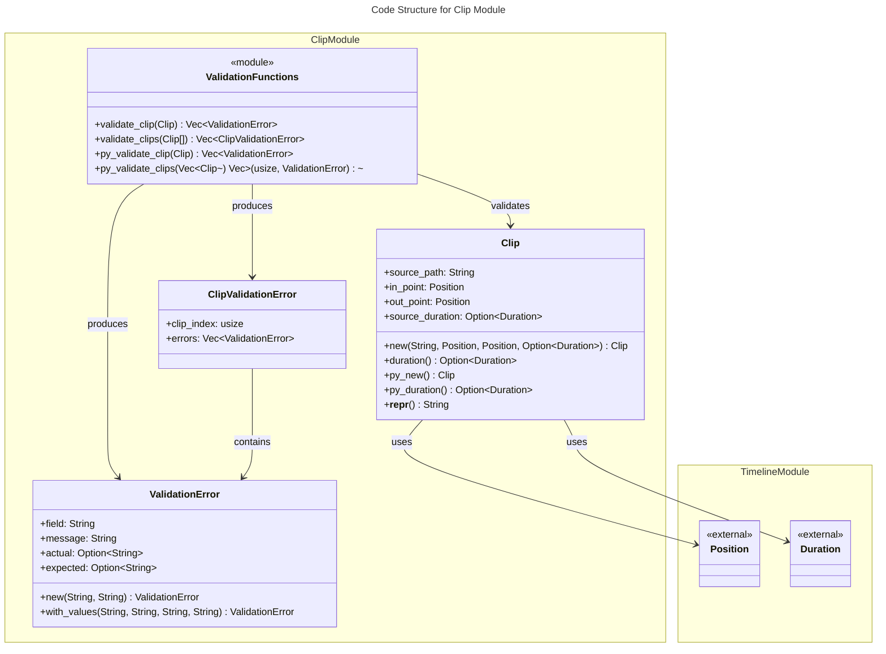

# C4 Code Level: Video Clip Representation and Validation

## Overview

- **Name**: Clip Module
- **Description**: Provides types and validation logic for representing video clips with source paths, in/out points, and optional source duration information.
- **Location**: `rust/stoat_ferret_core/src/clip`
- **Language**: Rust (with PyO3 Python bindings)
- **Purpose**: Define core video clip data structures and implement comprehensive validation for clip temporal bounds and structure.
- **Parent Component**: [Rust Core Engine](./c4-component-rust-core-engine.md)

## Code Elements

### Structs

#### `Clip`
- **Description**: Represents a segment of a source media file with in/out points.
- **Location**: `mod.rs:63-76`
- **Fields**:
  - `source_path: String` - Path to the source media file
  - `in_point: Position` - Start position within source (inclusive)
  - `out_point: Position` - End position within source (exclusive)
  - `source_duration: Option<Duration>` - Total source file duration (optional)
- **Attributes**: `#[gen_stub_pyclass]` `#[pyclass]` `#[derive(Debug, Clone)]`

#### `ValidationError`
- **Description**: Detailed validation error with field name, message, and optional actual/expected values.
- **Location**: `validation.rs:71-84`
- **Fields**:
  - `field: String` - Name of the field that failed validation
  - `message: String` - Human-readable error explanation
  - `actual: Option<String>` - Actual value that caused the error
  - `expected: Option<String>` - Expected value or constraint
- **Attributes**: `#[gen_stub_pyclass]` `#[pyclass(name = "ClipValidationError")]` `#[derive(Debug, Clone, PartialEq, Eq)]`

#### `ClipValidationError`
- **Description**: Batch validation result containing index and errors for a single clip.
- **Location**: `validation.rs:318-323`
- **Fields**:
  - `clip_index: usize` - 0-based index in original clip list
  - `errors: Vec<ValidationError>` - All validation errors for this clip
- **Attributes**: `#[derive(Debug, Clone)]`

### Functions/Methods

#### `Clip::new(source_path: String, in_point: Position, out_point: Position, source_duration: Option<Duration>) -> Self`
- **Description**: Creates a new clip with the specified source path and temporal points.
- **Location**: `mod.rs:102-114`
- **Dependencies**: Uses `Position` and `Duration` from timeline module
- **Returns**: `Clip` instance

#### `Clip::duration(&self) -> Option<Duration>`
- **Description**: Calculates the duration of the clip by computing the difference between out_point and in_point.
- **Location**: `mod.rs:136-138`
- **Returns**: `Option<Duration>` - None if out_point is not greater than in_point

#### `Clip::py_new(source_path: String, in_point: Position, out_point: Position, source_duration: Option<Duration>) -> Self`
- **Description**: Python constructor wrapper for creating clips from Python code.
- **Location**: `mod.rs:152-159`
- **Attributes**: `#[new]`

#### `Clip::py_duration(&self) -> Option<Duration>`
- **Description**: Python wrapper for duration calculation.
- **Location**: `mod.rs:165-167`
- **Attributes**: `#[pyo3(name = "duration")]`

#### `Clip::__repr__(&self) -> String`
- **Description**: Returns string representation of the clip.
- **Location**: `mod.rs:170-178`

#### `ValidationError::new(field: impl Into<String>, message: impl Into<String>) -> Self`
- **Description**: Creates a validation error with field name and message.
- **Location**: `validation.rs:103-110`
- **Returns**: `ValidationError`

#### `ValidationError::with_values(field: impl Into<String>, message: impl Into<String>, actual: impl Into<String>, expected: impl Into<String>) -> Self`
- **Description**: Creates a validation error with field, message, actual value, and expected constraint.
- **Location**: `validation.rs:138-150`
- **Returns**: `ValidationError`

#### `validate_clip(clip: &Clip) -> Vec<ValidationError>`
- **Description**: Validates a single clip, checking source path, in/out point ordering, and temporal bounds.
- **Location**: `validation.rs:250-295`
- **Checks**:
  - Non-empty source path (FR-001)
  - Out point > in point (FR-001)
  - Points within source duration if known (FR-002)
- **Returns**: `Vec<ValidationError>` - empty if valid

#### `validate_clips(clips: &[Clip]) -> Vec<ClipValidationError>`
- **Description**: Batch validates multiple clips, reporting errors per clip with indices.
- **Location**: `validation.rs:357-373`
- **Returns**: `Vec<ClipValidationError>` - only clips with errors

#### `py_validate_clip(clip: &Clip) -> Vec<ValidationError>`
- **Description**: Python wrapper for single clip validation.
- **Location**: `validation.rs:393-395`
- **Attributes**: `#[gen_stub_pyfunction]` `#[pyfunction]` `#[pyo3(name = "validate_clip")]`

#### `py_validate_clips(clips: Vec<Clip>) -> Vec<(usize, ValidationError)>`
- **Description**: Python wrapper for batch validation, flattened to (index, error) tuples.
- **Location**: `validation.rs:412-424`
- **Attributes**: `#[gen_stub_pyfunction]` `#[pyfunction]` `#[pyo3(name = "validate_clips")]`

## Dependencies

### Internal Dependencies
- `crate::timeline::{Duration, Position}` - Frame-based temporal types for clip boundaries

### External Dependencies
- `pyo3::prelude::*` - PyO3 Python interop macros
- `pyo3_stub_gen::derive::{gen_stub_pyclass, gen_stub_pyfunction}` - Stub generation for Python type hints

## Relationships

```mermaid
---
title: Code Structure for Clip Module
---
classDiagram
    namespace ClipModule {
        class Clip {
            +source_path: String
            +in_point: Position
            +out_point: Position
            +source_duration: Option~Duration~
            +new(String, Position, Position, Option~Duration~) Clip
            +duration() Option~Duration~
            +py_new() Clip
            +py_duration() Option~Duration~
            +__repr__() String
        }
        
        class ValidationError {
            +field: String
            +message: String
            +actual: Option~String~
            +expected: Option~String~
            +new(String, String) ValidationError
            +with_values(String, String, String, String) ValidationError
        }
        
        class ClipValidationError {
            +clip_index: usize
            +errors: Vec~ValidationError~
        }
        
        class ValidationFunctions {
            <<module>>
            +validate_clip(Clip) Vec~ValidationError~
            +validate_clips(Clip[]) Vec~ClipValidationError~
            +py_validate_clip(Clip) Vec~ValidationError~
            +py_validate_clips(Vec~Clip~) Vec~(usize, ValidationError)~
        }
    }

    namespace TimelineModule {
        class Position {
            <<external>>
        }
        class Duration {
            <<external>>
        }
    }

    Clip --> Position : uses
    Clip --> Duration : uses
    ValidationFunctions --> Clip : validates
    ValidationFunctions --> ValidationError : produces
    ClipValidationError --> ValidationError : contains
    ValidationFunctions --> ClipValidationError : produces
```

## Notes

- All validation functions check source path non-emptiness, in/out point ordering, and temporal bounds when source duration is known.
- The module provides both Rust APIs and Python bindings via PyO3 for cross-language integration.
- Validation errors include actionable information (actual and expected values) for user debugging.
- Frame-based temporal representation delegates to the timeline module for Position and Duration calculations.
