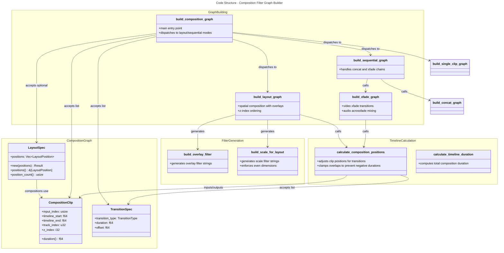

# C4 Code Level: Composition Filter Graph Builder

## Overview

- **Name**: Composition Filter Graph Builder
- **Description**: Generates FFmpeg filter graphs for multi-clip video compositions with support for sequential playback, transitions, and spatial overlay layouts.
- **Location**: `rust/stoat_ferret_core/src/compose`
- **Language**: Rust
- **Purpose**: Builds complete FFmpeg filter chains from high-level composition specifications (clips, transitions, layouts), enabling multi-stream video editing workflows like PIP, split-screen, and sequential compositions.
- **Parent Component**: [Rust Core Engine](./c4-component-rust-core-engine.md)

## Code Elements

### Modules & Re-exports

- **`mod graph`** – Primary composition graph builder (LayoutSpec, build_composition_graph)
- **`mod overlay`** – Overlay and scale filter string builders (build_overlay_filter, build_scale_for_layout)
- **`mod timeline`** – Timeline composition calculator (CompositionClip, TransitionSpec, calculate_composition_positions)

### Structs

- `LayoutSpec`
  - Description: Defines spatial layout positions for multi-stream composition
  - Location: `graph.rs:84-152`
  - Fields: `positions: Vec<LayoutPosition>`
  - Key methods:
    - `new(positions: Vec<LayoutPosition>) -> Result<Self, String>` – Creates layout with validation
    - `positions(&self) -> &[LayoutPosition]` – Returns position references
    - `position_count(&self) -> usize` – Returns number of positions

- `CompositionClip`
  - Description: A clip positioned on the composition timeline with metadata
  - Location: `timeline.rs:37-114`
  - Fields:
    - `input_index: usize` – Input source index
    - `timeline_start: f64` – Start time in seconds
    - `timeline_end: f64` – End time in seconds
    - `track_index: u32` – Multi-track layout index
    - `z_index: i32` – Z-order for layering
  - Key methods:
    - `new(input_index, timeline_start, timeline_end, track_index, z_index) -> Self`
    - `duration(&self) -> f64` – Returns duration (timeline_end - timeline_start)

- `TransitionSpec`
  - Description: Specifies transition effect between adjacent clips
  - Location: `timeline.rs:116-157`
  - Fields:
    - `transition_type: TransitionType` – Transition effect type
    - `duration: f64` – Transition overlap duration in seconds
    - `offset: f64` – Timing offset adjustment in seconds
  - Key methods:
    - `new(transition_type, duration, offset) -> Self`

### Primary Functions

**Graph Building**

- `pub fn build_composition_graph(clips: &[CompositionClip], transitions: &[TransitionSpec], layout: Option<&LayoutSpec>, audio_mix: Option<&AudioMixSpec>, output_width: u32, output_height: u32) -> FilterGraph`
  - Location: `graph.rs:173-193`
  - Purpose: Main entry point; dispatches to sequential or layout-based composition
  - Dependencies: Uses `build_single_clip_graph`, `build_layout_graph`, `build_sequential_graph`

**Sequential Composition Builders**

- `fn build_sequential_graph(clips: &[CompositionClip], transitions: &[TransitionSpec]) -> FilterGraph`
  - Location: `graph.rs:217-227`
  - Purpose: Builds concat or xfade chains for clips without layout
  - Dispatches: to `build_concat_graph` or `build_xfade_graph`

- `fn build_concat_graph(clips: &[CompositionClip]) -> FilterGraph`
  - Location: `graph.rs:229-242`
  - Purpose: Builds concat filter for sequential clips without transitions

- `fn build_xfade_graph(clips: &[CompositionClip], transitions: &[TransitionSpec]) -> FilterGraph`
  - Location: `graph.rs:244-321`
  - Purpose: Builds xfade video and acrossfade audio chains with transition timing
  - Dependencies: `calculate_composition_positions`, `Filter`, `FilterChain`

**Layout Composition Builders**

- `fn build_layout_graph(clips: &[CompositionClip], layout: &LayoutSpec, audio_mix: Option<&AudioMixSpec>, output_width: u32, output_height: u32) -> FilterGraph`
  - Location: `graph.rs:323-421`
  - Purpose: Builds spatial composition with overlay/scale filters sorted by z-index
  - Complexity: Handles canvas creation, per-clip scaling, overlay chaining, audio mixing

- `fn add_audio_mix(graph: FilterGraph, audio_mix: &AudioMixSpec) -> FilterGraph`
  - Location: `graph.rs:423+`
  - Purpose: Appends audio mixing filters (volume, fade-in, fade-out) to graph

**Overlay & Scale Filters**

- `pub fn build_overlay_filter(position: &LayoutPosition, output_w: u32, output_h: u32, start: f64, end: f64) -> String`
  - Location: `overlay.rs:44-59`
  - Purpose: Generates overlay filter string with time-based enable expression
  - Returns: `"overlay=x={px}:y={py}:enable='between(t,{start},{end})'"`

- `pub fn build_scale_for_layout(position: &LayoutPosition, output_w: u32, output_h: u32, preserve_aspect: bool) -> String`
  - Location: `overlay.rs:79-100`
  - Purpose: Generates scale filter string with optional aspect ratio preservation
  - Returns: `"scale=w={w}:h={h}:force_divisible_by=2[:force_original_aspect_ratio=decrease]"`

**Timeline Calculation**

- `pub fn calculate_composition_positions(clips: &[CompositionClip], transitions: &[TransitionSpec]) -> Vec<CompositionClip>`
  - Location: `timeline.rs:180-228`
  - Purpose: Adjusts clip timeline positions to account for transition overlaps
  - Clamping: Prevents negative-duration clips via `clamp_transition_duration`

- `pub fn calculate_timeline_duration(clips: &[CompositionClip], transitions: &[TransitionSpec]) -> f64`
  - Location: `timeline.rs:234-247`
  - Purpose: Returns total composition duration accounting for transitions

**Utility Functions**

- `fn format_value(value: f64) -> String` – Formats numeric values, stripping trailing zeros (graph.rs:42-50)
- `fn round_even(value: f64) -> u32` – Ensures even dimensions for codec compatibility (graph.rs:55-63; overlay.rs:17-25)
- `fn clamp_transition_duration(transition_duration, clip_a_duration, clip_b_duration) -> f64` – Prevents negative clip durations (timeline.rs:160-169)

## Dependencies

### Internal Dependencies

- `crate::compose::timeline::{CompositionClip, TransitionSpec, calculate_composition_positions}`
- `crate::ffmpeg::audio::AudioMixSpec`
- `crate::ffmpeg::filter::{concat, Filter, FilterChain, FilterGraph}`
- `crate::ffmpeg::transitions::TransitionType`
- `crate::layout::position::LayoutPosition`

### External Dependencies

- `pyo3` – Python interop (PyO3 bindings for LayoutSpec, CompositionClip, TransitionSpec)
- `pyo3_stub_gen::derive::gen_stub_pyclass` – Stub generation for PyO3 classes

## Relationships

## Notes

- **PyO3 Integration**: LayoutSpec, CompositionClip, and TransitionSpec are exported to Python via PyO3 with stub generation. All module functions are also exposed as `py_*` variants.
- **Codec Safety**: The `round_even()` function ensures all dimensions are even numbers (required by H.264 and many video codecs).
- **Transition Clamping**: Transition overlaps are clamped to prevent negative-duration clips, ensuring playable compositions even with excessive transition requests.
- **Z-Ordering**: Layout composition sorts positions by z_index to ensure correct overlay stacking in the FilterGraph.
- **Timeline Flexibility**: Sequential compositions (no layout) support both simple concatenation and complex multi-transition crossfading.
- **Comprehensive Testing**: Includes unit tests covering boundary cases, property-based tests (proptest), and parametric tests for all major functions.
