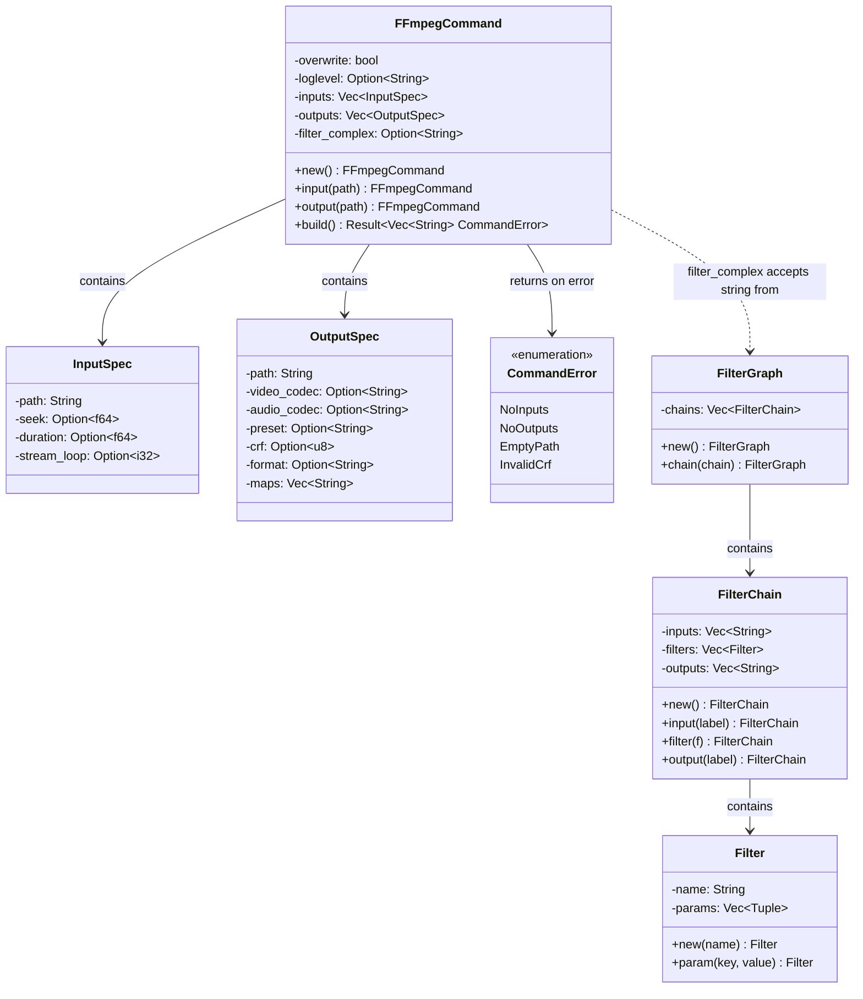

# C4 Code Level: FFmpeg Module

## Overview
- **Name**: FFmpeg Command Builder Module
- **Description**: Type-safe builder for constructing FFmpeg command arguments and filter graphs
- **Location**: `rust/stoat_ferret_core/src/ffmpeg/`
- **Language**: Rust
- **Purpose**: Provides a builder-pattern API for constructing FFmpeg command-line arguments and complex filter graphs, with validation and PyO3 bindings

## Code Elements

### Classes/Modules

- `FFmpegCommand`
  - Description: Builder for constructing FFmpeg argument arrays as `Vec<String>`, avoiding shell escaping issues
  - Location: `rust/stoat_ferret_core/src/ffmpeg/command.rs:41`
  - Fields (private):
    - `overwrite: bool` - Whether to set `-y` flag
    - `loglevel: Option<String>` - Log verbosity level
    - `inputs: Vec<InputSpec>` - Input file specifications
    - `outputs: Vec<OutputSpec>` - Output file specifications
    - `filter_complex: Option<String>` - Complex filtergraph string
  - Rust Methods:
    - `new() -> Self`
    - `overwrite(self, yes: bool) -> Self`
    - `loglevel(self, level: impl Into<String>) -> Self`
    - `input(self, path: impl Into<String>) -> Self`
    - `seek(self, seconds: f64) -> Self`
    - `duration(self, seconds: f64) -> Self`
    - `stream_loop(self, count: i32) -> Self`
    - `output(self, path: impl Into<String>) -> Self`
    - `video_codec(self, codec: impl Into<String>) -> Self`
    - `audio_codec(self, codec: impl Into<String>) -> Self`
    - `preset(self, preset: impl Into<String>) -> Self`
    - `crf(self, crf: u8) -> Self`
    - `format(self, format: impl Into<String>) -> Self`
    - `filter_complex(self, filter: impl Into<String>) -> Self`
    - `map(self, stream: impl Into<String>) -> Self`
    - `build(&self) -> Result<Vec<String>, CommandError>`
  - PyO3 Methods: All Rust methods mirrored with `py_` prefix, returning `PyRefMut<Self>` for chaining
  - Dependencies: `pyo3`, `pyo3_stub_gen`

- `InputSpec` (private)
  - Description: Specification for an FFmpeg input file with seek, duration, and loop options
  - Location: `rust/stoat_ferret_core/src/ffmpeg/command.rs:51`
  - Fields: `path: String`, `seek: Option<f64>`, `duration: Option<f64>`, `stream_loop: Option<i32>`

- `OutputSpec` (private)
  - Description: Specification for an FFmpeg output file with codec, preset, CRF, format, and map options
  - Location: `rust/stoat_ferret_core/src/ffmpeg/command.rs:60`
  - Fields: `path: String`, `video_codec: Option<String>`, `audio_codec: Option<String>`, `preset: Option<String>`, `crf: Option<u8>`, `format: Option<String>`, `maps: Vec<String>`

- `CommandError`
  - Description: Enum of errors that can occur when building an FFmpeg command
  - Location: `rust/stoat_ferret_core/src/ffmpeg/command.rs:72`
  - Variants:
    - `NoInputs` - No input files specified
    - `NoOutputs` - No output files specified
    - `EmptyPath` - An input or output path is empty
    - `InvalidCrf(u8)` - CRF value out of range (0-51)
  - Trait Implementations: `Display`, `Error`, `Debug`, `Clone`, `PartialEq`, `Eq`

- `Filter`
  - Description: A single FFmpeg filter with a name and key-value parameters
  - Location: `rust/stoat_ferret_core/src/ffmpeg/filter.rs:54`
  - Fields (private): `name: String`, `params: Vec<(String, String)>`
  - Rust Methods:
    - `new(name: impl Into<String>) -> Self`
    - `param(self, key: impl Into<String>, value: impl ToString) -> Self`
  - PyO3 Methods:
    - `py_new(name: String) -> Self`
    - `py_param(key: String, value: String) -> PyRefMut<Self>`
    - `scale(width: i32, height: i32) -> Self` (`#[staticmethod]`)
    - `scale_fit(width: i32, height: i32) -> Self` (`#[staticmethod]`)
    - `concat(n: usize, v: usize, a: usize) -> Self` (`#[staticmethod]`)
    - `pad(width: i32, height: i32, color: String) -> Self` (`#[staticmethod]`)
    - `format(pix_fmt: String) -> Self` (`#[staticmethod]`)
  - Trait Implementations: `Display`, `Debug`, `Clone`

- `FilterChain`
  - Description: A sequence of filters with optional input/output labels, connected with commas
  - Location: `rust/stoat_ferret_core/src/ffmpeg/filter.rs:349`
  - Fields (private): `inputs: Vec<String>`, `filters: Vec<Filter>`, `outputs: Vec<String>`
  - Rust Methods:
    - `new() -> Self`
    - `input(self, label: impl Into<String>) -> Self`
    - `filter(self, f: Filter) -> Self`
    - `output(self, label: impl Into<String>) -> Self`
  - PyO3 Methods: Mirrored with `PyRefMut<Self>` return for chaining
  - Trait Implementations: `Display`, `Debug`, `Clone`, `Default`

- `FilterGraph`
  - Description: Multiple filter chains connected with semicolons, used with `-filter_complex`
  - Location: `rust/stoat_ferret_core/src/ffmpeg/filter.rs:540`
  - Fields (private): `chains: Vec<FilterChain>`
  - Rust Methods:
    - `new() -> Self`
    - `chain(self, chain: FilterChain) -> Self`
  - PyO3 Methods: Mirrored with `PyRefMut<Self>` return for chaining
  - Trait Implementations: `Display`, `Debug`, `Clone`, `Default`

### Functions/Methods

- `concat(n: usize, v: usize, a: usize) -> Filter`
  - Description: Creates a concat filter for concatenating multiple inputs
  - Location: `rust/stoat_ferret_core/src/ffmpeg/filter.rs:212`

- `scale(width: i32, height: i32) -> Filter`
  - Description: Creates a scale filter for resizing video
  - Location: `rust/stoat_ferret_core/src/ffmpeg/filter.rs:241`

- `scale_fit(width: i32, height: i32) -> Filter`
  - Description: Creates a scale filter that maintains aspect ratio using `force_original_aspect_ratio=decrease`
  - Location: `rust/stoat_ferret_core/src/ffmpeg/filter.rs:267`

- `pad(width: i32, height: i32, color: &str) -> Filter`
  - Description: Creates a pad filter to add borders and center content
  - Location: `rust/stoat_ferret_core/src/ffmpeg/filter.rs:296`

- `format(pix_fmt: &str) -> Filter`
  - Description: Creates a format filter for pixel format conversion
  - Location: `rust/stoat_ferret_core/src/ffmpeg/filter.rs:320`

- `py_scale_filter(width: i32, height: i32) -> Filter`
  - Description: Python-exposed scale filter factory function (exposed as `scale_filter`)
  - Location: `rust/stoat_ferret_core/src/ffmpeg/filter.rs:620`

- `py_concat_filter(n: usize, v: usize, a: usize) -> Filter`
  - Description: Python-exposed concat filter factory function (exposed as `concat_filter`)
  - Location: `rust/stoat_ferret_core/src/ffmpeg/filter.rs:628`

## Dependencies

### Internal Dependencies
- None (self-contained module)

### External Dependencies
- `pyo3` - Python bindings (`pyclass`, `pymethods`, `pyfunction`, `PyRefMut`)
- `pyo3_stub_gen` - Stub generation annotations
- `std::fmt` - Display trait implementations

## Relationships

