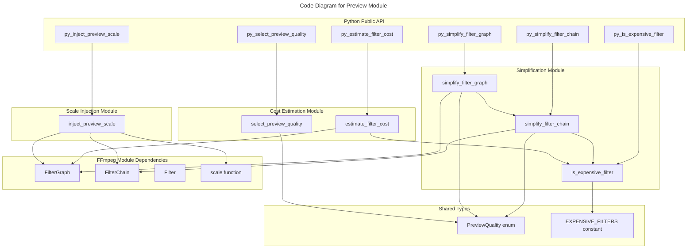

# C4 Code Level: Preview Filter Graph Management

## Overview

- **Name**: Preview Filter Graph Management
- **Description**: Rust module providing quality-level-based simplification, cost estimation, and resolution scaling for FFmpeg filter graphs in real-time preview playback.
- **Location**: rust/stoat_ferret_core/src/preview
- **Language**: Rust
- **Purpose**: Manage filter graph transformations for preview rendering by simplifying expensive filters, estimating computational cost, and injecting scale filters based on quality levels.
- **Parent Component**: [Rust Core Engine](./c4-component-rust-core-engine.md)

## Code Elements

### Enums

- `PreviewQuality`
  - Description: Quality level for filter simplification controlling filter reduction aggressiveness.
  - Location: mod.rs:22-31
  - Variants: `Draft` (removes all expensive filters), `Medium` (removes most expensive filters), `High` (preserves all filters)
  - Dependencies: PyO3 integration

### Functions/Methods

#### simplify.rs

- `fn is_expensive_filter(name: &str) -> bool`
  - Description: Classifies whether a filter name is computationally expensive.
  - Location: simplify.rs:30-32
  - Dependencies: `EXPENSIVE_FILTERS` constant

- `fn simplify_filter_chain(chain: &FilterChain, quality: PreviewQuality) -> FilterChain`
  - Description: Removes expensive filters from a single chain based on quality level.
  - Location: simplify.rs:43-56
  - Dependencies: `is_expensive_filter`, `FilterChain`, `PreviewQuality`

- `fn simplify_filter_graph(graph: &FilterGraph, quality: PreviewQuality) -> FilterGraph`
  - Description: Simplifies all chains in a filter graph based on quality level.
  - Location: simplify.rs:62-73
  - Dependencies: `simplify_filter_chain`, `FilterGraph`, `PreviewQuality`

- `fn py_simplify_filter_chain(chain: &FilterChain, quality: PreviewQuality) -> FilterChain`
  - Description: Python binding for simplifying a filter chain.
  - Location: simplify.rs:85-87
  - Dependencies: `simplify_filter_chain`, PyO3

- `fn py_simplify_filter_graph(graph: &FilterGraph, quality: PreviewQuality) -> FilterGraph`
  - Description: Python binding for simplifying a filter graph.
  - Location: simplify.rs:92-94
  - Dependencies: `simplify_filter_graph`, PyO3

- `fn py_is_expensive_filter(name: &str) -> bool`
  - Description: Python binding for expensive filter classification.
  - Location: simplify.rs:78-80
  - Dependencies: `is_expensive_filter`, PyO3

#### cost.rs

- `fn estimate_filter_cost(graph: &FilterGraph) -> f64`
  - Description: Calculates computational cost score (0.0-1.0) using weighted filter count and sigmoid normalization.
  - Location: cost.rs:46-65
  - Dependencies: `is_expensive_filter`, `FilterGraph`

- `fn select_preview_quality(cost: f64) -> PreviewQuality`
  - Description: Maps cost score to quality level (cost > 0.7: Draft, 0.3-0.7: Medium, < 0.3: High).
  - Location: cost.rs:83-91
  - Dependencies: `PreviewQuality`

- `fn py_estimate_filter_cost(graph: &FilterGraph) -> f64`
  - Description: Python binding for filter cost estimation.
  - Location: cost.rs:96-98
  - Dependencies: `estimate_filter_cost`, PyO3

- `fn py_select_preview_quality(cost: f64) -> PreviewQuality`
  - Description: Python binding for quality selection from cost.
  - Location: cost.rs:103-105
  - Dependencies: `select_preview_quality`, PyO3

#### scale.rs

- `fn inject_preview_scale(graph: &FilterGraph, width: i32, height: i32) -> FilterGraph`
  - Description: Appends a scale filter chain to the graph for resolution control.
  - Location: scale.rs:28-34
  - Dependencies: `scale()`, `FilterChain`, `FilterGraph`

- `fn py_inject_preview_scale(graph: &FilterGraph, width: i32, height: i32) -> FilterGraph`
  - Description: Python binding for preview scale injection.
  - Location: scale.rs:39-41
  - Dependencies: `inject_preview_scale`, PyO3

#### mod.rs

- `fn register(m: &Bound<'_, PyModule>) -> PyResult<()>`
  - Description: Registers preview module types and functions with Python module.
  - Location: mod.rs:34-43
  - Dependencies: PyO3, all submodule functions

## Dependencies

### Internal Dependencies

- `crate::ffmpeg::filter::FilterGraph` - FFmpeg filter graph structure
- `crate::ffmpeg::filter::FilterChain` - Single chain in filter graph
- `crate::ffmpeg::filter::Filter` - Individual filter unit
- `crate::ffmpeg::filter::scale()` - Helper function for creating scale filters

### External Dependencies

- `pyo3` - Python-Rust interop (prelude, PyResult, PyModule, pyclass, pyfunction)
- `proptest` - Property-based testing (for test modules)

## Relationships

## Notes

- **Expensive Filters**: Hardcoded set of 11 filters (hue, eq, colorbalance, unsharp, gblur, boxblur, smartblur, atadenoise, nlmeans, perspective, lenscorrection) identified as high computational cost.
- **Cost Calculation**: Uses sigmoid normalization with configurable midpoint (10.0) and steepness (0.3) to bound cost in [0.0, 1.0].
- **Quality Thresholds**: Cost > 0.7 → Draft, 0.3-0.7 → Medium, < 0.3 → High.
- **Simplification Behavior**: Draft and Medium currently perform identical simplification (all expensive filters removed). Medium provides extension point for graduated simplification.
- **Scale Injection**: Appends scale filter as new chain (not modifying existing chains), enabling resolution control without structural changes.
- **PyO3 Integration**: All public functions have Python bindings via `#[pyfunction]` and `#[pyo3(name = "...")]`.
