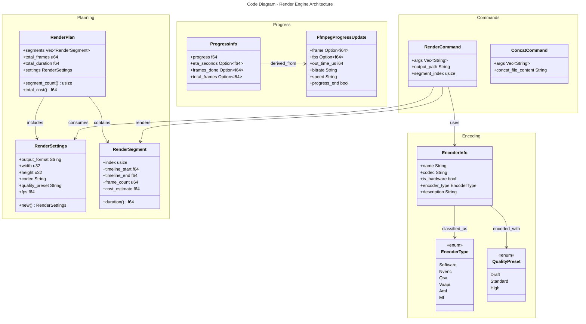

# C4 Code Level: Render Engine

## Overview

- **Name**: Render Plan & Command Builder
- **Description**: Decomposes composition timelines into render segments, detects encoders, and generates FFmpeg commands for multi-clip video rendering.
- **Location**: rust/stoat_ferret_core/src/render
- **Language**: Rust (PyO3 bindings to Python)
- **Purpose**: Provides render planning, encoder detection/selection, FFmpeg command building, and progress tracking for the rendering pipeline.
- **Parent Component**: [Rust Core Engine](./c4-component-rust-core-engine.md)

## Code Elements

### Public Structs

- `RenderSettings`
  - Description: Encapsulates output format, resolution, codec, quality preset, and fps
  - Location: plan.rs
  - Methods: `new()`, `py_new()`
  - Fields: output_format, width, height, codec, quality_preset, fps

- `RenderSegment`
  - Description: Non-overlapping timeline partition with frame count and cost estimate
  - Location: plan.rs
  - Methods: `new()`, `duration()`
  - Fields: index, timeline_start, timeline_end, frame_count, cost_estimate

- `RenderPlan`
  - Description: Complete render decomposition with ordered segments and totals
  - Location: plan.rs
  - Methods: `new()`, `segment_count()`, `total_cost()`
  - Fields: segments, total_frames, total_duration, settings

- `EncoderInfo`
  - Description: Detected video encoder with classification and metadata
  - Location: encoder.rs
  - Fields: name, codec, is_hardware, encoder_type, description

- `RenderCommand`
  - Description: FFmpeg arguments for a single segment render
  - Location: command.rs
  - Fields: args, output_path, segment_index

- `ConcatCommand`
  - Description: FFmpeg concat demuxer command and file content
  - Location: command.rs
  - Fields: args, concat_file_content

- `FfmpegProgressUpdate`
  - Description: Parsed FFmpeg `-progress pipe:1` output block
  - Location: progress.rs
  - Fields: frame, fps, out_time_us, bitrate, speed, progress_end

- `ProgressInfo`
  - Description: Calculated progress with ETA and frame counts
  - Location: progress.rs
  - Fields: progress, eta_seconds, frames_done, total_frames

### Public Enums

- `EncoderType`
  - Variants: Software, Nvenc, Qsv, Vaapi, Amf, Mf
  - Location: encoder.rs

- `QualityPreset`
  - Variants: Draft, Standard, High
  - Location: encoder.rs

### Functions

**Plan Building**
- `fn build_render_plan(clips: &[CompositionClip], transitions: &[TransitionSpec], layout: Option<&LayoutSpec>, audio_mix: Option<&AudioMixSpec>, output_width: u32, output_height: u32, settings: &RenderSettings) -> RenderPlan`
  - Decomposes timeline into non-overlapping segments with cost estimates
  - Location: plan.rs:328

- `fn validate_render_settings(settings: &RenderSettings) -> Result<(), String>`
  - Validates output format, resolution, codec, quality preset, fps
  - Location: plan.rs:413

**Encoder Detection & Selection**
- `fn detect_hardware_encoders(ffmpeg_output: &str) -> Vec<EncoderInfo>`
  - Parses FFmpeg `-encoders` output and classifies hardware/software
  - Location: encoder.rs:151

- `fn select_encoder(available: &[EncoderInfo], codec: &str) -> EncoderInfo`
  - Selects best encoder via fallback chain (NVENC → QSV → VAAPI → AMF → MF → Software)
  - Location: encoder.rs:228

- `fn build_encoding_args(encoder: &EncoderInfo, quality: &QualityPreset) -> Vec<String>`
  - Generates encoder-specific FFmpeg arguments (preset, quality params)
  - Location: encoder.rs:277

**Command Building**
- `fn build_render_command(segment: &RenderSegment, encoder: &EncoderInfo, quality: &QualityPreset, settings: &RenderSettings, input_path: &str, output_path: &str) -> RenderCommand`
  - Builds complete FFmpeg render command for a segment
  - Location: command.rs:164

- `fn build_concat_command(segment_outputs: &[String], final_output: &str, concat_file_path: &str) -> ConcatCommand`
  - Builds FFmpeg concat demuxer command and file content
  - Location: command.rs:245

- `fn check_output_conflict(output_path: &str) -> bool`
  - Checks if output file already exists
  - Location: command.rs:299

**Progress Tracking**
- `fn parse_ffmpeg_progress(output: &str) -> Vec<FfmpegProgressUpdate>`
  - Parses `-progress pipe:1` output into update objects
  - Location: progress.rs:106

- `fn calculate_progress(current_time_us: i64, total_duration_us: i64) -> f64`
  - Calculates progress ratio [0.0, 1.0]
  - Location: progress.rs:180

- `fn estimate_eta(elapsed_seconds: f64, progress: f64) -> Option<f64>`
  - Estimates remaining seconds from elapsed time and progress
  - Location: progress.rs:192

- `fn aggregate_segment_progress(segments: &[(f64, f64)]) -> f64`
  - Aggregates per-segment progress weighted by duration
  - Location: progress.rs:205

### translate.rs (added post-v090, BL-505/BL-555)

**RenderGraphTranslator** (`render/translate.rs:405`):
Unit struct; stateless. Translates a list of `ClipWithEffects` into an FFmpeg `filter_complex` string and a list of input file paths.
- `new() -> Self` (also `#[new]` for Python: `RenderGraphTranslator()`)
- `translate(clips: Vec<ClipWithEffects>) -> PyResult<(String, Vec<String>)>` — returns `(filter_complex_string, input_paths)`. Enforces: 1–100 clips, positive durations, non-empty `source_path`, valid xfade transitions.

**RenderEffect** (`render/translate.rs:211`):
Python-visible class (`#[pyclass]`) representing an effect to apply to a clip. Created via static factory methods:
- `none()` — no-op effect (pass-through)
- `animated_alpha(start: f64, end: f64)` — linear alpha fade over the clip duration
- `custom(filter_chain: String)` — raw FFmpeg filter chain string passthrough
- `windowed_custom(filter_chain: String, start_s: f64, end_s: f64)` — T-capable windowed effect using FFmpeg `enable=between(t,start_s,end_s)` expression

**RenderEffectKind** (`render/translate.rs:194`):
Internal Rust enum (`pub` visibility, **not exposed to Python** — no `#[pyclass]`). Variants: `None`, `AnimatedAlpha { start: f64, end: f64 }`, `Custom { filter_chain: String }`. Held inside `RenderEffect` as the implementation detail.

**ClipWithEffects** (`render/translate.rs:315`):
Python-visible struct (`#[pyclass]`) representing one clip with its associated effects. Fields:
- `input_index: usize` — index of this clip's input file in the FFmpeg command (`#[pyo3(get)]`)
- `duration_secs: f64` — clip playback duration in seconds (`#[pyo3(get)]`)
- `framerate: f64` — clip frame rate for filter timing (`#[pyo3(get)]`)
- `source_path: String` — file path to the clip's source video/audio (`#[pyo3(get)]`)
- `effects: Vec<RenderEffect>` — effects to apply (in order; not a Python property)
- `outgoing_transition: Option<RenderTransition>` — optional xfade transition to the next clip (not a Python property)

**RenderTransition** (`render/translate.rs:143`):
Python-visible struct (`#[pyclass]`) representing an xfade transition between clips. Fields:
- `transition_type: String` — must be one of the 54 valid xfade transition names (`#[pyo3(get, set)]`)
- `duration_secs: f64` — overlap duration for the xfade filter (`#[pyo3(get, set)]`)

Validates against `VALID_XFADE_TRANSITIONS` constant (54 transition types).

## Dependencies

### Internal Dependencies

- `crate::compose::graph::LayoutSpec` - Layout specification
- `crate::compose::timeline::*` - CompositionClip, TransitionSpec, timeline calculations
- `crate::ffmpeg::audio::AudioMixSpec` - Audio mixing specification
- `crate::ffmpeg::transitions::TransitionType` - Transition types

### External Dependencies

- `pyo3` - Python FFI and bindings
- `pyo3_stub_gen` - Type stub generation
- `regex` - FFmpeg output parsing
- `std::path::Path` - File path handling
- `std::sync::LazyLock` - Static regex initialization

## Relationships

## Notes

- **PyO3 Integration**: All public types and functions are exported to Python via `#[pyclass]` and `#[pyfunction]` macros registered in `mod.rs`
- **Segment Boundaries**: Segments are defined by clip start/end times and transition clamping per compose::timeline logic
- **Cost Estimation**: Cost = frame_count × active_clip_count to weight rendering effort
- **Encoder Fallback**: Hardware detection relies on FFmpeg `-encoders` output; always falls back to software encoder (e.g., libx264)
- **Progress Parsing**: Handles deviation where FFmpeg `-progress` reports `out_time_ms` in microseconds, not milliseconds (NFR-002)
- **Bitrate Lookup**: Command builder uses preset-based lookup (draft/standard/high) with codec-specific multipliers

