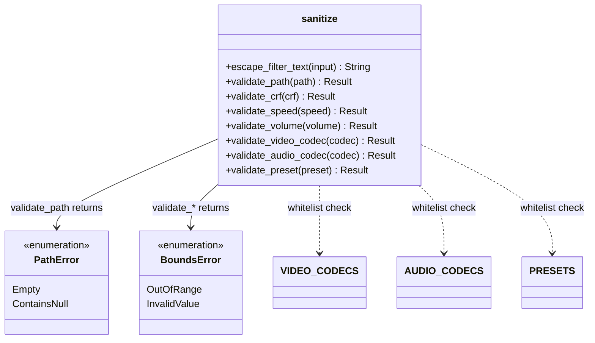

# C4 Code Level: Sanitize Module

## Overview
- **Name**: Input Sanitization Module
- **Description**: Input sanitization and validation functions for FFmpeg command parameters
- **Location**: `rust/stoat_ferret_core/src/sanitize/`
- **Language**: Rust
- **Purpose**: Prevents command injection and ensures parameter safety by escaping filter text, validating paths, validating numeric bounds (CRF, speed, volume), and whitelisting codec/preset values

## Code Elements

### Classes/Modules

- `PathError`
  - Description: Enum of errors for file path validation
  - Location: `rust/stoat_ferret_core/src/sanitize/mod.rs:61`
  - Variants:
    - `Empty` - Path is empty
    - `ContainsNull` - Path contains null bytes
  - Trait Implementations: `Display`, `Error`, `Debug`, `Clone`, `PartialEq`, `Eq`

- `BoundsError`
  - Description: Enum of errors for parameter bounds and whitelist validation
  - Location: `rust/stoat_ferret_core/src/sanitize/mod.rs:81`
  - Variants:
    - `OutOfRange { name: String, value: f64, min: f64, max: f64 }` - Numeric out of range
    - `InvalidValue { name: String, value: String, allowed: Vec<String> }` - Not in allowed set
  - Trait Implementations: `Display`, `Error`, `Debug`, `Clone`, `PartialEq`

### Functions/Methods

- `escape_filter_text(input: &str) -> String`
  - Description: Escapes special characters (`\ ' : [ ] ; \n \r`) for use in FFmpeg filter parameters
  - Location: `rust/stoat_ferret_core/src/sanitize/mod.rs:181`
  - Dependencies: None

- `validate_path(path: &str) -> Result<(), PathError>`
  - Description: Validates file paths are non-empty and contain no null bytes
  - Location: `rust/stoat_ferret_core/src/sanitize/mod.rs:230`
  - Dependencies: `PathError`

- `validate_crf(crf: u8) -> Result<u8, BoundsError>`
  - Description: Validates CRF value is in range 0-51
  - Location: `rust/stoat_ferret_core/src/sanitize/mod.rs:267`
  - Dependencies: `BoundsError`

- `validate_speed(speed: f64) -> Result<f64, BoundsError>`
  - Description: Validates speed multiplier is in range 0.25-4.0
  - Location: `rust/stoat_ferret_core/src/sanitize/mod.rs:306`
  - Dependencies: `BoundsError`

- `validate_volume(volume: f64) -> Result<f64, BoundsError>`
  - Description: Validates volume multiplier is in range 0.0-10.0
  - Location: `rust/stoat_ferret_core/src/sanitize/mod.rs:345`
  - Dependencies: `BoundsError`

- `validate_video_codec(codec: &str) -> Result<&str, BoundsError>`
  - Description: Validates video codec against whitelist (libx264, libx265, libvpx, libvpx-vp9, libaom-av1, copy)
  - Location: `rust/stoat_ferret_core/src/sanitize/mod.rs:415`
  - Dependencies: `VIDEO_CODECS` constant, `BoundsError`

- `validate_audio_codec(codec: &str) -> Result<&str, BoundsError>`
  - Description: Validates audio codec against whitelist (aac, libopus, libmp3lame, copy)
  - Location: `rust/stoat_ferret_core/src/sanitize/mod.rs:455`
  - Dependencies: `AUDIO_CODECS` constant, `BoundsError`

- `validate_preset(preset: &str) -> Result<&str, BoundsError>`
  - Description: Validates encoding preset against whitelist (ultrafast through placebo)
  - Location: `rust/stoat_ferret_core/src/sanitize/mod.rs:496`
  - Dependencies: `PRESETS` constant, `BoundsError`

- `py_escape_filter_text(input: &str) -> String`
  - Description: Python-exposed wrapper (exposed as `escape_filter_text`)
  - Location: `rust/stoat_ferret_core/src/sanitize/mod.rs:525`

- `py_validate_path(path: &str) -> PyResult<()>`
  - Description: Python-exposed wrapper (exposed as `validate_path`)
  - Location: `rust/stoat_ferret_core/src/sanitize/mod.rs:541`

- `py_validate_crf(crf: u8) -> PyResult<u8>`
  - Description: Python-exposed wrapper (exposed as `validate_crf`)
  - Location: `rust/stoat_ferret_core/src/sanitize/mod.rs:561`

- `py_validate_speed(speed: f64) -> PyResult<f64>`
  - Description: Python-exposed wrapper (exposed as `validate_speed`)
  - Location: `rust/stoat_ferret_core/src/sanitize/mod.rs:581`

- `py_validate_volume(volume: f64) -> PyResult<f64>`
  - Description: Python-exposed wrapper (exposed as `validate_volume`)
  - Location: `rust/stoat_ferret_core/src/sanitize/mod.rs:601`

- `py_validate_video_codec(codec: &str) -> PyResult<String>`
  - Description: Python-exposed wrapper (exposed as `validate_video_codec`)
  - Location: `rust/stoat_ferret_core/src/sanitize/mod.rs:621`

- `py_validate_audio_codec(codec: &str) -> PyResult<String>`
  - Description: Python-exposed wrapper (exposed as `validate_audio_codec`)
  - Location: `rust/stoat_ferret_core/src/sanitize/mod.rs:643`

- `py_validate_preset(preset: &str) -> PyResult<String>`
  - Description: Python-exposed wrapper (exposed as `validate_preset`)
  - Location: `rust/stoat_ferret_core/src/sanitize/mod.rs:665`

### Constants

- `VIDEO_CODECS: &[&str]` - Allowed video codecs whitelist
  - Location: `rust/stoat_ferret_core/src/sanitize/mod.rs:359`
- `AUDIO_CODECS: &[&str]` - Allowed audio codecs whitelist
  - Location: `rust/stoat_ferret_core/src/sanitize/mod.rs:369`
- `PRESETS: &[&str]` - Allowed encoding presets whitelist
  - Location: `rust/stoat_ferret_core/src/sanitize/mod.rs:372`

## Dependencies

### Internal Dependencies
- None (self-contained module)

### External Dependencies
- `pyo3` - Python bindings (`pyfunction`, `PyResult`, `exceptions::PyValueError`)
- `pyo3_stub_gen` - Stub generation annotations (`gen_stub_pyfunction`)
- `std::fmt` - Display trait implementations

## Relationships

