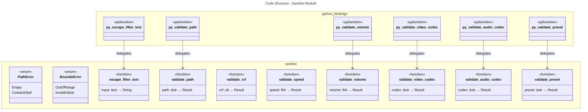

# C4 Code Level: FFmpeg Input Sanitization Module

## Overview

- **Name**: Sanitize Module
- **Description**: Provides input validation and escaping functions to safely prepare user-supplied parameters for FFmpeg command construction.
- **Location**: rust/stoat_ferret_core/src/sanitize
- **Language**: Rust (with PyO3 Python bindings)
- **Purpose**: Prevent command injection attacks and validate parameter bounds for FFmpeg encoding operations
- **Parent Component**: [Rust Core Engine](./c4-component-rust-core-engine.md)

## Code Elements

### Error Types

- `PathError`
  - Description: Enum for path validation errors (empty, contains null bytes)
  - Location: mod.rs:59-66
  - Variants: `Empty`, `ContainsNull`
  - Implements: `Display`, `std::error::Error`

- `BoundsError`
  - Description: Enum for parameter validation errors (out of range, invalid values)
  - Location: mod.rs:79-102
  - Variants: `OutOfRange { name, value, min, max }`, `InvalidValue { name, value, allowed }`
  - Implements: `Display`, `std::error::Error`

### Public Functions

- `fn escape_filter_text(input: &str) -> String`
  - Description: Escapes special FFmpeg filter characters (backslash, quotes, colons, brackets, semicolons, newlines)
  - Location: mod.rs:181-197
  - Dependencies: std library only

- `fn validate_path(path: &str) -> Result<(), PathError>`
  - Description: Validates file path safety (rejects empty paths and null bytes)
  - Location: mod.rs:230-238
  - Dependencies: std library only

- `fn validate_crf(crf: u8) -> Result<u8, BoundsError>`
  - Description: Validates Constant Rate Factor (0-51 range for video quality)
  - Location: mod.rs:267-278
  - Dependencies: std library only

- `fn validate_speed(speed: f64) -> Result<f64, BoundsError>`
  - Description: Validates video speed multiplier (0.25-4.0 range)
  - Location: mod.rs:306-317
  - Dependencies: std library only

- `fn validate_volume(volume: f64) -> Result<f64, BoundsError>`
  - Description: Validates audio volume multiplier (0.0-10.0 range)
  - Location: mod.rs:345-356
  - Dependencies: std library only

- `fn validate_video_codec(codec: &str) -> Result<&str, BoundsError>`
  - Description: Whitelists video codec names (libx264, libx265, libvpx, libvpx-vp9, libaom-av1, copy)
  - Location: mod.rs:415-425
  - Dependencies: Constant `VIDEO_CODECS` array

- `fn validate_audio_codec(codec: &str) -> Result<&str, BoundsError>`
  - Description: Whitelists audio codec names (aac, libopus, libmp3lame, copy)
  - Location: mod.rs:455-465
  - Dependencies: Constant `AUDIO_CODECS` array

- `fn validate_preset(preset: &str) -> Result<&str, BoundsError>`
  - Description: Whitelists encoding presets (ultrafast through placebo)
  - Location: mod.rs:496-506
  - Dependencies: Constant `PRESETS` array

### Python-exposed Functions (PyO3)

- `fn py_escape_filter_text(input: &str) -> String` (bound as `escape_filter_text`)
  - Location: mod.rs:525-527
  - Delegates to: `escape_filter_text()`

- `fn py_validate_path(path: &str) -> PyResult<()>` (bound as `validate_path`)
  - Location: mod.rs:541-543
  - Delegates to: `validate_path()`, converts errors to `PyValueError`

- `fn py_validate_volume(volume: f64) -> PyResult<f64>` (bound as `validate_volume`)
  - Location: mod.rs:561-563
  - Delegates to: `validate_volume()`, converts errors to `PyValueError`

- `fn py_validate_video_codec(codec: &str) -> PyResult<String>` (bound as `validate_video_codec`)
  - Location: mod.rs:581-585
  - Delegates to: `validate_video_codec()`, converts to String and errors to `PyValueError`

- `fn py_validate_audio_codec(codec: &str) -> PyResult<String>` (bound as `validate_audio_codec`)
  - Location: mod.rs:603-607
  - Delegates to: `validate_audio_codec()`, converts to String and errors to `PyValueError`

- `fn py_validate_preset(preset: &str) -> PyResult<String>` (bound as `validate_preset`)
  - Location: mod.rs:625-629
  - Delegates to: `validate_preset()`, converts to String and errors to `PyValueError`

### Constants

- `VIDEO_CODECS: &[&str]` - Allowed video codecs (mod.rs:359-366)
- `AUDIO_CODECS: &[&str]` - Allowed audio codecs (mod.rs:369)
- `PRESETS: &[&str]` - Allowed encoding presets (mod.rs:372-383)

## Dependencies

### Internal Dependencies

- None (pure module with no internal cross-module dependencies)

### External Dependencies

- `pyo3::prelude::*` - Python FFI and exception handling
- `pyo3_stub_gen::derive::gen_stub_pyfunction` - Generates Python stub files
- `std::fmt` - Error display formatting
- `std` - Standard library (String, char iteration)

## Relationships

```mermaid
---
title: Code Structure - Sanitize Module
---
classDiagram
    namespace sanitize {
        class PathError {
            <<enum>>
            Empty
            ContainsNull
        }
        
        class BoundsError {
            <<enum>>
            OutOfRange
            InvalidValue
        }
        
        class escape_filter_text {
            <<function>>
            input: &str → String
        }
        
        class validate_path {
            <<function>>
            path: &str → Result
        }
        
        class validate_crf {
            <<function>>
            crf: u8 → Result
        }
        
        class validate_speed {
            <<function>>
            speed: f64 → Result
        }
        
        class validate_volume {
            <<function>>
            volume: f64 → Result
        }
        
        class validate_video_codec {
            <<function>>
            codec: &str → Result
        }
        
        class validate_audio_codec {
            <<function>>
            codec: &str → Result
        }
        
        class validate_preset {
            <<function>>
            preset: &str → Result
        }
    }
    
    namespace python_bindings {
        class py_escape_filter_text {
            <<pyfunction>>
        }
        
        class py_validate_path {
            <<pyfunction>>
        }
        
        class py_validate_volume {
            <<pyfunction>>
        }
        
        class py_validate_video_codec {
            <<pyfunction>>
        }
        
        class py_validate_audio_codec {
            <<pyfunction>>
        }
        
        class py_validate_preset {
            <<pyfunction>>
        }
    }
    
    py_escape_filter_text --> escape_filter_text: delegates
    py_validate_path --> validate_path: delegates
    py_validate_volume --> validate_volume: delegates
    py_validate_video_codec --> validate_video_codec: delegates
    py_validate_audio_codec --> validate_audio_codec: delegates
    py_validate_preset --> validate_preset: delegates
```

## Notes

- All validation functions use whitelisting (allowlists) rather than blacklisting to prevent injection attacks
- Path validation is intentionally minimal; directory allowlist enforcement is deferred to the Python layer
- The module uses two-layer design: pure Rust functions + PyO3 wrappers for Python exposure
- All error types implement `Display` and `std::error::Error` for proper error handling
- UTF-8 characters are preserved during escaping; only FFmpeg special characters are escaped
- Test coverage includes edge cases, injection attempts, and UTF-8 handling
